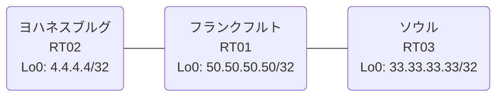

# 問題 20260920-086

> **本問は機器に接続せずに解答すること。追加の show 実行は認めない。**

## シナリオ

あなたの組織は、下記に示されているところのネットワークを運用しています。あなたの会社のネットワークは、複数のルーティング・ドメインが、境界のルーターによって接続され、そして、すべての拠点の到達可能性が提供されている、というものです。ルーティングの設計の詳細は、示されているところのコンフィギュレーションから、読み取られることが、期待されています。各拠点のルーターと、拠点の網との対応は、下記の表に示されているとおりです。ユーザーから、通信に関する事象が、報告されています。あなたは、提示されているところの情報のみを使用して、要求されている状態が満たされていない理由を、特定しなければなりません。redistribute によって参照されるところのプロセス ID / AS 番号は、その境界に実在する隣接のドメインのものと一致させられ、そして、実在しないプロセスへの参照が、残置されてはなりません。ルーティング・プロトコルの種別およびプロセスの配置は、変更されることはできません。EIGRP へのルートの注入においては、redistribute のステートメントにおいて、シード・メトリック `1000000 100 255 1 1500` が、直接に指定されなければなりません。いずれのサイトからも、他のすべてのサイトのネットワークへの、IP リーチアビリティが、確保されていること。ルートの再配送に対して、フィルタが、適用されてはなりません。



| 拠点 | ルータ | 拠点網 |
|------|--------|----------------------|
| ソウル | RT03 | `33.33.33.33/32` |
| フランクフルト | RT01 | `50.50.50.50/32` |
| ヨハネスブルグ | RT02 | `4.4.4.4/32` |

リンク一覧:
```
  RT01:E0/0(.1) ── RT02:E0/0(.2)   10.247.177.0/30
  RT01:E0/1(.1) ── RT03:E0/0(.2)   10.104.160.0/30
```

## 出力

```
RT02# show ip route
Gateway of last resort is not set
      4.0.0.0/32 is subnetted, 1 subnets
C        4.4.4.4 is directly connected, Loopback0
      10.0.0.0/8 is variably subnetted, 2 subnets, 2 masks
C        10.247.177.0/30 is directly connected, Ethernet0/0
L        10.247.177.2/32 is directly connected, Ethernet0/0
      50.0.0.0/32 is subnetted, 1 subnets
D        50.50.50.50 [90/409600] via 10.247.177.1, 00:03:56, Ethernet0/0
```
```
RT01# show route-map
route-map RM-STG1, deny, sequence 10
  Match clauses:
    ip address prefix-lists: PL-STG1 
  Set clauses:
  Policy routing matches: 0 packets, 0 bytes
route-map RM-STG1, permit, sequence 20
  Match clauses:
  Set clauses:
  Policy routing matches: 0 packets, 0 bytes
route-map RM-OLD2, deny, sequence 10
  Match clauses:
    ip address prefix-lists: PL-OLD2 
  Set clauses:
  Policy routing matches: 0 packets, 0 bytes
route-map RM-OLD2, permit, sequence 20
  Match clauses:
  Set clauses:
  Policy routing matches: 0 packets, 0 bytes
```
```
RT02# show running-config | section router
router eigrp 117
 network 4.4.4.4 0.0.0.0
 network 10.247.177.0 0.0.0.3
```
```
RT01# show ip prefix-list
ip prefix-list PL-OLD2: 2 entries
   seq 5 deny 4.4.4.4/32
   seq 10 permit 0.0.0.0/0 le 32
ip prefix-list PL-STG1: 2 entries
   seq 5 deny 50.50.50.50/32
   seq 10 permit 0.0.0.0/0 le 32
```
```
RT01# show running-config | section router
router eigrp 117
 network 10.247.177.0 0.0.0.3
 network 50.50.50.50 0.0.0.0
 redistribute ospf 88 match internal external 1 external 2
router ospf 88
 router-id 50.50.50.50
 redistribute eigrp 117
 passive-interface Loopback0
 network 10.104.160.0 0.0.0.3 area 0
 network 50.50.50.50 0.0.0.0 area 0
```
```
RT01# show access-lists
Standard IP access list 22
    10 deny   4.4.4.4
    20 permit any
Standard IP access list 54
    10 deny   50.50.50.50
    20 permit any
```
```
RT03# show ip route
Gateway of last resort is not set
      4.0.0.0/32 is subnetted, 1 subnets
O E2     4.4.4.4 [110/20] via 10.104.160.1, 00:03:30, Ethernet0/0
      10.0.0.0/8 is variably subnetted, 3 subnets, 2 masks
C        10.104.160.0/30 is directly connected, Ethernet0/0
L        10.104.160.2/32 is directly connected, Ethernet0/0
O E2     10.247.177.0/30 [110/20] via 10.104.160.1, 00:03:30, Ethernet0/0
      33.0.0.0/32 is subnetted, 1 subnets
C        33.33.33.33 is directly connected, Loopback0
      50.0.0.0/32 is subnetted, 1 subnets
O        50.50.50.50 [110/11] via 10.104.160.1, 00:03:30, Ethernet0/0
```
```
RT03# show running-config | section router
router ospf 88
 router-id 33.33.33.33
 passive-interface Loopback0
 network 10.104.160.0 0.0.0.3 area 0
 network 33.33.33.33 0.0.0.0 area 0
```

## 設問

次のうち、正しいものは、どれですか。

## 選択肢
**A.**
```
router eigrp 117
 default-metric 1000000 100 255 1 1500
```

**B.**
```
router eigrp 117
 no passive-interface <上流IF>
```

**C.**
```
router eigrp 117
 redistribute ospf 88 match internal external 1 external 2 metric 1000000 100 255 1 1500
```

**D.**
```
router ospf 88
 redistribute eigrp 117
```

**E.**
```
router eigrp 117
 redistribute connected metric 1000000 100 255 1 1500
```

**F.**
```
clear ip route *
```
