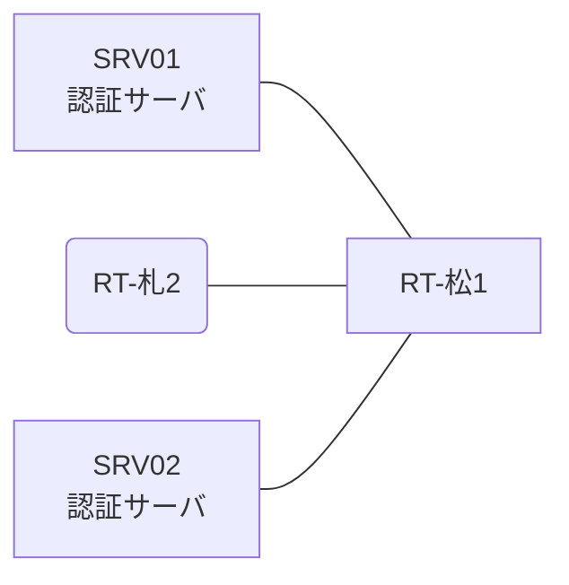

# 問題 20260920-087

> **本問は機器に接続せずに解答すること。追加の show 実行は認めない。**

## シナリオ

あなたは、ネットワークの運用を担当しています。2 つの拠点のルータが、共通の認証サーバ群を用いて、管理者の認証を行うように構成されています。一方のルータはサーバと直結しており、他方はそのルーターを経由してサーバに到達します。いくつかの宛先への通信について、報告が上がっています。示されているところの出力および構成に基づいて、要求されているところの動作が得られていない理由が、判断されなければなりません。松山・札幌 の両拠点で、利用者 noc-hanako が権限レベル 15 で機器を操作できること。緊急時にコンソールから操作できる経路を失わないこと。認証は認証サーバ群 RAD-GROUP を用いること。運用者の遠隔からの接続が失われないこと。



### 認証サーバの仕様

| 項目 | SRV01 | SRV02 |
|---|---|---|
| アドレス | 10.99.25.2 | 10.99.26.2 |
| 待受ポート | 1812 / 1813 | 1912 / 1913 |
| 共有鍵 | Ccnp-Aaa-77 | Ccnp-Aaa-77 |
| 受理する送信元 | 10.7.0.1 ・ 10.6.0.2 | 同左 |
| 台帳 | noc-hanako(15) ・ monitor-op(1) ・ SUZUKI(15) | 同左 |
| 現在の稼働状態 | 保守作業のため停止中 | 稼働中 |

### ルータのアドレス

| ルータ | Loopback0 | 認証サーバ方向のインタフェース |
|---|---|---|
| RT-松1(松山) | 10.7.0.1 | Ethernet0/0 = 10.99.25.1 |
| RT-札2(札幌) | 10.6.0.2 | Ethernet0/0 = 10.90.12.2 |

## 出力

| 拠点 | ユーザ | 結果 |
|---|---|---|
| 松山 | noc-hanako | ログイン可(権限レベル 15) |
| 松山 | monitor-op | ログイン可(権限レベル 1) |
| 松山 | local-admin | ログイン不可 |
| 松山 | monitor-op からの特権昇格 | 昇格可(15) |
| 松山 | noc-hanako(6 セッション目以降) | ログイン可(権限レベル 15) |
| 松山 | local-admin(コンソールから) | ログイン可(権限レベル 15) |
| 松山 | noc-hanako(ログインに要する時間) | 1 回目 約 9 秒 / 2 回目以降 即時 |
| 札幌 | noc-hanako | ログイン可(権限レベル 15) |
| 札幌 | monitor-op | ログイン可(権限レベル 1) |
| 札幌 | local-admin | ログイン不可 |
| 札幌 | monitor-op からの特権昇格 | 昇格可(15) |
| 札幌 | noc-hanako(6 セッション目以降) | ログイン可(権限レベル 15) |
| 札幌 | local-admin(コンソールから) | ログイン可(権限レベル 15) |
| 札幌 | noc-hanako(ログインに要する時間) | 1 回目 約 9 秒 / 2 回目以降 即時 |

認証サーバがすべて停止した場合:

| 拠点 | ユーザ | 結果 |
|---|---|---|
| 松山 | local-admin | ログイン可(権限レベル 15) |
| 松山 | SUZUKI | ログイン可(権限レベル 15) |
| 松山 | local-admin(コンソールから) | ログイン可(権限レベル 15) |
| 札幌 | local-admin | ログインは通るが exec 拒否 |
| 札幌 | SUZUKI | ログインは通るが exec 拒否 |
| 札幌 | local-admin(コンソールから) | ログイン可(権限レベル 15) |

```
松山: User was successfully authenticated. (1 回目 約 9 秒 / 2 回目以降 即時)
札幌: User was successfully authenticated. (1 回目 約 9 秒 / 2 回目以降 即時)
```
```
RT-松1# show running-config | section aaa
aaa new-model
!
radius server RAD1
 address ipv4 10.99.25.2 auth-port 1812 acct-port 1813
 key Ccnp-Aaa-77
!
radius server RAD2
 address ipv4 10.99.26.2 auth-port 1912 acct-port 1913
 key Ccnp-Aaa-77
!
aaa group server radius RAD-GROUP
 server name RAD1
 server name RAD2
 deadtime 5
!
aaa authentication login default group RAD-GROUP local
aaa authentication login CONSOLE local
aaa authorization exec default group RAD-GROUP local
aaa authorization exec CONSOLE local
aaa authorization console
!
ip radius source-interface Loopback0
radius-server timeout 3
radius-server retransmit 2
radius-server dead-criteria time 3 tries 1
!
username local-admin privilege 15 secret 5 $1$xxxx
username SUZUKI privilege 15 secret 5 $1$yyyy
!
line con 0
 exec-timeout 0 0
 logging synchronous
 login authentication CONSOLE
 authorization exec CONSOLE
line vty 0 4
 exec-timeout 0 0
 transport input ssh
line vty 5 15
 exec-timeout 0 0
 transport input ssh
```
```
RT-札2# show running-config | section aaa
aaa new-model
!
radius server RAD1
 address ipv4 10.99.25.2 auth-port 1812 acct-port 1813
 key Ccnp-Aaa-77
!
radius server RAD2
 address ipv4 10.99.26.2 auth-port 1912 acct-port 1913
 key Ccnp-Aaa-77
!
aaa group server radius RAD-GROUP
 server name RAD1
 server name RAD2
 deadtime 5
!
aaa authentication login default group RAD-GROUP local
aaa authentication login CONSOLE local
aaa authorization exec default group RAD-GROUP
aaa authorization exec CONSOLE local
aaa authorization console
!
ip radius source-interface Loopback0
radius-server timeout 3
radius-server retransmit 2
radius-server dead-criteria time 3 tries 1
!
username local-admin privilege 15 secret 5 $1$xxxx
username SUZUKI privilege 15 secret 5 $1$yyyy
!
line con 0
 exec-timeout 0 0
 logging synchronous
 login authentication CONSOLE
 authorization exec CONSOLE
line vty 0 4
 exec-timeout 0 0
 transport input ssh
line vty 5 15
 exec-timeout 0 0
 transport input ssh
```

## 設問

次のうち、正しいものは、どれですか。

## 選択肢
A. コンソール回線に対する認可が有効化されていない。

B. 応答しないサーバを判定する条件が構成されていないため、そのサーバが問い合わせ先から外れない。

C. コンソール回線に専用の方式リストが適用されていない。

D. exec の認可に代替手段が構成されていない。
