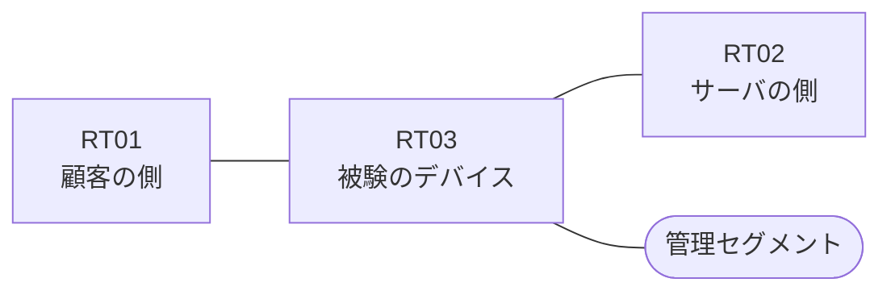

# 問題 20260920-088

> **本問は機器に接続せずに解答すること。追加の show 実行は認めない。**

## シナリオ

あなたは、下記のネットワークの保守を担当する技術者です。ある企業のネットワークにおいて、RT03 は、顧客の側のネットワークと、サーバの側のネットワークとの間に、配置されています。ユーザーから、通信に関する事象が、報告されています。あなたは、提示されているところの情報のみを使用して、要求されている状態が満たされていない理由を、特定しなければなりません。RT03 において、`10.168.129.0/24`、`10.168.131.0/24`、`10.168.133.0/24`、`10.168.135.0/24` のネットワークからの通信のみが、許可されなければなりません。`10.168.128.0/24` からの通信は、許可されてはなりません。`10.168.130.0/24` からの通信は、許可されてはなりません。アクセス リストのエントリは、1行で構成されなければなりません。アクセス リストは、顧客の側のインターフェイスである `Ethernet0/0` において、着信の方向に適用されなければなりません。インタフェースの IP アドレッシングは、変更されてはなりません。



| 区間 | 被験デバイス側のインターフェイス | ネットワーク |
|------|----------------------------------|--------------|
| RT01（顧客の側） ⇔ RT03 | `Ethernet0/0` | 10.168.253.0/24 |
| RT03 ⇔ RT02（サーバの側） | `Ethernet0/1` | 10.168.254.0/24 |
| RT03 ⇔ 管理セグメント | `Ethernet0/2` | 10.168.255.0/24 |

## 出力

観測 | サーバへの到達
--- | ---
送信元が 10.168.129.0/24 のネットワークにあるホストから、172.18.83.65 の TCP ポート 80 宛ての通信 | 到達可
送信元が 10.168.131.0/24 のネットワークにあるホストから、172.18.83.65 の TCP ポート 80 宛ての通信 | 到達可
送信元が 10.168.133.0/24 のネットワークにあるホストから、172.18.83.65 の TCP ポート 80 宛ての通信 | 到達可
送信元が 10.168.135.0/24 のネットワークにあるホストから、172.18.83.65 の TCP ポート 80 宛ての通信 | 到達可
送信元が 10.168.128.0/24 のネットワークにあるホストから、172.18.83.65 の TCP ポート 80 宛ての通信 | 到達可
送信元が 10.168.130.0/24 のネットワークにあるホストから、172.18.83.65 の TCP ポート 80 宛ての通信 | 到達可
送信元が 10.168.250.0/24 のネットワークにあるホストから、172.18.83.65 の TCP ポート 80 宛ての通信 | 到達可

```
RT03# show ip access-lists
Standard IP access list 20
    10 permit 10.168.129.0, wildcard bits 0.0.0.255
    20 permit 10.168.131.0, wildcard bits 0.0.0.255
    30 permit 10.168.133.0, wildcard bits 0.0.0.255
    40 permit 10.168.135.0, wildcard bits 0.0.0.255
```
```
RT03# show running-config | section ^interface
interface Ethernet0/0
 description === to RT01 ===
 ip address 10.168.253.1 255.255.255.0
interface Ethernet0/1
 description === to RT02 ===
 ip address 10.168.254.1 255.255.255.0
interface Ethernet0/2
 description === management ===
 ip address 10.168.255.1 255.255.255.0
 ip access-group 20 in
```

## 設問

次のうち、正しいものは、どれですか。

## 選択肢
A. アクセス・リストが、管理のためのインターフェイスに適用されている

B. 戻りの通信を許可するアクセス・リストの範囲が、対象としているネットワークの一部しか含んでいない

C. インターフェイスに適用されているアクセス・リストが、意図されているものとは別のアクセス・リストである

D. インターフェイスが管理上シャットダウンされている

E. ルーティング・プロトコルの隣接関係が確立されていない

F. established のキーワードが、戻りの側ではなく、通信を開始する側のアクセス・リストに記述されている
