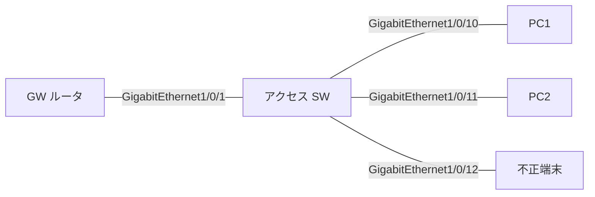

# 問題 20260920-110

> **本問は機器に接続せずに解答すること。追加の show 実行は認めない。**

## 設問

次の説明文(設定例を含む)の空欄 ①〜④ に入る語句を、下の語群 A〜H から 1 つずつ選択してください。同じ語句を 2 つの空欄に使うことはありません。語群にはどの空欄にも当てはまらない語句が含まれます。

FHS を入れる順序は「表を作る→制御メッセージを守る→データを守る」である。まず［①］のポリシーを VLAN に付けてバインディングテーブルを育て、`show device-tracking database` に端末が載ることを確認する。次に RA guard と DHCPv6 guard を入れるが、役割の付け方はGW 側 GigabitEthernet1/0/1 に［②］、端末側 GigabitEthernet1/0/10〜GigabitEthernet1/0/12 に host と client である。最後に、端末側だけに source guard を付ける。投入後の確認は、ポリシーの中身が `show ipv6 nd raguard policy` と `show ipv6 dhcp guard policy` と `show device-tracking policies`、実際に何が落ちたかは［③］で見る。端末側の症状から逆引きすると、「GUA が付かずリンクローカルだけ」なら正規 GW の RA が RA guard で落ちている、「GW もアドレスも正常だが DNS が取れない」なら GW ポートの DHCPv6 guard が client になっているを疑う。一連の設定は show running-config では既定値が省かれるので、［④］を正とする。

## 選択肢

A. router と server

B. show startup-config

C. show の policy 表示

D. device-tracking(snooping)

E. source guard

F. show device-tracking counters interface

G. host と client

H. show ipv6 neighbors
