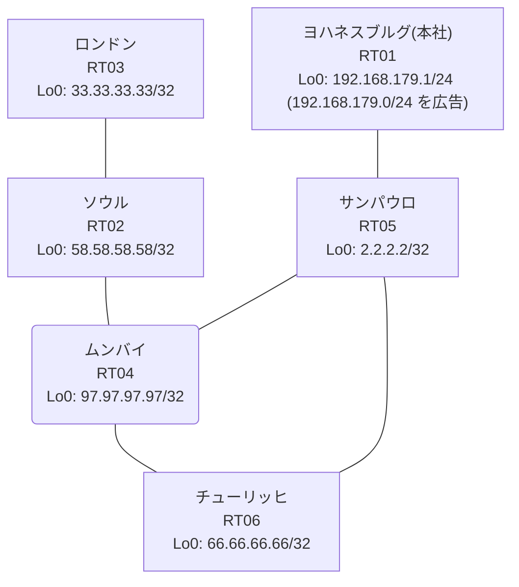

# 問題 20260921-002

> **本問は機器に接続せずに解答すること。追加の show 実行は認めない。**

## 設問

本社の顧客のネットワークは、BGP AS 65117 の RT01 によって、広告されています。あなたの会社の内部は、BGP / EIGRP / OSPF という 3 つのドメインから構成されています。サイトと、ルータおよびアドレスとの対応は、下記の表に示されているとおりです。経路の遮断は、当該の経路の出自に基づいて、実施される、かつ、すべてのルータが、`192.168.179.0/24` を含むところのすべての宛先へ、到達することができる、かつ、それぞれのドメインの間の再配送の設計は、維持されるという条件において、必要とされる設定を、下記から選択しなさい。`192.168.179.0/24` 宛のパケットが、広告元である RT01 の方向へ転送され、そして、転送のループが存在しておらず、管理のための構成に対して、変更が加えられず、対象外であるところのデバイスに対する構成の変更は、許可されていないことが求められます。distance コマンドによる管理距離の操作は、監査のポリシー上、使用されることができません。



| 拠点 | ルータ | 拠点網 / 広告網 |
|------|--------|------------------|
| サンパウロ | RT05 | 2.2.2.2/32 |
| ソウル | RT02 | 58.58.58.58/32 |
| チューリッヒ | RT06 | 66.66.66.66/32 |
| ムンバイ | RT04 | 97.97.97.97/32 |
| ヨハネスブルグ(本社) | RT01 | 192.168.179.1/24 (`192.168.179.0/24` を広告) |
| ロンドン | RT03 | 33.33.33.33/32 |

リンク一覧:
```
  RT01:E0/0(.1) ── RT05:E0/0(.2)   10.161.48.0/30
  RT05:E0/1(.1) ── RT06:E0/0(.2)   10.209.13.0/30
  RT05:E0/2(.1) ── RT04:E0/0(.2)   10.110.201.0/30
  RT06:E0/1(.1) ── RT04:E0/1(.2)   10.25.168.0/30
  RT04:E0/2(.1) ── RT02:E0/0(.2)   10.182.74.0/30
  RT02:E0/2(.1) ── RT03:E0/0(.2)   10.140.224.0/30
```

```
RT04# show running-config | section router
router ospf 7
 router-id 97.97.97.97
 timers throttle spf 50 200 5000
 passive-interface Loopback0
 network 10.25.168.0 0.0.0.3 area 0
 network 10.110.201.0 0.0.0.3 area 0
 network 10.182.74.0 0.0.0.3 area 0
 network 97.97.97.97 0.0.0.0 area 0
```
```
RT05# show ip bgp
BGP table version is 12, local router ID is 2.2.2.2
Status codes: s suppressed, d damped, h history, * valid, > best, i - internal, 
              r RIB-failure, S Stale, m multipath, b backup-path, f RT-Filter, 
              x best-external, a additional-path, c RIB-compressed, 
              t secondary path, L long-lived-stale,
Origin codes: i - IGP, e - EGP, ? - incomplete
RPKI validation codes: V valid, I invalid, N Not found

     Network          Next Hop            Metric LocPrf Weight Path
 *>   2.2.2.2/32       0.0.0.0                  0         32768 i
 *>   10.25.168.0/30   10.110.201.2            20         32768 ?
 *>   10.110.201.0/30  0.0.0.0                  0         32768 ?
 *>   10.140.224.0/30  10.110.201.2            30         32768 ?
 *>   10.182.74.0/30   10.110.201.2            20         32768 ?
 *>   33.33.33.33/32   10.110.201.2            31         32768 ?
 *>   58.58.58.58/32   10.110.201.2            21         32768 ?
 *>   66.66.66.66/32   10.110.201.2            21         32768 ?
 *>   97.97.97.97/32   10.110.201.2            11         32768 ?
 r>i  192.168.179.0    10.161.48.1              0    100      0 i
```
```
RT05# show ip prefix-list
ip prefix-list PL-OLD1: 2 entries
   seq 5 deny 66.66.66.66/32
   seq 10 permit 0.0.0.0/0 le 32
ip prefix-list PL-OLD2: 2 entries
   seq 5 deny 2.2.2.2/32
   seq 10 permit 0.0.0.0/0 le 32
```
```
RT05# show route-map
route-map RM-OLD1, deny, sequence 10
  Match clauses:
    ip address prefix-lists: PL-OLD1 
  Set clauses:
  Policy routing matches: 0 packets, 0 bytes
route-map RM-OLD1, permit, sequence 20
  Match clauses:
  Set clauses:
  Policy routing matches: 0 packets, 0 bytes
route-map RM-OLD2, deny, sequence 10
  Match clauses:
    ip address prefix-lists: PL-OLD2 
  Set clauses:
  Policy routing matches: 0 packets, 0 bytes
route-map RM-OLD2, permit, sequence 20
  Match clauses:
  Set clauses:
  Policy routing matches: 0 packets, 0 bytes
```
```
RT05# show running-config | section router
router eigrp 851
 timers active-time 5
 network 10.209.13.0 0.0.0.3
 passive-interface Loopback0
router ospf 7
 router-id 2.2.2.2
 redistribute eigrp 851
 redistribute bgp 65117
 network 2.2.2.2 0.0.0.0 area 0
 network 10.110.201.0 0.0.0.3 area 0
router bgp 65117
 bgp router-id 2.2.2.2
 bgp log-neighbor-changes
 bgp redistribute-internal
 network 2.2.2.2 mask 255.255.255.255
 redistribute ospf 7
 neighbor 10.161.48.1 remote-as 65117
```
```
RT01# show running-config | section router
router bgp 65117
 bgp router-id 192.168.179.1
 bgp log-neighbor-changes
 network 192.168.179.0
 neighbor 10.161.48.2 remote-as 65117
```
```
RT03# traceroute 192.168.179.1 probe 1 timeout 1 ttl 1 8
Type escape sequence to abort.
Tracing the route to 192.168.179.1
VRF info: (vrf in name/id, vrf out name/id)
  1 10.140.224.1 1 msec
  2 10.182.74.1 1 msec
  3 10.110.201.1 1 msec
  4 10.209.13.2 2 msec
  5 10.25.168.2 2 msec
  6 10.110.201.1 3 msec
  7 10.209.13.2 2 msec
  8 10.25.168.2 5 msec
```
```
RT06# show running-config | section router
router eigrp 851
 network 10.209.13.0 0.0.0.3
 redistribute ospf 7 metric 100000 100 255 1 1500
router ospf 7
 router-id 66.66.66.66
 redistribute eigrp 851
 network 10.25.168.0 0.0.0.3 area 0
 network 66.66.66.66 0.0.0.0 area 0
```
```
RT05# show ip protocols | include Routing Protocol|Distance
Routing Protocol is "application"
    Gateway         Distance      Last Update
  Distance: (default is 4)
Routing Protocol is "eigrp 851"
      Distance: internal 90 external 170
    Gateway         Distance      Last Update
  Distance: internal 90 external 170
Routing Protocol is "ospf 7"
    Gateway         Distance      Last Update
  Distance: (default is 110)
Routing Protocol is "bgp 65117"
    Gateway         Distance      Last Update
  Distance: external 20 internal 200 local 200
```
```
RT05# show access-lists
Standard IP access list 30
    10 deny   2.2.2.2
    20 permit any
Standard IP access list 38
    10 deny   66.66.66.66
    20 permit any
```
```
RT05# show ip route
Gateway of last resort is not set
      2.0.0.0/32 is subnetted, 1 subnets
C        2.2.2.2 is directly connected, Loopback0
      10.0.0.0/8 is variably subnetted, 9 subnets, 2 masks
O        10.25.168.0/30 [110/20] via 10.110.201.2, 00:04:40, Ethernet0/2
C        10.110.201.0/30 is directly connected, Ethernet0/2
L        10.110.201.1/32 is directly connected, Ethernet0/2
O        10.140.224.0/30 [110/30] via 10.110.201.2, 00:04:11, Ethernet0/2
C        10.161.48.0/30 is directly connected, Ethernet0/0
L        10.161.48.2/32 is directly connected, Ethernet0/0
O        10.182.74.0/30 [110/20] via 10.110.201.2, 00:04:40, Ethernet0/2
C        10.209.13.0/30 is directly connected, Ethernet0/1
L        10.209.13.1/32 is directly connected, Ethernet0/1
      33.0.0.0/32 is subnetted, 1 subnets
O        33.33.33.33 [110/31] via 10.110.201.2, 00:04:05, Ethernet0/2
      58.0.0.0/32 is subnetted, 1 subnets
O        58.58.58.58 [110/21] via 10.110.201.2, 00:04:11, Ethernet0/2
      66.0.0.0/32 is subnetted, 1 subnets
O        66.66.66.66 [110/21] via 10.110.201.2, 00:04:02, Ethernet0/2
      97.0.0.0/32 is subnetted, 1 subnets
O        97.97.97.97 [110/11] via 10.110.201.2, 00:04:40, Ethernet0/2
D EX  192.168.179.0/24 [170/307200] via 10.209.13.2, 00:04:04, Ethernet0/1
```

## 選択肢

**A.**
```
! RT06
route-map RM-MARK permit 10
 set tag 65117
router eigrp 851
 redistribute ospf 7 route-map RM-MARK
! RT05
route-map RM-DROP deny 10
 match tag 65117
route-map RM-DROP permit 20
router ospf 7
 redistribute bgp 65117 route-map RM-DROP
```

**B.**
```
! RT05
route-map RM-ORIGIN permit 10
 set tag 65117
router ospf 7
 redistribute bgp 65117 route-map RM-ORIGIN
! RT06
route-map RM-NOBACK deny 10
 match tag 65117
route-map RM-NOBACK permit 20
router eigrp 851
 redistribute ospf 7 route-map RM-NOBACK
```

**C.**
```
router bgp 65117
 no bgp redistribute-internal
```

**D.**
```
ip prefix-list PL-BLOCK seq 5 deny 192.168.179.0/24
ip prefix-list PL-BLOCK seq 10 permit 0.0.0.0/0 le 32
router eigrp 851
 distribute-list prefix PL-BLOCK in
```

**E.**
```
router bgp 65117
 distance bgp 20 165 165
end
clear ip route *
```

**F.**
```
! RT06 側で両方向の redistribute に deny route-map を適用
route-map RM-BLK deny 10
 match ip address prefix-list PL-BLK
route-map RM-BLK permit 20
```

**G.**
```
route-map RM-ORIGIN permit 10
 set tag 65117
router ospf 7
 redistribute bgp 65117 route-map RM-ORIGIN
```
