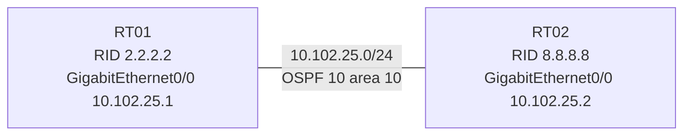

# 問題 20260921-003

> **本問は機器に接続せずに解答すること。追加の show 実行は認めない。**

## シナリオ



RT01 と RT02 は GigabitEthernet0/0 同士で直接接続され、OSPF プロセス 10 のエリア 10 で隣接を形成する構成です。 隣接が形成されないため、RT01 でデバッグを有効にしたところ、次の出力が得られました。

```
RT01# debug ip ospf adj
*Sep 18 12:47:40.000: OSPF-10 ADJ   Gi0/0: Rcv pkt from 10.102.25.2 : Mismatched Authentication Key - Invalid cryptographic authentication Key ID 10 on interface
*Sep 18 12:47:44.548: OSPF-10 HELLO Gi0/0: Send hello to 224.0.0.5 area 10 from 10.102.25.1
*Sep 18 12:47:50.370: OSPF-10 ADJ   Gi0/0: Rcv pkt from 10.102.25.2 : Mismatched Authentication Key - Invalid cryptographic authentication Key ID 10 on interface
```

## 設問

この出力から分かることとして、正しく述べられているものは、次のうちどれですか。(1つを選択してください)

## 選択肢

A. RT02 は鍵 ID 10 で認証したパケットを送っている。

B. RT01 と RT02 で認証タイプが一致していない。

C. RT01 は鍵 ID 10 で認証したパケットを送っている。

D. 両方のルータで鍵 ID は一致しているが、鍵の文字列が異なる。
