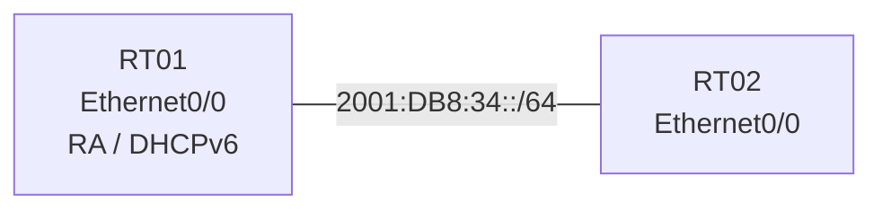

# 問題 20260921-006

> **本問は機器に接続せずに解答すること。追加の show 実行は認めない。**

## シナリオ



RT01 は DHCPv6 サーバとしてアドレスと DNS サーバ・ドメイン名を配布し、RT02 はアドレスを DHCPv6 で取得します。

```
RT01# show running-config | section ipv6|interface Ethernet0/0
ipv6 unicast-routing
ipv6 dhcp pool DHCP6-A
 address prefix 2001:DB8:34::/64 lifetime infinite infinite
 dns-server 2001:4860:4860::8844
 domain-name example.net
!
interface Ethernet0/0
 ipv6 address 2001:DB8:34::1/64
 ipv6 dhcp server DHCP6-A
 【1】
 no shutdown

RT02# show running-config | section interface Ethernet0/0
interface Ethernet0/0
 【2】
 no shutdown
```

## 設問

【1】と【2】に当てはまるコマンドを、次のうちから 2 つ選択してください。

## 選択肢

A. ipv6 address dhcp

B. ipv6 dhcp relay destination FE80::A8BB:CCFF:FE01:5800

C. ipv6 nd managed-config-flag

D. ipv6 nd other-config-flag

E. ipv6 address autoconfig
