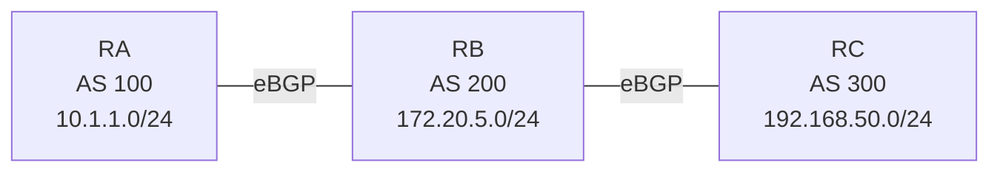

# 問題 20260921-012

> **本問は機器に接続せずに解答すること。追加の show 実行は認めない。**

## シナリオ



RA(AS 100)- RB(AS 200)- RC(AS 300)の順に eBGP で接続されています。RA は 10.1.1.0/24、RB は 172.20.5.0/24、RC は 192.168.50.0/24 を広告しています。AS 200 を非トランジット AS にしようとしましたが、AS 100 と AS 300 がそれぞれの経路を交換しています。

```
RA# show ip bgp | begin Network
     Network          Next Hop            Metric LocPrf Weight Path
 *>  10.1.1.0/24      0.0.0.0                  0         32768 i
 *>  172.20.5.0/24    203.0.113.2              0             0 200 i
 *>  192.168.50.0/24  203.0.113.2                            0 200 300 i

【RB に追加する設定】
RB(config)# 【?】
RB(config)# router bgp 200
RB(config-router)# neighbor 203.0.113.1 distribute-list 1 out
RB(config-router)# neighbor 203.0.113.6 distribute-list 3 out
```

## 設問

AS 100 に AS 300 の経路、AS 300 に AS 100 の経路が届かないようにするために RB で必要な【?】に当てはまる設定はどれですか。なお、RA と RC は AS 200 の経路を動的に学習する必要があり、RB は AS 100 と AS 300 の経路を動的に学習する必要があります。(1つを選択してください)

## 選択肢

**A.**

```
access-list 1 deny 192.168.50.0 0.0.0.255
access-list 1 permit any
access-list 3 deny 10.1.1.0 0.0.0.255
access-list 3 permit any
```

**B.**

```
access-list 1 deny 10.1.1.0 0.0.0.255
access-list 1 permit any
access-list 3 deny 192.168.50.0 0.0.0.255
access-list 3 permit any
```

**C.**

```
access-list 1 permit 192.168.50.0 0.0.0.255
access-list 1 deny any
access-list 3 permit 10.1.1.0 0.0.0.255
access-list 3 deny any
```

**D.**

```
access-list 11 deny 192.168.50.0 0.0.0.255
access-list 11 permit any
access-list 31 deny 10.1.1.0 0.0.0.255
access-list 31 permit any
```
