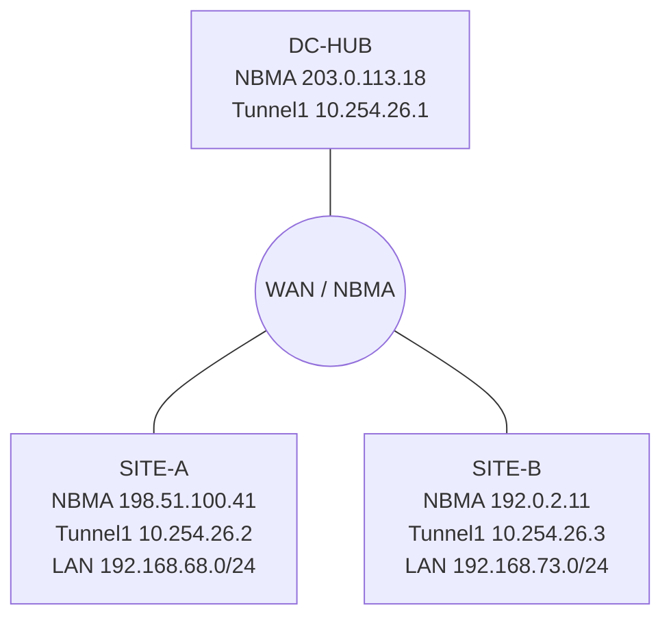

# 問題 20260921-021

> **本問は機器に接続せずに解答すること。追加の show 実行は認めない。**

## シナリオ



DC-HUB をハブ、SITE-A と SITE-B をスポークとする DMVPN(フェーズ 3・IKEv2/IPsec で保護)です。各スポークの LAN は 192.168.68.0/24(SITE-A)と 192.168.73.0/24(SITE-B)で、EIGRP 448 をトンネル上で動作させています。DC-HUB のトンネル送信元は Loopback0(203.0.113.18)、トンネルのネットワークは 10.254.26.0/24 です。 昨日まで全拠点が正常に通信していましたが、SITE-B のトンネル設定を変更した後、SITE-B の LAN と他拠点との通信ができなくなりました。SITE-A は正常です。

```
DC-HUB# show running-config interface Tunnel1
interface Tunnel1
 ip address 10.254.26.1 255.255.255.0
 no ip redirects
 ip mtu 1400
 ip nhrp authentication OVLNET43
 ip nhrp map multicast dynamic
 ip nhrp network-id 36
 ip nhrp redirect
 ip tcp adjust-mss 1360
 tunnel source Loopback0
 tunnel mode gre multipoint
 tunnel key 399
 tunnel protection ipsec profile IPSEC-DMVPN

SITE-B# show running-config interface Tunnel1
interface Tunnel1
 ip address 10.254.26.3 255.255.255.0
 no ip redirects
 ip mtu 1400
 ip nhrp authentication OVLNET34
 ip nhrp network-id 56
 ip nhrp nhs 10.254.26.1 nbma 203.0.113.18 multicast
 ip nhrp shortcut
 ip tcp adjust-mss 1360
 tunnel source Loopback0
 tunnel mode gre multipoint
 tunnel key 399
 tunnel protection ipsec profile IPSEC-DMVPN

DC-HUB# show dmvpn
Legend: Attrb --> S - Static, D - Dynamic, I - Incomplete
	N - NATed, L - Local, X - No Socket
	T1 - Route Installed, T2 - Nexthop-override, B - BGP
	C - CTS Capable, I2 - Temporary
	# Ent --> Number of NHRP entries with same NBMA peer
	NHS Status: E --> Expecting Replies, R --> Responding, W --> Waiting
	UpDn Time --> Up or Down Time for a Tunnel
==========================================================================

Interface: Tunnel1, IPv4 NHRP Details 
Type:Hub, NHRP Peers:1, 

 # Ent  Peer NBMA Addr Peer Tunnel Add State  UpDn Tm Attrb
 ----- --------------- --------------- ----- -------- -----
     1 198.51.100.41       10.254.26.2    UP 09:35:05     D

DC-HUB# show logging | include DMVPN|DUAL
*Sep 18 09:35:07.000: %DMVPN-5-CRYPTO_SS:  Tunnel1: local address : 203.0.113.18 remote address : 192.0.2.11 socket is UP
*Sep 18 09:36:18.137: %DMVPN-3-DMVPN_NHRP_ERROR:  Tunnel1: Recieved wrong authentication string for  Registration Request , Reason:  authentication failure (11) on (Tunnel: 10.254.26.1 NBMA: 203.0.113.18)
*Sep 18 09:37:29.274: %DMVPN-3-DMVPN_NHRP_ERROR:  Tunnel1: Recieved wrong authentication string for  Registration Request , Reason:  authentication failure (11) on (Tunnel: 10.254.26.1 NBMA: 203.0.113.18)

SITE-B# show dmvpn
Legend: Attrb --> S - Static, D - Dynamic, I - Incomplete
	N - NATed, L - Local, X - No Socket
	T1 - Route Installed, T2 - Nexthop-override, B - BGP
	C - CTS Capable, I2 - Temporary
	# Ent --> Number of NHRP entries with same NBMA peer
	NHS Status: E --> Expecting Replies, R --> Responding, W --> Waiting
	UpDn Time --> Up or Down Time for a Tunnel
==========================================================================

Interface: Tunnel1, IPv4 NHRP Details 
Type:Spoke, NHRP Peers:1, 

 # Ent  Peer NBMA Addr Peer Tunnel Add State  UpDn Tm Attrb
 ----- --------------- --------------- ----- -------- -----
     1 203.0.113.18        10.254.26.1  NHRP 00:01:15     S

SITE-B# show ip nhrp nhs detail
Legend:	E=Expecting replies, R=Responding, W=Waiting, D=Dynamic
Tunnel1:
10.254.26.1   E  NBMA Address: 203.0.113.18 priority = 0 cluster = 0  req-sent 6  req-failed 0  repl-recv 0 
Pending Registration Requests:
Registration Request: Reqid 14, Ret 64  NHS 10.254.26.1 expired (Tu1)

SITE-B# show crypto ikev2 sa
 IPv4 Crypto IKEv2  SA 

Tunnel-id Local                 Remote                fvrf/ivrf            Status 
1         192.0.2.11/500        203.0.113.18/500        none/none            READY  
      Encr: AES-CBC, keysize: 256, PRF: SHA256, Hash: SHA256, DH Grp:14, Auth sign: PSK, Auth verify: PSK
      Life/Active Time: 86400/95 sec

 IPv6 Crypto IKEv2  SA 

```

## 設問

SITE-B の登録を回復させるために必要な変更として最も適切なものは、次のうちどれですか。(1つを選択してください)

## 選択肢

A. SITE-B の Tunnel1 で ip nhrp registration no-unique を構成する。

B. DC-HUB の Tunnel1 で ip nhrp map multicast dynamic を構成する。

C. SITE-B の Tunnel1 で ip nhrp network-id 36 を構成する(DC-HUB と一致させる)。

D. SITE-B の Tunnel1 で ip nhrp authentication OVLNET43 を構成する。
