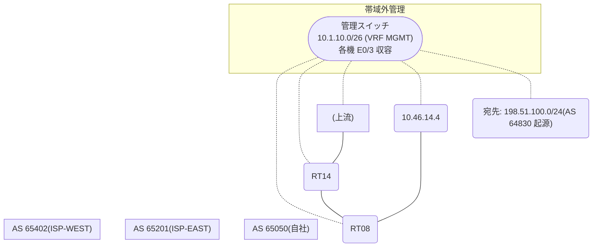

# 問題 20260921-022

> **本問は機器に接続せずに解答すること。追加の show 実行は認めない。**

## 設問

自社のルーター RT08 は、外部のネットワーク 198.51.100.0/24 への到達性を、複数の経路を通じて、確立しています。 ISP-WEST とも、接続されています。 一部の経路は、自 AS 内の境界ルーターから、iBGP で、学習されています。ベストパスの選出の結果について、その根拠が、確認されようとしています。なお、機器の構成は、示されている抜粋のほかは、既定値である。示されているところの出力において、ベストパスの選出を決定づけた要素は、どれですか。(1つを選択してください)



```
RT14# show running-config | section router bgp
router bgp 65050
 bgp router-id 8.5.5.5
 neighbor 102.102.102.102 remote-as 65050
 neighbor 102.102.102.102 update-source Loopback0
 neighbor 10.46.25.2 remote-as 65201
 !
 address-family ipv4
  neighbor 102.102.102.102 activate
  neighbor 10.46.25.2 activate
 exit-address-family
```
```
RT08# show running-config | section router bgp
router bgp 65050
 bgp router-id 102.102.102.102
 bgp log-neighbor-changes
 neighbor 8.5.5.5 remote-as 65050
 neighbor 8.5.5.5 update-source Loopback0
 neighbor 10.46.14.4 remote-as 65402
 !
 address-family ipv4
  neighbor 8.5.5.5 activate
  neighbor 10.46.14.4 activate
 exit-address-family
```
```
RT08# show ip bgp 198.51.100.0
BGP routing table entry for 198.51.100.0/24, version 49
Paths: (2 available, best #2, table default)
  Advertised to update-groups:
     5         
  Refresh Epoch 3
  65201 64830
    10.46.25.2 (inaccessible) from 8.5.5.5 (8.5.5.5)
      Origin IGP, localpref 200, valid, internal
      rx pathid: 0, tx pathid: 0
      Updated on Jun 3 2026 18:24:03 UTC
  Refresh Epoch 3
  65402 65402 64830
    10.46.14.4 from 10.46.14.4 (127.127.127.127)
      Origin IGP, localpref 100, valid, external, best
      rx pathid: 0, tx pathid: 0x0
      Updated on Jun 3 2026 19:22:03 UTC
```
```
RT08# show ip bgp
BGP table version is 49, local router ID is 102.102.102.102
Status codes: s suppressed, d damped, h history, * valid, > best, i - internal, 
              r RIB-failure, S Stale, m multipath, b backup-path, f RT-Filter, 
              x best-external, a additional-path, c RIB-compressed, 
              t secondary path, L long-lived-stale,
Origin codes: i - IGP, e - EGP, ? - incomplete
RPKI validation codes: V valid, I invalid, N Not found

     Network          Next Hop            Metric LocPrf Weight Path
 * i  198.51.100.0     10.46.25.2                    200      0 65201 64830 i
 *>                    10.46.14.4                             0 65402 65402 64830 i
```

## 選択肢

A. MED(小さいほうが優先)

B. LOCAL_PREF(大きいほうが優先)

C. AS-PATH 長(短いほうが優先)

D. 送り手の BGP ルータ ID(小さいほうが優先)

E. next-hop の解決可否(そもそも候補に入らない)
