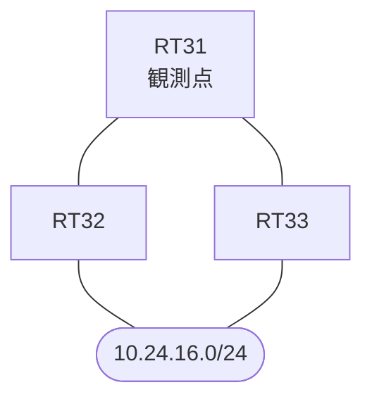

# 問題 20260921-023

> **本問は機器に接続せずに解答すること。追加の show 実行は認めない。**

## 設問

拠点のルーター RT31 は、複数の隣接するルーターを経由して、10.24.16.0/24 への経路を学習しています。ネットワークは単一の OSPF のドメインとして運用されており、そして、RT31 は当該のプレフィックスを複数の経路によって受け取っています。ルーティング プロトコルの種別およびプロセスの配置は、変更されず、現在の最良の経路のメトリックは、悪化させられないものとします。既存の隣接関係は、維持される、かつ、RT31 における 10.24.16.0/24 への転送のパスは、運用の設計の意図と一致している、かつ、構成の変更は、対象のルータ自身においてのみ、実施される、かつ、構成の変更は、1 箇所に限られるという条件において、RT31 のルーティング・テーブルに、10.24.16.0/24 の経路として搭載されるものは、どれですか。(1つを選択してください)



| 対象 | 内容 |
|------|------|
| RT31 ⇔ RT32 | Ethernet0/0・10.223.2.0/24（RT31 側の OSPF のコスト = 50） |
| RT31 ⇔ RT33 | Ethernet0/1・10.223.3.0/24（RT31 側の OSPF のコスト = 40） |
| RT32 | 外部の経路を再配送しているルータ（ASBR） |
| RT33 | 外部の経路を再配送しているルータ（ASBR） |

```
RT31# show ip ospf border-routers
OSPF Router with ID (1.1.1.1) (Process ID 10)


		Base Topology (MTID 0)

Internal Router Routing Table
Codes: i - Intra-area route, I - Inter-area route

i 2.2.2.2 [50] via 10.223.2.2, Ethernet0/0, ASBR, Area 0, SPF 21
i 3.3.3.3 [40] via 10.223.3.3, Ethernet0/1, ASBR, Area 0, SPF 21
```
```
RT31# show running-config | section interface
interface Ethernet0/0
 description === to RT32 ===
 ip address 10.223.2.1 255.255.255.0
 ip ospf cost 50
interface Ethernet0/1
 description === to RT33 ===
 ip address 10.223.3.1 255.255.255.0
 ip ospf cost 40
```
```
RT31# show ip ospf database external 10.24.16.0
OSPF Router with ID (1.1.1.1) (Process ID 10)

		Type-5 AS External Link States
  LS age: 143
  Options: (No TOS-capability, DC, Upward)
  LS Type: AS External Link
  Link State ID: 10.24.16.0 (External Network Number )
  Advertising Router: 2.2.2.2
  LS Seq Number: 80000005
  Checksum: 0x6257
  Length: 36
  Network Mask: /24
	Metric Type: 2 (Larger than any link state path)
	MTID: 0 
	Metric: 30 
	Forward Address: 0.0.0.0
	External Route Tag: 0

  LS age: 452
  Options: (No TOS-capability, DC, Upward)
  LS Type: AS External Link
  Link State ID: 10.24.16.0 (External Network Number )
  Advertising Router: 3.3.3.3
  LS Seq Number: 80000001
  Checksum: 0xACC9
  Length: 36
  Network Mask: /24
	Metric Type: 2 (Larger than any link state path)
	MTID: 0 
	Metric: 30 
	Forward Address: 0.0.0.0
	External Route Tag: 0
```
```
RT31# show running-config | section router ospf
router ospf 10
 router-id 1.1.1.1
 network 10.223.2.0 0.0.0.255 area 0
 network 10.223.3.0 0.0.0.255 area 0
```

## 選択肢

A. RT33(10.223.3.3)経由とRT32(10.223.2.2)経由の両方が、等コストのパスとして搭載される

B. いずれの経路も搭載されず、10.24.16.0/24 はルーティング・テーブルに現れない

C. RT33(10.223.3.3)経由が、メトリック 30 で、ルーティング・テーブルに搭載される

D. RT33(10.223.3.3)経由が、メトリック 70 で、ルーティング・テーブルに搭載される

E. RT32(10.223.2.2)経由が、メトリック 30 で、ルーティング・テーブルに搭載される
