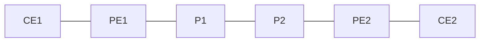

# 問題 20260921-032

> **本問は機器に接続せずに解答すること。追加の show 実行は認めない。**

## 設問

次の説明文(設定例を含む)の空欄 ①〜④ に入る語句を、下の語群 A〜H から 1 つずつ選択してください。同じ語句を 2 つの空欄に使うことはありません。語群にはどの空欄にも当てはまらない語句が含まれます。



```
vrf definition ACME
 rd 64512:20
 address-family ipv4
  route-target export 64512:200
  route-target import 64512:200
!
interface GigabitEthernet0/1
 vrf forwarding ACME
 ip address 192.168.1.1 255.255.255.252
!
router bgp 64512
 neighbor 192.168.255.2 remote-as 64512
 neighbor 192.168.255.2 update-source Loopback0
 !
 address-family ［①］
  neighbor 192.168.255.2 ［②］
  neighbor 192.168.255.2 send-community extended
 !
 address-family ipv4 vrf ACME
  neighbor 192.168.1.2 remote-as 65001
  neighbor 192.168.1.2 ［②］
  neighbor 192.168.1.2 as-override
```

上は PE1 の設定である。`address-family ［①］` 配下のネイバー 192.168.255.2 は［③］に属する対向 PE で、この AF で VRF ACME の経路が RD 64512:20 付きの VPNv4 経路と VPN ラベルとして交換される。RT は BGP の拡張コミュニティなので、この AF で `send-community extended` が無いと RT が伝わらず、対向 PE はどの VRF にも取り込めない。ネイバーアドレスに Loopback0 の /32 アドレスを使うのは、その /32 に対して LDP が配るラベルがそのまま VPN パケットのトランスポートラベルになるからである。`address-family ipv4 vrf ACME` 配下のネイバー 192.168.1.2 は［④］に属し、ここで学んだ経路は VRF ACME の経路表にだけ入る。両拠点の CE が同じ AS 65001 を使うため、PE から CE へ広告する際に as-override で AS_PATH 中の 65001 を 64512 に書き換えないと、受け取った CE が自 AS を見つけてループ検出で捨ててしまう。

## 選択肢

A. 顧客側(PE-CE の eBGP)

B. ipv4 vrf ACME

C. P ルータとの間

D. next-hop-self

E. vpnv4

F. route-reflector-client

G. activate

H. プロバイダ網内(PE-PE の iBGP)
