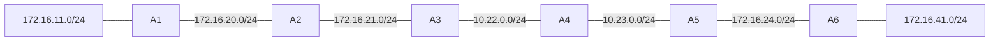

# 問題 20260921-038

> **本問は機器に接続せずに解答すること。追加の show 実行は認めない。**

## シナリオ



A1 から A6 までを直列に接続し、全ルータで EIGRP(AS 1)を動作させています。A1 のルーティング テーブルを確認したところ、A6 の LAN のネットワークが載っていません。

```
リンクとサブネット:
  A1 LAN: 172.16.11.0/24
  A1 — A2: 172.16.20.0/24
  A2 — A3: 172.16.21.0/24
  A3 — A4: 10.22.0.0/24
  A4 — A5: 10.23.0.0/24
  A5 — A6: 172.16.24.0/24
  A6 LAN: 172.16.41.0/24

A1# show running-config | section router eigrp
router eigrp 1
 network 172.16.0.0
 network 10.0.0.0
 auto-summary
(他のルータも同じ router eigrp 1 の構成です)
```

## 設問

この構成での動作について、正しく述べられているものは、次のうちどれですか。(1つを選択してください)

## 選択肢

A. A1 から A6 の LAN への通信は成功する。

B. A3 だけで no auto-summary を実行すると、A1 から A6 の LAN への通信は成功する。

C. A3 だけで no auto-summary を実行すると、A1 のルーティング テーブルに A6 の LAN の個別経路が載る。

D. A1 で variance を設定すると、A6 の LAN の経路が載る。
