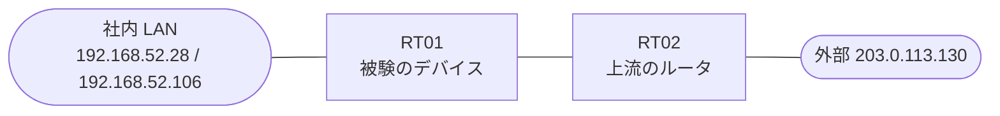

# 問題 20260921-040

> **本問は機器に接続せずに解答すること。追加の show 実行は認めない。**

## トポロジ

あなたは、下記のネットワークの保守を担当する技術者です。あなたの会社の拠点のルータ RT01 は、上流のルータ RT02 を経由して、外部のネットワークへ接続されています。社内の LAN には、管理のステーション 192.168.52.28 およびサーバ 192.168.52.106 が存在し、そして、RT01 と RT02 の間では、ルーティング プロトコルの隣接関係が確立されています。RT01 には、コントロール プレーンを保護するためのサービス ポリシーが、構成されています。



| 対象 | 内容 |
|------|------|
| RT01 ⇔ RT02（外部側） | Ethernet0/0・10.164.143.0/30（RT01=10.164.143.1 / RT02=10.164.143.2） |
| RT01 ⇔ 社内 LAN | Ethernet0/1・192.168.52.0/24（RT01=192.168.52.1） |
| 管理のステーション（NMS） | 192.168.52.28（SSH / ping の発信元） |
| サーバ | 192.168.52.106 |
| 外部の発信元 | 203.0.113.130 |

## 要件

1. 管理のステーション 192.168.52.28 からの SSH によるアクセス、および、ルーティング・プロトコルの隣接関係は、影響を受けてはなりません。
2. 攻撃元 203.0.113.130 からの、ルーター自身に宛てられた ICMP は、レートに関わらず、完全に破棄される必要があります。
3. ルーターを通過するところのトラフィックの転送に、影響が与えられてはなりません。
4. スタティック ルートおよび既定のルートによる迂回は、実施されてはなりません。
5. ルータ自身に宛てられたトラフィックの保護は、control-plane の input のサービス・ポリシーによって、実装されなければなりません。
6. 監視のためのホスト 192.168.52.28 からの ping による死活監視は、安定して維持されなければなりません。

## 現在の状態

ユーザーから、通信に関する事象が、報告されています。あなたは、示されているところの出力および構成に基づいて、その構成が、下記において記述されているとおりに動作していない理由を、判断する必要があります。

```
RT01# show policy-map control-plane
Control Plane 

  Service-policy input: PM-CPP

    Class-map: CM-ICMP (match-all)  
      Match: access-group 125
      police:
          cir 8000 bps, bc 1500 bytes
        conformed 366 packets, 41724 bytes; actions:
          transmit 
        exceeded 37 packets, 4218 bytes; actions:
          drop 
        conformed 3000 bps, exceeded 0000 bps

    Class-map: CM-BLOCK (match-all)  
      Match: access-group 110
      police:
          cir 8000 bps, bc 1500 bytes
        conformed 0 packets, 0 bytes; actions:
          drop 
        exceeded 0 packets, 0 bytes; actions:
          drop 
        conformed 0000 bps, exceeded 0000 bps

    Class-map: class-default (match-any)  
      Match: any
```

## 設定抜粋

```
RT01# show running-config | section control-plane
control-plane
 service-policy input PM-CPP
```
```
RT01# show access-lists
Extended IP access list 110
    10 permit icmp host 203.0.113.130 any
Extended IP access list 125
    10 permit icmp any any
```
```
RT01# show running-config | section interface
interface Ethernet0/0
 description === to RT02 ===
 ip address 10.164.143.1 255.255.255.252
interface Ethernet0/1
 ip address 192.168.52.1 255.255.255.0
```
```
RT01# show running-config | section line
line con 0
 logging synchronous
line vty 0 4
 login local
 transport input ssh
```

## 設問

次のうち、正しいものは、どれですか。

## 選択肢
**A.**
```
access-list 150 permit icmp host 203.0.113.130 any
access-list 155 permit icmp any any
access-list 160 permit tcp host 192.168.52.28 any eq 22
class-map match-all CM-BLOCK-NEW
 match access-group 150
class-map match-all CM-LIMIT-NEW
 match access-group 155
class-map match-all CM-MGMT-NEW
 match access-group 160
policy-map PM-NEW
 class CM-BLOCK-NEW
  police cir 8000 bc 1500
   conform-action drop
   exceed-action drop
 class CM-LIMIT-NEW
  police cir 8000 bc 1500
   conform-action transmit
   exceed-action drop
 class CM-MGMT-NEW
control-plane
 no service-policy input PM-CPP
 service-policy input PM-NEW
```

**B.**
```
access-list 170 deny icmp any any
access-list 170 permit ip any any
access-list 155 permit icmp any any
class-map match-all CM-LIMIT-NEW
 match access-group 155
policy-map PM-NEW
 class CM-LIMIT-NEW
  police cir 8000 bc 1500
   conform-action transmit
   exceed-action drop
control-plane
 no service-policy input PM-CPP
 service-policy input PM-NEW
interface Ethernet0/0
 ip access-group 170 in
```

**C.**
```
access-list 155 deny icmp host 203.0.113.130 any
access-list 155 permit icmp any any
class-map match-all CM-LIMIT-NEW
 match access-group 155
policy-map PM-NEW
 class CM-LIMIT-NEW
  police cir 8000 bc 1500
   conform-action transmit
   exceed-action drop
control-plane
 no service-policy input PM-CPP
 service-policy input PM-NEW
```

**D.**
```
access-list 160 permit tcp host 192.168.52.28 any eq 22
access-list 160 permit ospf any any
class-map match-all CM-PROTECT-NEW
 match access-group 160
policy-map PM-NEW
 class CM-PROTECT-NEW
 class class-default
  police cir 8000 bc 1500
   conform-action transmit
   exceed-action drop
control-plane
 no service-policy input PM-CPP
 service-policy input PM-NEW
```

**E.**
```
access-list 160 permit tcp host 192.168.52.28 any eq 23
access-list 160 permit ospf any any
class-map match-all CM-PROTECT-NEW
 match access-group 160
policy-map PM-NEW
 class CM-PROTECT-NEW
 class class-default
  police cir 8000 bc 1500
   conform-action transmit
   exceed-action drop
control-plane
 no service-policy input PM-CPP
 service-policy input PM-NEW
```
