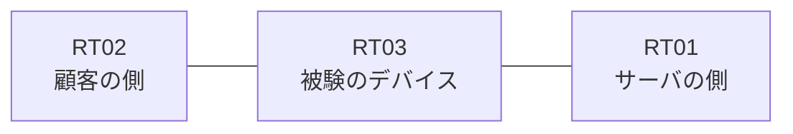

# 問題 20260921-041

> **本問は機器に接続せずに解答すること。追加の show 実行は認めない。**

## 設問

ある企業のネットワークにおいて、RT03 は、顧客の側のネットワークと、サーバの側のネットワークとの間に配置されており、IPv6 によって運用されています。RT03 において、`2001:DB8:6C:10::/64`、`2001:DB8:6C:11::/64`、`2001:DB8:6C:12::/64` のネットワークからの通信のみが、`2001:DB8:6C:FF::10` の TCP ポート 22 に到達できるという条件において、下記の項目から、正しいものを選択しなさい。対象外であるところのデバイスに対する構成の変更は、許可されておらず、拒否のエントリを使用せず、`2001:DB8:6C:15::/64` からの通信は、許可されないものとします。



観測 | サーバへの到達
--- | ---
送信元が 2001:DB8:6C:10::/64 のネットワークにあるホストから、2001:DB8:6C:FF::10 の TCP ポート 22 宛ての通信 | 到達可
送信元が 2001:DB8:6C:11::/64 のネットワークにあるホストから、2001:DB8:6C:FF::10 の TCP ポート 22 宛ての通信 | 到達可
送信元が 2001:DB8:6C:12::/64 のネットワークにあるホストから、2001:DB8:6C:FF::10 の TCP ポート 22 宛ての通信 | 到達不可
送信元が 2001:DB8:6C:13::/64 のネットワークにあるホストから、2001:DB8:6C:FF::10 の TCP ポート 22 宛ての通信 | 到達不可
送信元が 2001:DB8:6C:15::/64 のネットワークにあるホストから、2001:DB8:6C:FF::10 の TCP ポート 22 宛ての通信 | 到達不可
送信元が 2001:DB8:6C:FA::/64 のネットワークにあるホストから、2001:DB8:6C:FF::10 の TCP ポート 22 宛ての通信 | 到達不可

```
RT03# show ipv6 access-list
IPv6 access list V6-CUST-IN
    permit ipv6 2001:DB8:6C:10::/63 any sequence 10
```
```
RT03# show ipv6 neighbors
IPv6 Address                              Age Link-layer Addr State Interface
2001:DB8:6C:10::3                           0 aabb.cc02.4f00  REACH Et0/0
```
```
RT03# show running-config | section ipv6 access-list|traffic-filter
ipv6 access-list V6-CUST-IN
 sequence 10 permit ipv6 2001:DB8:6C:10::/63 any
interface Ethernet0/0
 ipv6 traffic-filter V6-CUST-IN in
```

## 選択肢

A. ワイルドカードによる指定が受理されず、意図されたエントリが存在していない

B. 末尾に明示の拒否のエントリが記述されているため、近隣探索に対する暗黙の許可が失われ、隣接のアドレスが解決できていない

C. プレフィックスの長さが長く、対象としているネットワークの一部が一致の対象から外れている

D. アクセス・リストが `ip access-group` によって適用されている

E. 参照されているアクセス・リストが定義されていない

F. インターフェイスにおいて IPv6 が有効にされていない
