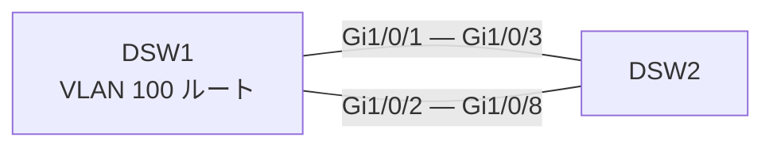

# 問題 20260922-012

> **本問は機器に接続せずに解答すること。追加の show 実行は認めない。**

## シナリオ

DSW1 と DSW2 を 1 Gbps のトランク 2 本で接続し、Rapid PVST+(ショート方式)で運用しています。DSW1 は VLAN 100 のルート ブリッジで、現在 DSW2 の VLAN 100 のルート ポートは Gi1/0/3 です。記載のない設定は既定値です。

## 設問

DSW2 の VLAN 100 のルート ポートを Gi1/0/8 に変更したい。DSW1 の設定だけを変更して要件を満たす方法はどれですか。(1つを選択してください)

## 選択肢

A. DSW2 の Gi1/0/8 で `spanning-tree vlan 100 cost 2` を設定する

B. DSW1 の Gi1/0/1 で `spanning-tree vlan 100 port-priority 64` を設定する

C. DSW2 の Gi1/0/8 で `spanning-tree vlan 100 port-priority 64` を設定する

D. DSW1 の Gi1/0/2 で `spanning-tree vlan 100 port-priority 64` を設定する
