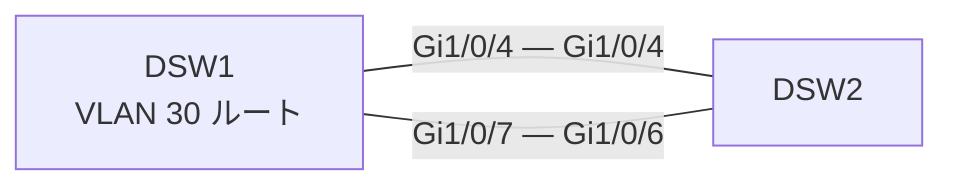

# 問題 20260925-003

> **本問は機器に接続せずに解答すること。追加の show 実行は認めない。**

## シナリオ

DSW1 と DSW2 を 1 Gbps のトランク 2 本で接続し、Rapid PVST+(ショート方式)で運用しています。DSW1 は VLAN 30 のルート ブリッジで、現在 DSW2 の VLAN 30 のルート ポートは Gi1/0/4 です。記載のない設定は既定値です。

## 設問

DSW2 の VLAN 30 のルート ポートを Gi1/0/6 に変更したい。DSW2 の設定だけを変更して要件を満たす方法はどれですか。(1つを選択してください)

## 選択肢

A. `spanning-tree cost` の値は、そのスイッチ自身のルート ポート選択に影響する

B. `spanning-tree pathcost method long` はインターフェイス コンフィギュレーション モードで設定する

C. `spanning-tree vlan 10 root secondary` は、ブリッジ プライオリティを 28672 に設定する

D. `spanning-tree vlan 10 root primary` は、実行した時点の値から計算したブリッジ プライオリティを設定として書き込む

E. 自分のポートの port-priority を下げると、自分のルート ポートがそのポートに変わる
