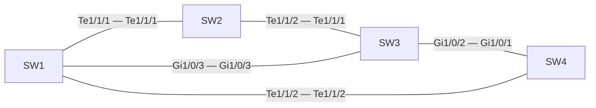

# 問題 20260925-005

> **本問は機器に接続せずに解答すること。追加の show 実行は認めない。**

## シナリオ

| スイッチ | ブリッジ プライオリティ(VLAN 10) | MAC アドレス |
|---|---|---|
| SW1 | 32768 | 5c50.1573.9bf2 |
| SW2 | 32768 | a0cf.5bdb.170c |
| SW3 | 8192 | a0cf.5b18.e955 |
| SW4 | 32768 | 5c50.153b.f8b2 |

| リンク | 帯域幅 |
|---|---|
| SW1 Te1/1/1 — SW2 Te1/1/1 | 10 Gbps |
| SW2 Te1/1/2 — SW3 Te1/1/1 | 10 Gbps |
| SW3 Gi1/0/2 — SW4 Gi1/0/1 | 1 Gbps |
| SW4 Te1/1/2 — SW1 Te1/1/2 | 10 Gbps |
| SW1 Gi1/0/3 — SW3 Gi1/0/3 | 1 Gbps |

全スイッチで Rapid PVST+ を使用し、パス コストはロング方式にそろえています。リンクはすべて全二重のトランクで、記載のない設定は既定値です。

## 設問

VLAN 10 のスパニング ツリーについて正しい記述はどれですか。(2つを選択してください)

## 選択肢

A. SW1 のルート パス コストは 4000 である

B. SW1 のルート ポートは Te1/1/2 である

C. SW1 がルート ブリッジになる

D. SW1 のルート ポートは Te1/1/1 である

E. SW2 がルート ブリッジになる
