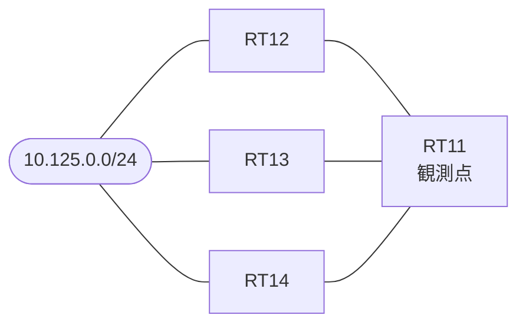

# 問題 20260927-001

> **本問は機器に接続せずに解答すること。追加の show 実行は認めない。**

## 設問

拠点のルータ RT11 は、複数の隣接するルータを経由して、10.125.0.0/24 への経路を学習しています。ネットワークは単一の EIGRP のオートノマス・システム(200)として運用されており、そして、冗長なパスの活用が検討されています。管理のための構成に対して、変更が加えられず、現在選好されているところの経路の側の構成は、変更されないものとします。RT11 における 10.125.0.0/24 への転送のパスは、運用の設計の意図と一致している、かつ、構成の変更は、1 箇所に限られる、かつ、既存の隣接関係は、維持されるという条件において、RT13(10.207.3.3)経由の経路が、`variance 3` を構成しても搭載されない理由は、どれですか。(1つを選択してください)



| 対象 | 内容 |
|------|------|
| RT11 ⇔ RT12 | Ethernet0/0・10.207.2.0/24（RT11 側の delay = 150） |
| RT11 ⇔ RT13 | Ethernet0/1・10.207.3.0/24（RT11 側の delay = 3850） |
| RT11 ⇔ RT14 | Ethernet0/2・10.207.4.0/24（RT11 側の delay = 950） |
| 宛先 | 10.125.0.0/24（すべての隣接から到達可能） |

```
RT11# show ip eigrp topology all-links
EIGRP-IPv4 Topology Table for AS(200)/ID(65.0.0.1)
Codes: P - Passive, A - Active, U - Update, Q - Query, R - Reply,
       r - reply Status, s - sia Status 

P 10.207.2.0/24, 1 successors, FD is 294400, serno 2
        via Connected, Ethernet0/0
P 10.207.3.0/24, 1 successors, FD is 1241600, serno 3
        via Connected, Ethernet0/1
P 10.125.0.0/24, 1 successors, FD is 448000, serno 7, refcount 1
        via 10.207.2.2 (448000/409600), Ethernet0/0
        via 10.207.4.4 (652800/409600), Ethernet0/2
        via 10.207.3.3 (1395200/409600), Ethernet0/1
```
```
RT11# show running-config | section interface
interface Ethernet0/0
 description === to RT12 ===
 ip address 10.207.2.1 255.255.255.0
 delay 150
interface Ethernet0/1
 description === to RT13 ===
 ip address 10.207.3.1 255.255.255.0
 delay 3850
interface Ethernet0/2
 description === to RT14 ===
 ip address 10.207.4.1 255.255.255.0
 delay 950
```
```
RT11# show running-config | section router eigrp
router eigrp 200
 eigrp router-id 65.0.0.1
 network 10.207.0.0 0.0.255.255
 no auto-summary
```

## 選択肢

A. variance による倍率の範囲(FD が variance × サクセサの FD 以下であること)

B. フィージビリティの条件(RD が、現在のサクセサの FD より小さいこと)

C. アドミニストレーティブ・ディスタンスの比較

D. ホップ数の比較

E. FD の大小の比較
