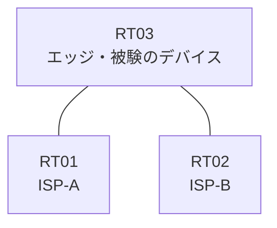

# 問題 20260927-003

> **本問は機器に接続せずに解答すること。追加の show 実行は認めない。**

## 設問

あなたの会社のエッジのルータは、2つのアップリンクによって、2つのサービス・プロバイダへ接続されている、というものです。顧客のネットワーク 192.168.86.0/24 および 192.168.133.0/24 は、それぞれのプロバイダを経由して、広告されています。検証に対する例外は、当該のネットワークの単位で、アクセス・リストによって許可される、そして、着信のインターフェイスと一致しない送信元を持つところのトラフィックは、破棄される、そして、エッジのルータの両方のアップリンクのインターフェイスにおいて、送信元アドレスの検証が、有効にされているという条件において、正しいものを、下記から選択しなさい。インタフェースの IP アドレッシングは、変更されず、監視のためのホストである 192.168.133.40 および 192.168.133.152 からの、正規のトラフィックが、破棄されないことが求められます。



| 区間 | エッジ側インターフェイス | ネットワーク |
|------|--------------------------|--------------|
| RT03 ⇔ RT01（ISP-A） | Ethernet0/0 | 10.32.12.0/30 |
| RT03 ⇔ RT02（ISP-B） | Ethernet0/1 | 10.32.13.0/30 |

- 監視のためのホスト `192.168.133.40` および `192.168.133.152` は、ISP-B を経由して着信します。

```
RT03# show access-lists
(出力なし)
```
```
RT03# show ip interface Ethernet0/0
Ethernet0/0 is up, line protocol is up
  Internet address is 10.32.12.1/30
  IP verify source reachable-via RX
   10 verification drops
   0 suppressed verification drops
```
```
RT03# show running-config | section interface
interface Ethernet0/0
 ip address 10.32.12.1 255.255.255.252
 ip verify unicast source reachable-via rx
interface Ethernet0/1
 ip address 10.32.13.1 255.255.255.252
```
```
RT03# show ip interface Ethernet0/1
Ethernet0/1 is up, line protocol is up
  Internet address is 10.32.13.1/30
  IP verify source reachable-via is disabled
```
```
RT03# show ip route | begin Gateway
Gateway of last resort is not set
      192.168.86.0/24 is subnetted, 1 subnets
O E2     192.168.86.0 [110/20] via 10.32.13.2, Ethernet0/1
      192.168.133.0/24 is subnetted, 1 subnets
O E2     192.168.133.0 [110/20] via 10.32.12.2, Ethernet0/0
```

## 選択肢

A. RT03 の両方のアップリンクのインターフェイスに `ip verify unicast source reachable-via rx` を構成する

B. RT03 の ISP-A 向けを `ip verify unicast source reachable-via rx`、ISP-B 向けを `ip verify unicast source reachable-via any` に構成する

C. RT03 の ISP-B 向けインターフェイスから、送信元の検証の構成を削除する

D. RT03 の両方のアップリンクのインターフェイスに `ip verify unicast source reachable-via rx 15` を構成し、`access-list 15 permit 192.168.133.0 0.0.0.255` を定義する

E. RT03 の両方のアップリンクのインターフェイスに `ip verify unicast source reachable-via rx 15` を構成し、`access-list 15 permit 192.168.133.40` および `access-list 15 permit 192.168.133.152` を定義する
