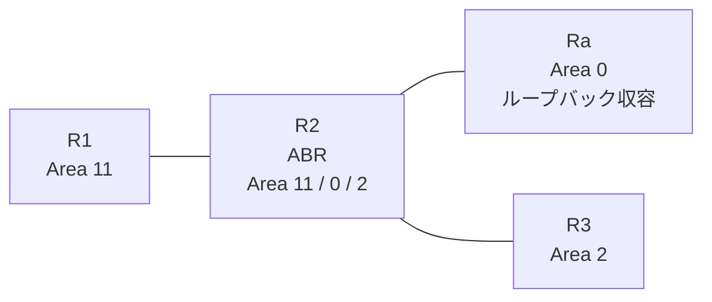

# 問題 20260927-004

> **本問は機器に接続せずに解答すること。追加の show 実行は認めない。**

## トポロジ

あなたは、ネットワークの運用を担当しています。拠点の集約ルータ Ra は、サービスのためのプレフィックスを、4つのループバック・インターフェイスによって収容しています。R2 は、エリア 11・エリア 0・エリア 2 を接続するところの ABR であり、そして、すべてのルーターにおいて、OSPFv3 のプロセス 10 が構成されています。



| 区間 | インターフェイス | ネットワーク | エリア |
|------|------------------|--------------|--------|
| R1 ⇔ R2 | E0/0 | 2001:DB8:2:1::/64 | 11 |
| R2 ⇔ Ra | E0/1 | 2001:DB8:1:3::/64 | 0 |
| R2 ⇔ R3 | E0/2 | 2001:DB8:6:7::/64 | 2 |

- R1 の E0/0 セカンダリ: 2001:DB8:0:1::/64（Area 11）
- Ra のループバック: 2001:DB8:8:8::/64, 2001:DB8:9:9::/64, 2001:DB8:A:A::/64, 2001:DB8:B:B::/64（Area 0）

## 要件

1. エリア 11 のルータの経路テーブルには、ループバックに由来するエリア間のルートとして、2001:DB8:8:8::/64 および 2001:DB8:9:9::/64 のみが存在する必要があります。その他のエリア間のルートは、存在してはなりません。
2. この制御は、エリア 11 に今後追加されるところの、いかなるルーターに対しても、等しく適用される必要があります。
3. 本作業は、日中の時間帯において実施されるという理由により、対象外であるところのデバイスに対する構成の変更は、許可されていません。
4. エリア 2 のルーターの経路テーブルは、いかなる影響も受けてはなりません。

## 現在の状態

一部の通信が、意図されているとおりに動作していない、という報告があります。あなたは、示されているところの出力および構成に基づいて、その構成が、下記において記述されているとおりに動作していない理由を、判断する必要があります。

```
R1# show ipv6 route ospf | include ^O|via

```
```
R3# show ipv6 route ospf | include ^O|via
OI  2001:DB8:0:1::/64 [110/20]
     via FE80::A8BB:CCFF:FE01:9F20, Ethernet0/0
OI  2001:DB8:1:3::/64 [110/20]
     via FE80::A8BB:CCFF:FE01:9F20, Ethernet0/0
OI  2001:DB8:2:1::/64 [110/20]
     via FE80::A8BB:CCFF:FE01:9F20, Ethernet0/0
OI  2001:DB8:8:8::/64 [110/21]
     via FE80::A8BB:CCFF:FE01:9F20, Ethernet0/0
OI  2001:DB8:9:9::/64 [110/21]
     via FE80::A8BB:CCFF:FE01:9F20, Ethernet0/0
OI  2001:DB8:A:A::/64 [110/21]
     via FE80::A8BB:CCFF:FE01:9F20, Ethernet0/0
OI  2001:DB8:B:B::/64 [110/21]
     via FE80::A8BB:CCFF:FE01:9F20, Ethernet0/0
```

## 設定抜粋

```
R2# show running-config
Building configuration...
!
interface Ethernet0/0
 no ip address
 ipv6 address 2001:DB8:2:1::2/64
 ipv6 enable
 ipv6 ospf 10 area 11
!
interface Ethernet0/1
 no ip address
 ipv6 address 2001:DB8:1:3::2/64
 ipv6 enable
 ipv6 ospf 10 area 0
!
interface Ethernet0/2
 no ip address
 ipv6 address 2001:DB8:6:7::2/64
 ipv6 enable
 ipv6 ospf 10 area 2
!
router ospfv3 10
 router-id 2.2.2.2
 !
 address-family ipv6 unicast
  area 11 filter-list prefix PL-AREA10 in
 exit-address-family
!
ipv6 prefix-list PL-AREA10 seq 5 permit 2001:DB8:8::/47 le 63
!
ipv6 prefix-list PL-CORE seq 5 permit 2001:DB8:8:8::/64
!
ipv6 prefix-list PL10 seq 5 permit 2001:DB8:8::/46 le 64
!
```

## 設問

次のうち、正しいものは、どれですか。

## 選択肢
A. R2 において、長さの範囲の指定を伴わないリストを、エリア 11 の filter-list として、in の方向に適用する

B. R2 において、対象を許可するところのプレフィックス・リストを、エリア 11 の filter-list として、in の方向に適用する

C. R1 において、対象を許可するところのリストを、distribute-list として、in の方向に適用する

D. R2 において、対象を許可するところのリストを、エリア 0 の filter-list として、out の方向に適用する
