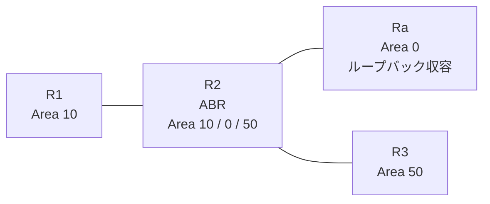

# 問題 20260927-005

> **本問は機器に接続せずに解答すること。追加の show 実行は認めない。**

## 設問

拠点の集約ルータ Ra は、サービスのためのプレフィックスを、4つのループバック インターフェイスによって収容しています。R2 は、エリア 10・エリア 0・エリア 50 を接続するところの ABR であり、そして、すべてのルーターにおいて、OSPFv3 のプロセス 1 が構成されています。この制御は、エリア 10 に今後追加されるところの、いかなるルーターに対しても、等しく適用されるという条件において、必要とされる設定を、下記から選択しなさい。エリア 50 のルータの経路テーブルは、いかなる影響も受けず、スタティック ルートおよび既定のルートによる迂回は、実施されないものとします。エリア 10 のルーターの経路テーブルには、ループバックに由来するエリア間のルートとして、2001:DB8:A:A::/64 および 2001:DB8:B:B::/64 のみが存在しなければなりません。その他のエリア間のルートは、存在してはなりません。



| 区間 | インターフェイス | ネットワーク | エリア |
|------|------------------|--------------|--------|
| R1 ⇔ R2 | E0/0 | 2001:DB8:3:8::/64 | 10 |
| R2 ⇔ Ra | E0/1 | 2001:DB8:1:2::/64 | 0 |
| R2 ⇔ R3 | E0/2 | 2001:DB8:1:A::/64 | 50 |

- R1 の E0/0 セカンダリ: 2001:DB8:5:7::/64（Area 10）
- Ra のループバック: 2001:DB8:A:A::/64, 2001:DB8:B:B::/64, 2001:DB8:C:C::/64, 2001:DB8:D:D::/64（Area 0）

```
R2# show running-config
Building configuration...
!
interface Ethernet0/0
 no ip address
 ipv6 address 2001:DB8:3:8::2/64
 ipv6 enable
 ipv6 ospf 1 area 10
!
interface Ethernet0/1
 no ip address
 ipv6 address 2001:DB8:1:2::2/64
 ipv6 enable
 ipv6 ospf 1 area 0
!
interface Ethernet0/2
 no ip address
 ipv6 address 2001:DB8:1:A::2/64
 ipv6 enable
 ipv6 ospf 1 area 50
!
router ospfv3 1
 router-id 2.2.2.2
 !
 address-family ipv6 unicast
  area 10 filter-list prefix PL01 in
 exit-address-family
!
ipv6 prefix-list PL-AREA10 seq 5 permit 2001:DB8:A:A::/64
!
ipv6 prefix-list PL-CORE seq 5 permit ::/0 ge 1
!
ipv6 prefix-list PL-LO seq 5 permit 2001:DB8:8::/45 le 64
!
ipv6 prefix-list PL01 seq 5 permit 2001:DB8:A::/47
!
```
```
R3# show ipv6 route ospf | include ^O|via
OI  2001:DB8:1:2::/64 [110/20]
     via FE80::A8BB:CCFF:FE01:C920, Ethernet0/0
OI  2001:DB8:3:8::/64 [110/20]
     via FE80::A8BB:CCFF:FE01:C920, Ethernet0/0
OI  2001:DB8:5:7::/64 [110/20]
     via FE80::A8BB:CCFF:FE01:C920, Ethernet0/0
OI  2001:DB8:A:A::/64 [110/21]
     via FE80::A8BB:CCFF:FE01:C920, Ethernet0/0
OI  2001:DB8:B:B::/64 [110/21]
     via FE80::A8BB:CCFF:FE01:C920, Ethernet0/0
OI  2001:DB8:C:C::/64 [110/21]
     via FE80::A8BB:CCFF:FE01:C920, Ethernet0/0
OI  2001:DB8:D:D::/64 [110/21]
     via FE80::A8BB:CCFF:FE01:C920, Ethernet0/0
```
```
R1# show ipv6 route ospf | include ^O|via

```

## 選択肢

**A.**
```
R1(config)# ipv6 prefix-list PL-NEW seq 5 permit 2001:DB8:A::/47 le 64
R2(config)# router ospfv3 1
R2(config-router)# address-family ipv6 unicast
R2(config-router-af)# no area 10 filter-list prefix PL01 in
R1(config)# router ospfv3 1
R1(config-router)# address-family ipv6 unicast
R1(config-router-af)# distribute-list prefix-list PL-NEW in
R2(config)# no ipv6 prefix-list PL01
```

**B.**
```
R2(config)# ipv6 prefix-list PL-NEW seq 5 permit 2001:DB8:A::/47 le 64
R2(config)# router ospfv3 1
R2(config-router)# address-family ipv6 unicast
R2(config-router-af)# no area 10 filter-list prefix PL01 in
R2(config-router-af)# area 10 filter-list prefix PL-NEW in
R2(config)# no ipv6 prefix-list PL01
```

**C.**
```
R2(config)# ipv6 prefix-list PL-NEW seq 5 permit 2001:DB8:A::/47
R2(config)# router ospfv3 1
R2(config-router)# address-family ipv6 unicast
R2(config-router-af)# no area 10 filter-list prefix PL01 in
R2(config-router-af)# area 10 filter-list prefix PL-NEW in
R2(config)# no ipv6 prefix-list PL01
```

**D.**
```
R2(config)# ipv6 prefix-list PL-NEW seq 5 permit 2001:DB8:A::/47 le 64
R2(config)# router ospfv3 1
R2(config-router)# address-family ipv6 unicast
R2(config-router-af)# no area 10 filter-list prefix PL01 in
R2(config-router-af)# area 0 filter-list prefix PL-NEW out
R2(config)# no ipv6 prefix-list PL01
```
