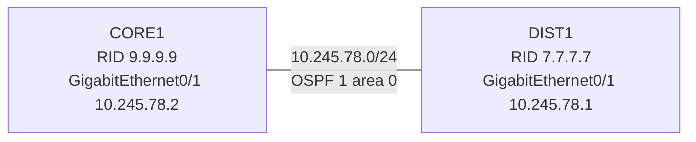

# 問題 20260927-020

> **本問は機器に接続せずに解答すること。追加の show 実行は認めない。**

## シナリオ



CORE1 と DIST1 は GigabitEthernet0/1 同士で直接接続され、OSPF プロセス 1 のエリア 0 で隣接を形成する構成です。 隣接の状態と経路について、次の出力が得られました。

```
CORE1# show ip ospf neighbor

Neighbor ID     Pri   State           Dead Time   Address         Interface
7.7.7.7           1   FULL/DR         00:00:36    10.245.78.1     GigabitEthernet0/1

CORE1# show ip ospf interface GigabitEthernet0/1 | include Network Type|Neighbor Count
  Process ID 1, Router ID 9.9.9.9, Network Type BROADCAST, Cost: 10
  Neighbor Count is 1, Adjacent neighbor count is 1

DIST1# show ip ospf interface GigabitEthernet0/1 | include Network Type|Neighbor Count
  Process ID 1, Router ID 7.7.7.7, Network Type POINT_TO_POINT, Cost: 10
  Neighbor Count is 0, Adjacent neighbor count is 0

CORE1# show ip route ospf
(OSPF の経路はありません)
```

## 設問

この出力から分かることとして、正しく述べられているものは、次のうちどれですか。(1つを選択してください)

## 選択肢

A. CORE1 と DIST1 で MTU が一致していない。

B. CORE1 と DIST1 の hello インターバルが一致していない。

C. 両方のルータで隣接は FULL に達しており、経路も交換されている。

D. 自ルータ 側の表示では隣接は FULL だが、OSPF の経路は交換されていない。
