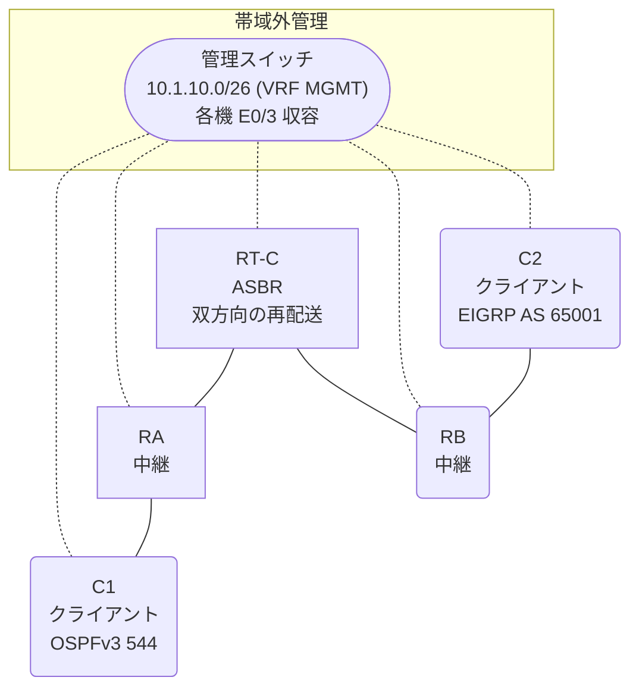

# 問題 20260927-021

> **本問は機器に接続せずに解答すること。追加の show 実行は認めない。**

## シナリオ

あなたは、下記のネットワークの保守を担当する技術者です。クライアントである C1 は OSPFv3 の ドメイン に、そして、C2 は EIGRP の ドメイン に、それぞれ収容されています。RT-C は、2 つの ドメイン の境界に位置しており、双方向の 再配送 が構成されています。通信の一部において、想定されていない挙動が、観測されています。あなたは、示されているところの出力および構成に基づいて、その構成が、下記において記述されているとおりに動作していない理由を、判断する必要があります。C1 と C2 は、相互に 通信 できなければなりません。管理のための構成に対して、変更が加えられてはなりません。いずれの ドメイン の ルーター の 経路テーブル にも、対向する ドメイン の トランジット の リンク の ネットワークが、現れてはなりません。



| ルータ | 位置づけ | 参加プロトコル |
|--------|----------|----------------|
| C1 | クライアント | OSPFv3 544 area 0 |
| RA | 中継 | OSPFv3 544 area 0 |
| RT-C | **ASBR(2 つの ドメイン の 境界)** | 双方向の 再配送 |
| RB | 中継 | EIGRP WAN AS 65001 |
| C2 | クライアント | EIGRP WAN AS 65001 |

リンク一覧:
```
  (a) C1:Et0/0         ── RA:Et0/1           2001:DB8:20:10::/64   C1 = 2001:DB8:20:10::2
  (b) RA:Et0/0         ── RT-C:Ethernet0/0   2001:DB8:1:A::/64
  (c) RT-C:Ethernet0/1 ── RB:Et0/0           2001:DB8:1A:1::/64
  (d) RB:Et0/1         ── C2:Et0/0           2001:DB8:2:2A::/64    C2 = 2001:DB8:2:2A::2
```

OSPFv3 の ドメイン には、RA によって注入されたところの 外部の ルート `2001:DB8:1:B::/64` が存在する。

## 出力

```
RB# show ipv6 route eigrp | include ^D|^EX|via
EX  2001:DB8:1:A::/64 [170/1536000]
     via FE80::A8BB:CCFF:FE01:1B00, Ethernet0/0
```
```
C1# ping 2001:DB8:2:2A::2
Type escape sequence to abort.
Sending 5, 100-byte ICMP Echos to 2001:DB8:2:2A::2, timeout is 2 seconds:

% No valid route for destination
Success rate is 0 percent (0/1)

C2# ping 2001:DB8:20:10::2
Type escape sequence to abort.
Sending 5, 100-byte ICMP Echos to 2001:DB8:20:10::2, timeout is 2 seconds:

% No valid route for destination
Success rate is 0 percent (0/1)
```
```
RT-C# show running-config
Building configuration...
!
interface Ethernet0/0
 description === to RA ===
 no ip address
 ipv6 address 2001:DB8:1:A::1/64
 ipv6 enable
 ipv6 ospf 544 area 0
!
interface Ethernet0/1
 description === to RB ===
 no ip address
 ipv6 address 2001:DB8:1A:1::1/64
 ipv6 enable
!
router eigrp WAN
 !
 address-family ipv6 unicast autonomous-system 65001
  !
  af-interface Ethernet0/0
   shutdown
  exit-af-interface
  !
  topology base
   redistribute ospf 544 match internal metric 10000 100 255 1 1500 route-map OMAP01 include-connected
  exit-af-topology
  eigrp router-id 9.8.8.5
 exit-address-family
!
router ospfv3 544
 router-id 6.6.5.5
 !
 address-family ipv6 unicast
  redistribute eigrp 65001 route-map RM-EIGRP include-connected
 exit-address-family
!
ipv6 prefix-list E5400 seq 5 permit 2001:DB8:1A:1::/64
ipv6 prefix-list O544 seq 5 permit 2001:DB8:1:A::/64
ipv6 prefix-list PL-EIGRP seq 5 permit 2001:DB8:1:A::/64
!
route-map OMAP01 permit 10
 match ipv6 address prefix-list O544
route-map RM-EIGRP permit 10
 match ipv6 address prefix-list E5400
route-map RM-OSPF permit 10
 match ipv6 address prefix-list PL-OSPF
!
```
```
C1# show ipv6 route ospf | include ^O|via
OE2 2001:DB8:1:B::/64 [110/20]
     via FE80::A8BB:CCFF:FE01:EB00, Ethernet0/0
OE2 2001:DB8:1A:1::/64 [110/20]
     via FE80::A8BB:CCFF:FE01:EB00, Ethernet0/0
```

## 設問

次のうち、正しいものは、どれですか。

## 選択肢
**A.**
```
no ipv6 prefix-list E5400
ipv6 prefix-list E5400 seq 5 permit 2001:DB8:2:2A::/64
no ipv6 prefix-list O544
ipv6 prefix-list O544 seq 5 permit 2001:DB8:20:10::/64
```

**B.**
```
router eigrp WAN
 address-family ipv6 unicast autonomous-system 65001
  topology base
   no redistribute ospf 544
   redistribute ospf 544 match internal include-connected
  exit-af-topology
 exit-address-family
exit
router ospfv3 544
 address-family ipv6 unicast
  no redistribute eigrp 65001
  redistribute eigrp 65001 include-connected
 exit-address-family
exit
```

**C.**
```
no ipv6 prefix-list E5400
no ipv6 prefix-list O544
```

**D.**
```
router eigrp WAN
 address-family ipv6 unicast autonomous-system 65001
  topology base
   redistribute ospf 544 match internal metric 10000 100 255 1 1500 include-connected
  exit-af-topology
 exit-address-family
exit
router ospfv3 544
 address-family ipv6 unicast
  redistribute eigrp 65001 include-connected
 exit-address-family
exit
```

**E.**
```
router eigrp WAN
 address-family ipv6 unicast autonomous-system 65001
  topology base
   no redistribute ospf 544
   redistribute ospf 544 match internal metric 10000 100 255 1 1500 include-connected
  exit-af-topology
 exit-address-family
exit
router ospfv3 544
 address-family ipv6 unicast
  no redistribute eigrp 65001
  redistribute eigrp 65001 include-connected
 exit-address-family
exit
```
