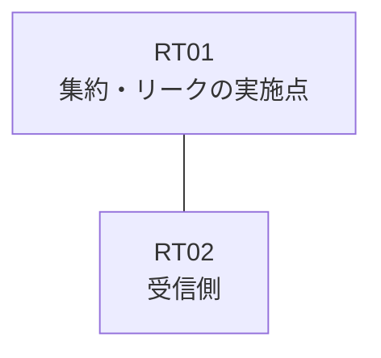

# 問題 20260927-023

> **本問は機器に接続せずに解答すること。追加の show 実行は認めない。**

## 設問

拠点のルータ RT01 は、複数のループバック インターフェイスによって、サービスのためのアドレスのブロック 192.168.37.8/30 を収容しています。RT01 と RT02 は、1本のリンクによって直接に接続されており、そして、EIGRP 65100 が構成されています。運用のためのループバック 10.226.4.97 (/32) は、引き続き受信される、そして、監視のためのホストである 192.168.37.10 (/32) の明細のルートは、集約とともに、受信される、そして、RT02 に対して、ブロック 192.168.37.8/30 は、集約のルートとして広告されるという条件において、正しいものを、下記から選択しなさい。ブロックの内部の明細のルートは、広告されず、ルーティング・プロトコルの種別およびプロセスの配置は、変更されず、ルートの再配送は、いかなる形においても、使用されないものとします。



| 対象 | 内容 |
|------|------|
| RT01 のループバック | 192.168.37.9, 192.168.37.10, 192.168.37.11 |
| RT01 の運用系ループバック | 10.226.4.97 |
| RT01 ⇔ RT02 のリンク | 10.209.184.0/24（RT01=10.209.184.1 / RT02=10.209.184.2・Ethernet0/0） |

```
RT01# show running-config
Building configuration...
!
interface Loopback0
 ip address 192.168.37.9 255.255.255.255
interface Loopback1
 ip address 192.168.37.10 255.255.255.255
interface Loopback2
 ip address 192.168.37.11 255.255.255.255
interface Loopback10
 ip address 10.226.4.97 255.255.255.255
interface Ethernet0/0
 description === to RT02 ===
 ip address 10.209.184.1 255.255.255.252
 ip summary-address eigrp 65100 192.168.37.8 255.255.255.252
!
router eigrp 65100
 network 192.168.37.9 0.0.0.0
 network 192.168.37.10 0.0.0.0
 network 192.168.37.11 0.0.0.0
 network 10.226.4.97 0.0.0.0
 network 10.209.184.0 0.0.0.3
!
ip prefix-list MON32 seq 5 permit 192.168.37.8/30 le 32
ip prefix-list PL-MON seq 5 permit 192.168.37.10/32
access-list 20 permit 192.168.37.10
!
route-map LEAK permit 10
 match ip address prefix-list MON32
route-map RMAP01 permit 10
 match ip address 20
!
```
```
RT02# show ip route eigrp | begin Gateway
Gateway of last resort is not set
      10.0.0.0/32 is subnetted, 1 subnets
D        10.226.4.97 [90/409600] via 10.209.184.1, 00:02:25, Ethernet0/0
      192.168.37.0/30 is subnetted, 1 subnets
D        192.168.37.8 [90/409600] via 10.209.184.1, 00:02:25, Ethernet0/0
```

## 選択肢

A. RT01 において、集約を `ip summary-address eigrp 65100 192.168.37.8 255.255.255.252 leak-map RM-NEW` の形へ構成し直し、RM-NEW は、192.168.37.11/32 を許可するところのプレフィックス・リストに一致させる

B. RT01 において、インターフェイスの集約の構成、および、192.168.37.10 を除くところのブロックのループバックの network のステートメントを削除する。`ip route 192.168.37.8 255.255.255.252 Null0` のスタティック・ルートを作成し、それを EIGRP 65100 へ再配送する

C. RT01 において、ブロックのループバックのすべてを network のステートメントによって EIGRP 65100 へ参加させる。そして、集約を `ip summary-address eigrp 65100 192.168.37.8 255.255.255.252 leak-map RM-NEW` の形へ構成し直し、RM-NEW は、192.168.37.10/32 を許可するところのプレフィックス・リストに一致させる

D. RT01 において、ブロックのループバックの network のステートメントを削除し、それらを `redistribute connected route-map` によって EIGRP 65100 へ注入する。そして、集約を `ip summary-address eigrp 65100 192.168.37.8 255.255.255.252 leak-map RM-NEW` の形へ構成し直し、RM-NEW は、192.168.37.10/32 を許可するところのプレフィックス・リストに一致させる

E. RT01 において、ブロックのループバックのすべてを network のステートメントによって参加させ、そして、集約を `ip summary-address eigrp 65100 192.168.37.8 255.255.255.252` の形(leak-map なし)へ構成し直す
