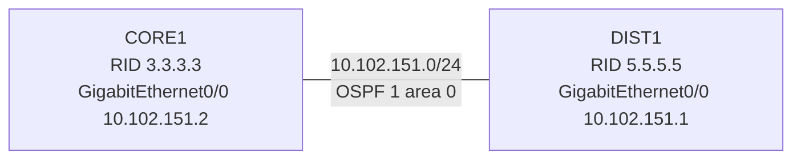

# 問題 20260927-024

> **本問は機器に接続せずに解答すること。追加の show 実行は認めない。**

## シナリオ



CORE1 と DIST1 は GigabitEthernet0/0 同士で直接接続され、OSPF プロセス 1 のエリア 0 で隣接を形成する構成です。 隣接が形成されないため、CORE1 でデバッグを有効にしたところ、次の出力が得られました。

```
CORE1# debug ip ospf adj
*Sep 18 15:44:21.000: OSPF-1 ADJ   Gi0/0: Rcv DBD from 5.5.5.5 seq 0x1C4 opt 0x52 flag 0x7 len 32  mtu 1380 state EXSTART
*Sep 18 15:44:21.000: OSPF-1 ADJ   Gi0/0: Nbr 5.5.5.5 has smaller interface MTU
*Sep 18 15:44:21.000: OSPF-1 ADJ   Gi0/0: NBR Negotiation Done. We are the SLAVE
*Sep 18 15:44:21.000: OSPF-1 ADJ   Gi0/0: Send DBD to 5.5.5.5 seq 0x1C4 opt 0x52 flag 0x2 len 52
*Sep 18 15:44:26.685: OSPF-1 ADJ   Gi0/0: Nbr 5.5.5.5 has smaller interface MTU
*Sep 18 15:44:26.685: OSPF-1 ADJ   Gi0/0: Send DBD to 5.5.5.5 seq 0x1C4 opt 0x52 flag 0x2 len 52
*Sep 18 15:44:31.370: OSPF-1 ADJ   Gi0/0: Nbr 5.5.5.5 has smaller interface MTU
*Sep 18 15:44:31.370: OSPF-1 ADJ   Gi0/0: Send DBD to 5.5.5.5 seq 0x1C4 opt 0x52 flag 0x2 len 52
*Sep 18 15:46:21.440: OSPF-1 ADJ   Gi0/0: Killing nbr 5.5.5.5 due to excessive (25) retransmissions
*Sep 18 15:46:21.440: %OSPF-5-ADJCHG: Process 1, Nbr 5.5.5.5 on GigabitEthernet0/0 from EXCHANGE to DOWN, Neighbor Down: Too many retransmissions

CORE1# show ip ospf neighbor

Neighbor ID     Pri   State           Dead Time   Address         Interface
5.5.5.5           1   EXCHANGE/BDR    00:00:38    10.102.151.1    GigabitEthernet0/0
```

## 設問

この事象を解消するための変更として最も適切なものは、次のうちどれですか。(1つを選択してください)

## 選択肢

A. CORE1 と DIST1 の GigabitEthernet0/0 に ip ospf mtu-ignore を構成する。

B. DIST1 の GigabitEthernet0/0 で ip ospf network point-to-point を構成する。

C. CORE1 と DIST1 の GigabitEthernet0/0 で ip ospf hello-interval を同じ値にそろえる。

D. CORE1 の GigabitEthernet0/0 にだけ ip ospf mtu-ignore を構成する。
