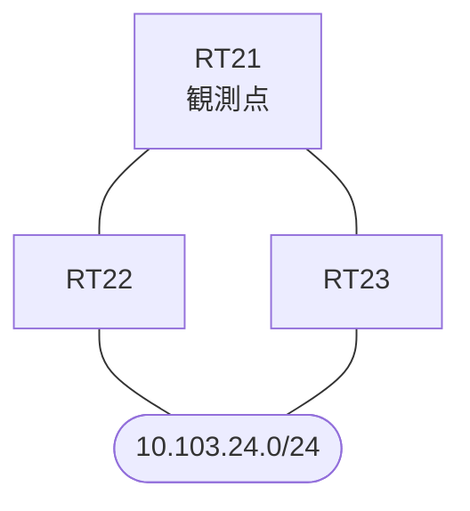

# 問題 20260927-039

> **本問は機器に接続せずに解答すること。追加の show 実行は認めない。**

## シナリオ

あなたの組織は、下記に示されているところのネットワークを運用しています。拠点のルータ RT21 は、複数の隣接するルーターを経由して、10.103.24.0/24 への経路を学習しています。ネットワークは単一の OSPF のドメインとして運用されており、そして、RT21 は当該のプレフィックスを複数の経路によって受け取っています。経路の選好に関する挙動のレビューが、実施されています。RT21 における 10.103.24.0/24 への転送のパスは、運用の設計の意図と一致していなければなりません。構成の変更は、1 箇所に限られなければなりません。既存の隣接関係は、維持される必要があります。管理のための構成に対して、変更が加えられてはなりません。現在の最良の経路のメトリックは、悪化させられてはなりません。



| 対象 | 内容 |
|------|------|
| RT21 ⇔ RT22 | Ethernet0/0・10.229.2.0/24（RT21 側の OSPF のコスト = 20） |
| RT21 ⇔ RT23 | Ethernet0/1・10.229.3.0/24（RT21 側の OSPF のコスト = 5） |
| RT22 における 10.103.24.0/24 | 当該のプレフィックスを持つインタフェースは、エリア 0 に属し、その OSPF のコストは 500 |
| RT23 | エリア 0 と エリア 1 の境界のルータ（ABR）。エリア 1 側にも、同一のプレフィックスが存在する |

## 出力

```
RT21# show ip ospf database summary 10.103.24.0
OSPF Router with ID (1.1.1.1) (Process ID 100)

		Summary Net Link States (Area 0)

  LS age: 824
  Options: (No TOS-capability, DC, Upward)
  LS Type: Summary Links(Network)
  Link State ID: 10.103.24.0 (summary Network Number)
  Advertising Router: 3.3.3.3
  LS Seq Number: 80000008
  Checksum: 0x7827
  Length: 28
  Network Mask: /24
	MTID: 0 	Metric: 5
```
```
RT21# show ip ospf border-routers
OSPF Router with ID (1.1.1.1) (Process ID 100)


		Base Topology (MTID 0)

Internal Router Routing Table
Codes: i - Intra-area route, I - Inter-area route

i 3.3.3.3 [5] via 10.229.3.3, Ethernet0/1, ABR, Area 0, SPF 21
```
```
RT21# show running-config | section router ospf
router ospf 100
 router-id 1.1.1.1
 network 10.229.2.0 0.0.0.255 area 0
 network 10.229.3.0 0.0.0.255 area 0
```
```
RT21# show running-config | section interface
interface Ethernet0/0
 description === to RT22 ===
 ip address 10.229.2.1 255.255.255.0
 ip ospf cost 20
interface Ethernet0/1
 description === to RT23 ===
 ip address 10.229.3.1 255.255.255.0
 ip ospf cost 5
```

## 設問

RT23(10.229.3.3)経由の経路が選好されることが期待されていましたが、そうなっていません。この事象の原因として、最も適切なものは、どれですか。(1つを選択してください)

## 選択肢
A. 当該の経路の隣接関係が確立されていないため

B. 2 つの経路の外部メトリックが同一であり、ASBR までの内部のコスト(forward metric)が大きい側が選好されないため

C. 当該の経路のホップ数が、他方の経路より多いため

D. 当該の経路は外部タイプ 2 として広告されており、外部タイプ 1 の経路に対して、メトリックの比較より前の段で選好されないため

E. 当該の経路はエリア間(inter area)であり、エリア内(intra area)の経路に対して、メトリックの比較より前の段で選好されないため
