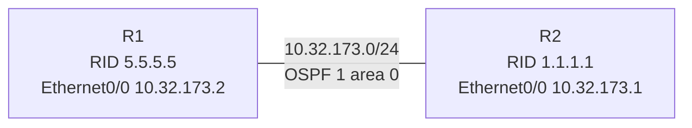

# 問題 20260927-040

> **本問は機器に接続せずに解答すること。追加の show 実行は認めない。**

## シナリオ



R1 と R2 は Ethernet0/0 同士で直接接続され、OSPF プロセス 1 のエリア 0 で隣接を形成する構成です。 隣接が形成されないため、R1 でデバッグを有効にしたところ、次の出力が得られました。

```
R1# debug ip ospf adj
*Sep 18 01:04:10.000: OSPF-1 ADJ   Et0/0: Rcv pkt from 10.32.173.1 : Mismatched Authentication key - ID 1
*Sep 18 01:04:14.548: OSPF-1 HELLO Et0/0: Send hello to 224.0.0.5 area 0 from 10.32.173.2
*Sep 18 01:04:20.370: OSPF-1 ADJ   Et0/0: Rcv pkt from 10.32.173.1 : Mismatched Authentication key - ID 1
```

## 設問

この出力から分かることとして、正しく述べられているものは、次のうちどれですか。(1つを選択してください)

## 選択肢

A. 両方のルータで認証タイプは一致している。

B. エリア ID が一致していない。

C. R2 は鍵 ID 1 を持っていない。

D. R1 は R2 から Hello パケットを受け取れていない。
