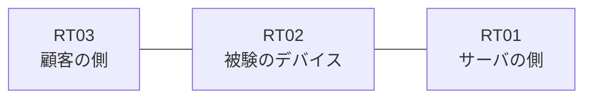

# 問題 20260927-041

> **本問は機器に接続せずに解答すること。追加の show 実行は認めない。**

## トポロジ

あなたは、下記のネットワークの保守を担当する技術者です。ある企業のネットワークにおいて、RT02 は、顧客の側のネットワークと、サーバの側のネットワークとの間に配置されており、IPv6 によって運用されています。



## 要件

1. ルーティング プロトコルの種別およびプロセスの配置は、変更されてはなりません。
2. `2001:DB8:57:5::/64` からの通信は、許可されることはできません。
3. 拒否のエントリを使用してはなりません。
4. RT02 において、`2001:DB8:57:0::/64`、`2001:DB8:57:1::/64`、`2001:DB8:57:2::/64` のネットワークからの通信のみが、`2001:DB8:57:FF::10` の TCP ポート 22 に到達できなければなりません。

## 現在の状態

通信の一部において、想定されていない挙動が、観測されています。あなたは、示されているところの出力および構成に基づいて、その構成が、下記において記述されているとおりに動作していない理由を、判断する必要があります。

観測 | サーバへの到達
--- | ---
送信元が 2001:DB8:57:0::/64 のネットワークにあるホストから、2001:DB8:57:FF::10 の TCP ポート 22 宛ての通信 | 到達可
送信元が 2001:DB8:57:1::/64 のネットワークにあるホストから、2001:DB8:57:FF::10 の TCP ポート 22 宛ての通信 | 到達可
送信元が 2001:DB8:57:2::/64 のネットワークにあるホストから、2001:DB8:57:FF::10 の TCP ポート 22 宛ての通信 | 到達可
送信元が 2001:DB8:57:3::/64 のネットワークにあるホストから、2001:DB8:57:FF::10 の TCP ポート 22 宛ての通信 | 到達可
送信元が 2001:DB8:57:5::/64 のネットワークにあるホストから、2001:DB8:57:FF::10 の TCP ポート 22 宛ての通信 | 到達可
送信元が 2001:DB8:57:FA::/64 のネットワークにあるホストから、2001:DB8:57:FF::10 の TCP ポート 22 宛ての通信 | 到達不可

```
RT02# show ipv6 access-list
IPv6 access list V6-FILTER-IN
    permit ipv6 2001:DB8:57::/61 any sequence 10
```
```
RT02# show ipv6 neighbors
IPv6 Address                              Age Link-layer Addr State Interface
2001:DB8:57:0::3                            0 aabb.cc02.4f00  REACH Et0/0
```

## 設定抜粋

```
RT02# show running-config | section ipv6 access-list|traffic-filter
ipv6 access-list V6-FILTER-IN
 sequence 10 permit ipv6 2001:DB8:57::/61 any
interface Ethernet0/0
 ipv6 traffic-filter V6-FILTER-IN in
```

## 設問

次のうち、正しいものは、どれですか。

## 選択肢
A. ワイルドカードによる指定が受理されず、意図されたエントリが存在していない

B. アクセス・リストが `ip access-group` によって適用されている

C. 末尾に明示の拒否のエントリが記述されているため、近隣探索に対する暗黙の許可が失われ、隣接のアドレスが解決できていない

D. プレフィックスの長さが長く、対象としているネットワークの一部が一致の対象から外れている

E. 空のアクセス・リストが参照されているため、暗黙の拒否によってすべてが破棄されている

F. プレフィックスの長さが短く、対象としていないネットワークまでが一致の対象に含まれている
