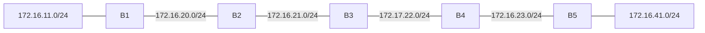

# 問題 20260927-043

> **本問は機器に接続せずに解答すること。追加の show 実行は認めない。**

## シナリオ



B1 から B5 までを直列に接続し、全ルータで EIGRP(AS 1)を動作させています。B1 のルーティング テーブルを確認したところ、B5 の LAN のネットワークが載っていません。

```
リンクとサブネット:
  B1 LAN: 172.16.11.0/24
  B1 — B2: 172.16.20.0/24
  B2 — B3: 172.16.21.0/24
  B3 — B4: 172.17.22.0/24
  B4 — B5: 172.16.23.0/24
  B5 LAN: 172.16.41.0/24

B1# show running-config | section router eigrp
router eigrp 1
 network 172.16.0.0
 network 172.17.0.0
 auto-summary
(他のルータも同じ router eigrp 1 の構成です)
```

## 設問

B1 と B5 の両方のルーティング テーブルに相手の LAN の個別経路が載るようにするには、どのコマンドを使用すればよいですか。(2つを選択してください)

## 選択肢

A. B2(config-router)# no auto-summary

B. B3(config-router)# no auto-summary

C. B1(config-router)# no auto-summary

D. B5(config-router)# no auto-summary

E. B4(config-router)# no auto-summary
