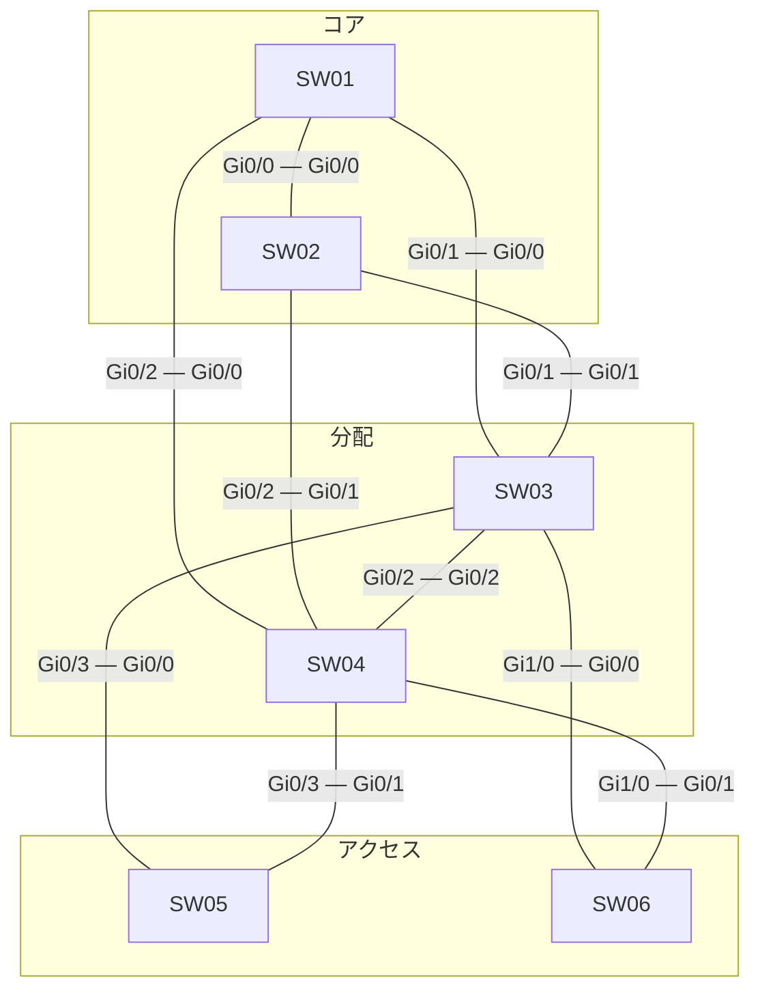

# 問題 20260927-059

> **本問は機器に接続せずに解答すること。追加の show 実行は認めない。**

## シナリオ



| スイッチ | 役割 | ブリッジ プライオリティ(VLAN 200) | MAC アドレス |
|---|---|---|---|
| SW01 | コア CR1 | 32768 | 0019.e8e9.d117 |
| SW02 | コア CR2 | 32768 | 5c50.1519.a1c0 |
| SW03 | 分配 DS1 | 32768 | a0cf.5b61.567e |
| SW04 | 分配 DS2 | 32768 | 0019.e89d.4569 |
| SW05 | アクセス AS1 | 32768 | 7c21.0ed7.f5ac |
| SW06 | アクセス AS2 | 36864 | 0023.04c3.7f11 |

既定値から変更している設定は次のとおりです。

```
SW04(config)# interface Gi1/0
SW04(config-if)# spanning-tree vlan 200 cost 19
```

全スイッチで Rapid PVST+ を使用し、パス コストはショート方式にそろえています。スイッチ間のリンクはすべて 1 Gbps・全二重のトランクで、VLAN 200 を通します。ポート ID はポート プライオリティ(既定 128)とポート番号で構成します。記載のない設定は既定値です。

## 設問

VLAN 200 について、次の表の各ポートの役割として正しいものを選択肢から選んでください。**①〜⑳ のすべてを正しく選んだ場合にのみ得点**になります。

### ポートの一覧(VLAN 200)

| スイッチ | ポート | ポート番号 | 接続先 | 役割 |
|---|---|---|---|---|
| SW01 | Gi0/0 | 1 | SW02 Gi0/0 | ［①］ |
| SW01 | Gi0/1 | 2 | SW03 Gi0/0 | ［②］ |
| SW01 | Gi0/2 | 3 | SW04 Gi0/0 | ［③］ |
| SW02 | Gi0/0 | 1 | SW01 Gi0/0 | ［④］ |
| SW02 | Gi0/1 | 2 | SW03 Gi0/1 | ［⑤］ |
| SW02 | Gi0/2 | 3 | SW04 Gi0/1 | ［⑥］ |
| SW03 | Gi0/0 | 1 | SW01 Gi0/1 | ［⑦］ |
| SW03 | Gi0/1 | 2 | SW02 Gi0/1 | ［⑧］ |
| SW03 | Gi0/2 | 3 | SW04 Gi0/2 | ［⑨］ |
| SW03 | Gi0/3 | 4 | SW05 Gi0/0 | ［⑩］ |
| SW03 | Gi1/0 | 5 | SW06 Gi0/0 | ［⑪］ |
| SW04 | Gi0/0 | 1 | SW01 Gi0/2 | ［⑫］ |
| SW04 | Gi0/1 | 2 | SW02 Gi0/2 | ［⑬］ |
| SW04 | Gi0/2 | 3 | SW03 Gi0/2 | ［⑭］ |
| SW04 | Gi0/3 | 4 | SW05 Gi0/1 | ［⑮］ |
| SW04 | Gi1/0 | 5 | SW06 Gi0/1 | ［⑯］ |
| SW05 | Gi0/0 | 1 | SW03 Gi0/3 | ［⑰］ |
| SW05 | Gi0/1 | 2 | SW04 Gi0/3 | ［⑱］ |
| SW06 | Gi0/0 | 1 | SW03 Gi1/0 | ［⑲］ |
| SW06 | Gi0/1 | 2 | SW04 Gi1/0 | ［⑳］ |

## 選択肢

A. ルート ポート

B. 指定ポート

C. 代替ポート

D. バックアップ ポート
