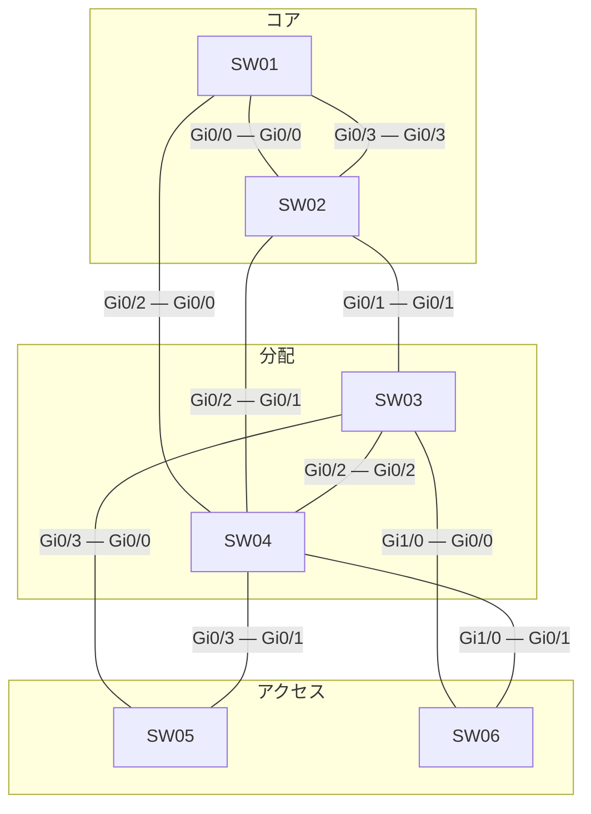

# 問題 20260927-063

> **本問は機器に接続せずに解答すること。追加の show 実行は認めない。**

## シナリオ



| スイッチ | 役割 | ブリッジ プライオリティ(VLAN 40) | ブリッジ プライオリティ(VLAN 20) | MAC アドレス |
|---|---|---|---|---|
| SW01 | コア CR1 | 8192 | 8192 | 0019.e8cc.d3d3 |
| SW02 | コア CR2 | 4096 | 28672 | 5c50.1520.c141 |
| SW03 | 分配 DS1 | 32768 | 32768 | 001a.a14f.9560 |
| SW04 | 分配 DS2 | 36864 | 8192 | a0cf.5b5f.2a10 |
| SW05 | アクセス AS1 | 32768 | 32768 | 0023.04d4.ebd3 |
| SW06 | アクセス AS2 | 32768 | 32768 | 001a.a134.5876 |

スパニング ツリーで既定値から変更している設定は次のとおりです。

```
SW04(config)# interface Gi0/2
SW04(config-if)# spanning-tree vlan 40 cost 100000
```

全スイッチで Rapid PVST+ を使用し、パス コストはロング方式にそろえています。スイッチ間のリンクはすべて 1 Gbps・全二重のトランクで、VLAN 40・VLAN 20 を通します。ポート ID はポート プライオリティ(既定 128)とポート番号で構成します。

SW03・SW04 は VLAN 40・VLAN 20 の SVI を持ち、HSRP で既定ゲートウェイを冗長化しています。コアは L2 の中継だけを行います。アクセスのスイッチはルーティングしません。

```
SW03(config)# ip routing
SW03(config)# interface Vlan40
SW03(config-if)# ip address 10.174.40.3 255.255.255.0
SW03(config-if)# standby version 2
SW03(config-if)# standby 40 ip 10.174.40.254
SW03(config-if)# standby 40 priority 90
SW03(config-if)# ip access-group SVI40-IN in
SW03(config)# interface Vlan20
SW03(config-if)# ip address 10.174.20.3 255.255.255.0
SW03(config-if)# standby version 2
SW03(config-if)# standby 20 ip 10.174.20.254
SW03(config-if)# standby 20 priority 120
SW03(config-if)# standby 20 preempt
SW03(config)# ip access-list extended SVI40-IN
SW03(config-ext-nacl)# deny icmp any any echo-reply
SW03(config-ext-nacl)# permit ip any any
```

```
SW04(config)# ip routing
SW04(config)# interface Vlan40
SW04(config-if)# ip address 10.174.40.4 255.255.255.0
SW04(config-if)# standby version 2
SW04(config-if)# standby 40 ip 10.174.40.254
SW04(config-if)# standby 40 priority 105
SW04(config)# interface Vlan20
SW04(config-if)# ip address 10.174.20.4 255.255.255.0
SW04(config-if)# standby version 2
SW04(config-if)# standby 20 ip 10.174.20.254
```

| 端末 | VLAN | 接続先 | IP アドレス | 既定ゲートウェイ |
|---|---|---|---|---|
| PC-A | 40 | SW06 | 10.174.40.101/24 | 10.174.40.254 |
| PC-B | 20 | SW05 | 10.174.20.102/24 | 10.174.20.254 |

SW03・SW04 は同時に起動し、その後は構成の変更も障害もありません。
ARP と MAC アドレスの学習は完了しているものとします。

## 設問

PC-A から PC-B へ ping を 1 回実行します。エコー要求(往路)とエコー応答(復路)が通るスイッチを、PC 側のアクセス スイッチから順に選んでください。同じスイッチを 2 回通るときはその都度記入し、経路が終わったら残りの欄は「—(ここで終わり)」を選びます。あわせて、往路と復路をそれぞれルーティングする機器を選んでください。さらに ping の結果と、破棄される場合はそれを破棄する機器(成功する場合は「—」)を選んでください。往路・復路の経路は ACL に関係なく転送の仕組みで決まる経路を答えます(破棄される場合も、破棄されなかったとした経路)。**①〜⑯ のすべてを正しく選んだ場合にのみ得点**になります。

### 解答の表

| 項目 | 1 | 2 | 3 | 4 | 5 | 6 |
|---|---|---|---|---|---|---|
| 往路 | ［①］ | ［②］ | ［③］ | ［④］ | ［⑤］ | ［⑥］ |
| 復路 | ［⑦］ | ［⑧］ | ［⑨］ | ［⑩］ | ［⑪］ | ［⑫］ |

| 項目 | 選択 |
|---|---|
| 往路でルーティングする機器 | ［⑬］ |
| 復路でルーティングする機器 | ［⑭］ |
| ping の結果 | ［⑮］ |
| 破棄する機器 | ［⑯］ |

## 選択肢

A. SW01

B. SW02

C. SW03

D. SW04

E. SW05

F. SW06

G. —(ここで終わり)

H. 成功する

I. 往路(エコー要求)が破棄される

J. 復路(エコー応答)が破棄される
