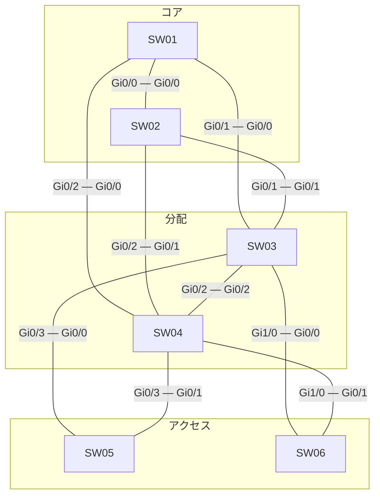

# 問題 20260927-064

> **本問は機器に接続せずに解答すること。追加の show 実行は認めない。**

## シナリオ



| スイッチ | 役割 | ブリッジ プライオリティ(VLAN 110) | ブリッジ プライオリティ(VLAN 10) | MAC アドレス |
|---|---|---|---|---|
| SW01 | コア CR1 | 32768 | 36864 | 0019.e824.c9f7 |
| SW02 | コア CR2 | 32768 | 28672 | 7c21.0ef1.3fee |
| SW03 | 分配 DS1 | 28672 | 32768 | 001a.a12d.d6ee |
| SW04 | 分配 DS2 | 32768 | 28672 | 0019.e891.145b |
| SW05 | アクセス AS1 | 36864 | 4096 | 7c21.0e36.9fcd |
| SW06 | アクセス AS2 | 32768 | 8192 | 0023.0442.8cb1 |

スパニング ツリーで既定値から変更している設定は次のとおりです。

```
SW01(config)# interface Gi0/2
SW01(config-if)# spanning-tree vlan 110 cost 19
```

全スイッチで Rapid PVST+ を使用し、パス コストはショート方式にそろえています。スイッチ間のリンクはすべて 1 Gbps・全二重のトランクで、VLAN 110・VLAN 10 を通します。ポート ID はポート プライオリティ(既定 128)とポート番号で構成します。

SW03・SW04 は VLAN 110・VLAN 10 の SVI を持ち、HSRP で既定ゲートウェイを冗長化しています。コアは L2 の中継だけを行います。アクセスのスイッチはルーティングしません。

```
SW03(config)# ip routing
SW03(config)# interface Vlan110
SW03(config-if)# ip address 10.161.110.3 255.255.255.0
SW03(config-if)# standby version 2
SW03(config-if)# standby 110 ip 10.161.110.254
SW03(config)# interface Vlan10
SW03(config-if)# ip address 10.161.10.3 255.255.255.0
SW03(config-if)# standby version 2
SW03(config-if)# standby 10 ip 10.161.10.254
SW03(config-if)# standby 10 priority 110
```

```
SW04(config)# ip routing
SW04(config)# interface Vlan110
SW04(config-if)# ip address 10.161.110.4 255.255.255.0
SW04(config-if)# standby version 2
SW04(config-if)# standby 110 ip 10.161.110.254
SW04(config-if)# standby 110 priority 90
SW04(config)# interface Vlan10
SW04(config-if)# ip address 10.161.10.4 255.255.255.0
SW04(config-if)# standby version 2
SW04(config-if)# standby 10 ip 10.161.10.254
SW04(config-if)# standby 10 priority 105
SW04(config-if)# standby 10 preempt
```

| 端末 | VLAN | 接続先 | IP アドレス | 既定ゲートウェイ |
|---|---|---|---|---|
| PC-A | 110 | SW05 | 10.161.110.101/24 | 10.161.110.254 |
| PC-B | 10 | SW05 | 10.161.10.102/24 | 10.161.10.254 |

SW03・SW04 は同時に起動し、その後は構成の変更も障害もありません。
ARP と MAC アドレスの学習は完了しているものとします。

## 設問

PC-A から PC-B へ ping を 1 回実行します。エコー要求(往路)とエコー応答(復路)が通るスイッチを、PC 側のアクセス スイッチから順に選んでください。同じスイッチを 2 回通るときはその都度記入し、経路が終わったら残りの欄は「—(ここで終わり)」を選びます。あわせて、往路と復路をそれぞれルーティングする機器を選んでください。**①〜⑩ のすべてを正しく選んだ場合にのみ得点**になります。

### 解答の表

| 項目 | 1 | 2 | 3 | 4 |
|---|---|---|---|---|
| 往路 | ［①］ | ［②］ | ［③］ | ［④］ |
| 復路 | ［⑤］ | ［⑥］ | ［⑦］ | ［⑧］ |

| 項目 | 選択 |
|---|---|
| 往路でルーティングする機器 | ［⑨］ |
| 復路でルーティングする機器 | ［⑩］ |

## 選択肢

A. SW01

B. SW02

C. SW03

D. SW04

E. SW05

F. SW06

G. —(ここで終わり)
