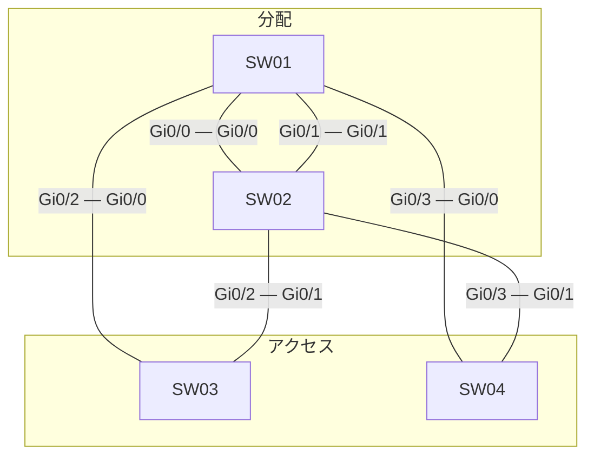

# 問題 20260927-065

> **本問は機器に接続せずに解答すること。追加の show 実行は認めない。**

## シナリオ



| スイッチ | 役割 | ブリッジ プライオリティ(VLAN 10) | ブリッジ プライオリティ(VLAN 30) | MAC アドレス |
|---|---|---|---|---|
| SW01 | 分配 DS1 | 32768 | 8192 | 0023.04cc.15cc |
| SW02 | 分配 DS2 | 24576 | 8192 | 5c50.15ae.22ee |
| SW03 | アクセス AS1 | 32768 | 36864 | 0019.e8fd.7e9c |
| SW04 | アクセス AS2 | 32768 | 32768 | 5c50.1539.2198 |

全スイッチで Rapid PVST+ を使用し、パス コストはショート方式にそろえています。スイッチ間のリンクはすべて 1 Gbps・全二重のトランクで、VLAN 10・VLAN 30 を通します。ポート ID はポート プライオリティ(既定 128)とポート番号で構成します。

SW01・SW02 は VLAN 10・VLAN 30 の SVI を持ち、HSRP で既定ゲートウェイを冗長化しています。アクセスのスイッチはルーティングしません。

```
SW01(config)# ip routing
SW01(config)# interface Vlan10
SW01(config-if)# ip address 10.135.10.1 255.255.255.0
SW01(config-if)# standby version 2
SW01(config-if)# standby 10 ip 10.135.10.254
SW01(config-if)# standby 10 priority 105
SW01(config-if)# standby 10 preempt
SW01(config)# interface Vlan30
SW01(config-if)# ip address 10.135.30.1 255.255.255.0
SW01(config-if)# standby version 2
SW01(config-if)# standby 30 ip 10.135.30.254
SW01(config-if)# standby 30 priority 110
```

```
SW02(config)# ip routing
SW02(config)# interface Vlan10
SW02(config-if)# ip address 10.135.10.2 255.255.255.0
SW02(config-if)# standby version 2
SW02(config-if)# standby 10 ip 10.135.10.254
SW02(config-if)# standby 10 priority 120
SW02(config)# interface Vlan30
SW02(config-if)# ip address 10.135.30.2 255.255.255.0
SW02(config-if)# standby version 2
SW02(config-if)# standby 30 ip 10.135.30.254
SW02(config-if)# standby 30 preempt
```

| 端末 | VLAN | 接続先 | IP アドレス | 既定ゲートウェイ |
|---|---|---|---|---|
| PC-A | 10 | SW04 | 10.135.10.101/24 | 10.135.10.254 |
| PC-B | 30 | SW03 | 10.135.30.102/24 | 10.135.30.254 |

SW01・SW02 は同時に起動し、その後は構成の変更も障害もありません。
ARP と MAC アドレスの学習は完了しているものとします。

## 設問

PC-A から PC-B へ ping を 1 回実行します。エコー要求(往路)とエコー応答(復路)が通るスイッチを、PC 側のアクセス スイッチから順に選んでください。同じスイッチを 2 回通るときはその都度記入し、経路が終わったら残りの欄は「—(ここで終わり)」を選びます。あわせて、往路と復路をそれぞれルーティングする機器を選んでください。**①〜⑫ のすべてを正しく選んだ場合にのみ得点**になります。

### 解答の表

| 項目 | 1 | 2 | 3 | 4 | 5 |
|---|---|---|---|---|---|
| 往路 | ［①］ | ［②］ | ［③］ | ［④］ | ［⑤］ |
| 復路 | ［⑥］ | ［⑦］ | ［⑧］ | ［⑨］ | ［⑩］ |

| 項目 | 選択 |
|---|---|
| 往路でルーティングする機器 | ［⑪］ |
| 復路でルーティングする機器 | ［⑫］ |

## 選択肢

A. SW01

B. SW02

C. SW03

D. SW04

E. —(ここで終わり)
