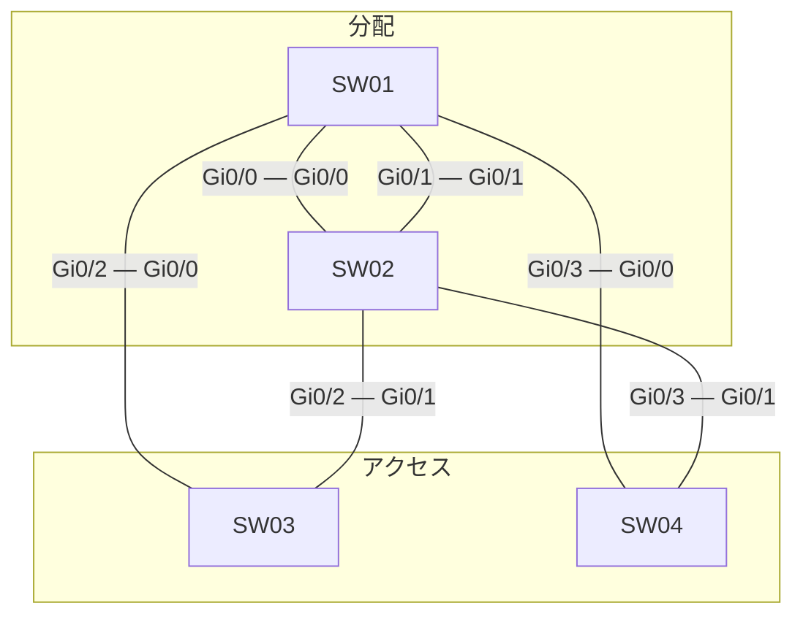

# 問題 20260927-066

> **本問は機器に接続せずに解答すること。追加の show 実行は認めない。**

## シナリオ



| スイッチ | 役割 | ブリッジ プライオリティ(VLAN 120) | ブリッジ プライオリティ(VLAN 110) | MAC アドレス |
|---|---|---|---|---|
| SW01 | 分配 DS1 | 32768 | 32768 | 0023.0450.216a |
| SW02 | 分配 DS2 | 32768 | 32768 | 5c50.15fe.8da1 |
| SW03 | アクセス AS1 | 32768 | 32768 | 0019.e89f.a1e0 |
| SW04 | アクセス AS2 | 32768 | 32768 | a0cf.5b95.6b47 |

スパニング ツリーで既定値から変更している設定は次のとおりです。

```
SW02(config)# interface Gi0/1
SW02(config-if)# spanning-tree vlan 120 port-priority 96
```

全スイッチで Rapid PVST+ を使用し、パス コストはロング方式にそろえています。スイッチ間のリンクはすべて 1 Gbps・全二重のトランクで、VLAN 120・VLAN 110 を通します。ポート ID はポート プライオリティ(既定 128)とポート番号で構成します。

SW01・SW02 は VLAN 120・VLAN 110 の SVI を持ち、HSRP で既定ゲートウェイを冗長化しています。アクセスのスイッチはルーティングしません。

```
SW01(config)# ip routing
SW01(config)# interface Vlan120
SW01(config-if)# ip address 10.162.120.1 255.255.255.0
SW01(config-if)# standby version 2
SW01(config-if)# standby 120 ip 10.162.120.254
SW01(config)# interface Vlan110
SW01(config-if)# ip address 10.162.110.1 255.255.255.0
SW01(config-if)# standby version 2
SW01(config-if)# standby 110 ip 10.162.110.254
SW01(config-if)# standby 110 preempt
SW01(config-if)# ip access-group SVI110-IN in
SW01(config)# ip access-list extended SVI110-IN
SW01(config-ext-nacl)# permit icmp 10.162.120.0 0.0.0.255 any
SW01(config-ext-nacl)# permit icmp 10.162.110.0 0.0.0.255 any
```

```
SW02(config)# ip routing
SW02(config)# interface Vlan120
SW02(config-if)# ip address 10.162.120.2 255.255.255.0
SW02(config-if)# standby version 2
SW02(config-if)# standby 120 ip 10.162.120.254
SW02(config-if)# standby 120 priority 120
SW02(config-if)# ip access-group SVI120-IN in
SW02(config)# interface Vlan110
SW02(config-if)# ip address 10.162.110.2 255.255.255.0
SW02(config-if)# standby version 2
SW02(config-if)# standby 110 ip 10.162.110.254
SW02(config-if)# standby 110 priority 110
SW02(config-if)# ip access-group SVI110-IN in
SW02(config)# ip access-list extended SVI120-IN
SW02(config-ext-nacl)# deny icmp host 10.162.120.101 host 10.162.110.102 echo
SW02(config-ext-nacl)# permit ip any any
SW02(config)# ip access-list extended SVI110-IN
SW02(config-ext-nacl)# deny icmp any any echo-reply
SW02(config-ext-nacl)# permit ip any any
```

| 端末 | VLAN | 接続先 | IP アドレス | 既定ゲートウェイ |
|---|---|---|---|---|
| PC-A | 120 | SW03 | 10.162.120.101/24 | 10.162.120.254 |
| PC-B | 110 | SW03 | 10.162.110.102/24 | 10.162.110.254 |

SW01・SW02 は同時に起動し、その後は構成の変更も障害もありません。
ARP と MAC アドレスの学習は完了しているものとします。

## 設問

PC-A から PC-B へ ping を 1 回実行します。エコー要求(往路)とエコー応答(復路)が通るスイッチを、PC 側のアクセス スイッチから順に選んでください。同じスイッチを 2 回通るときはその都度記入し、経路が終わったら残りの欄は「—(ここで終わり)」を選びます。あわせて、往路と復路をそれぞれルーティングする機器を選んでください。さらに ping の結果と、破棄される場合はそれを破棄する機器(成功する場合は「—」)を選んでください。往路・復路の経路は ACL に関係なく転送の仕組みで決まる経路を答えます(破棄される場合も、破棄されなかったとした経路)。**①〜⑫ のすべてを正しく選んだ場合にのみ得点**になります。

### 解答の表

| 項目 | 1 | 2 | 3 | 4 |
|---|---|---|---|---|
| 往路 | ［①］ | ［②］ | ［③］ | ［④］ |
| 復路 | ［⑤］ | ［⑥］ | ［⑦］ | ［⑧］ |

| 項目 | 選択 |
|---|---|
| 往路でルーティングする機器 | ［⑨］ |
| 復路でルーティングする機器 | ［⑩］ |
| ping の結果 | ［⑪］ |
| 破棄する機器 | ［⑫］ |

## 選択肢

A. SW01

B. SW02

C. SW03

D. SW04

E. —(ここで終わり)

F. 成功する

G. 往路(エコー要求)が破棄される

H. 復路(エコー応答)が破棄される
