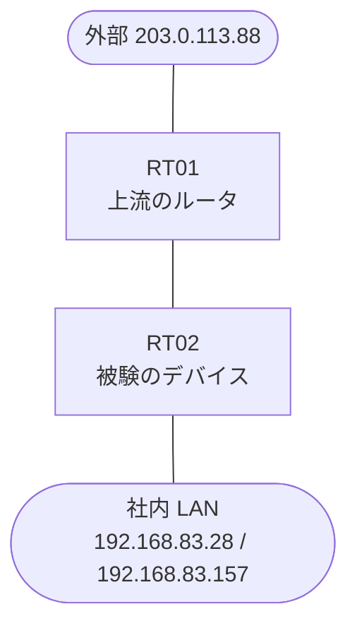

# 問題 20260929-001

> **本問は機器に接続せずに解答すること。追加の show 実行は認めない。**

## 設問

あなたの会社の拠点のルータ RT02 は、上流のルータ RT01 を経由して、外部のネットワークへ接続されています。社内の LAN には、管理のステーション 192.168.83.28 およびサーバ 192.168.83.157 が存在し、そして、RT02 と RT01 の間では、ルーティング・プロトコルの隣接関係が確立されています。RT02 には、コントロール・プレーンを保護するためのサービス・ポリシーが、構成されています。インタフェースの IP アドレッシングは、変更されず、ルータを通過するところのトラフィックの転送に、影響が与えられず、運用のために必要とされる、ルーターへの管理のアクセス、および、ルーティング・プロトコルの隣接関係は、影響を受けないものとします。ルーター自身に宛てられたトラフィックの保護は、control-plane の input のサービス ポリシーによって、実装される、かつ、攻撃元 203.0.113.88 からの、ルータ自身に宛てられた ICMP は、レートに関わらず、完全に破棄される、かつ、監視のためのホスト 192.168.83.28 からの ping による死活監視は、安定して維持されるという条件において、示されているところの構成の挙動に関する記述として、正しいものは、どれとどれですか。(2つを選択してください)



| 対象 | 内容 |
|------|------|
| RT02 ⇔ RT01（外部側） | Ethernet0/0・10.211.143.0/30（RT02=10.211.143.1 / RT01=10.211.143.2） |
| RT02 ⇔ 社内 LAN | Ethernet0/1・192.168.83.0/24（RT02=192.168.83.1） |
| 管理のステーション（NMS） | 192.168.83.28（SSH / ping の発信元） |
| サーバ | 192.168.83.157 |
| 外部の発信元 | 203.0.113.88 |

```
RT02# show access-lists
Extended IP access list 130
    10 permit icmp any any
```
```
RT02# show running-config | section interface
interface Ethernet0/0
 description === to RT01 ===
 ip address 10.211.143.1 255.255.255.252
interface Ethernet0/1
 ip address 192.168.83.1 255.255.255.0
```
```
RT02# show running-config | section control-plane
control-plane
 service-policy input PM-COPP
```
```
RT02# show running-config | section line
line con 0
 logging synchronous
line vty 0 4
 login local
 transport input ssh
```
```
RT02# show policy-map control-plane
Control Plane 

  Service-policy input: PM-COPP

    Class-map: CM-ICMP-LIMIT (match-all)  
      Match: access-group 131
      police:
          cir 8000 bps, bc 1500 bytes
        conformed 0 packets, 0 bytes; actions:
          transmit 
        exceeded 0 packets, 0 bytes; actions:
          drop 
        conformed 0000 bps, exceeded 0000 bps

    Class-map: class-default (match-any)  
      Match: any
```

## 選択肢

A. ポリサは、毎秒 8000 パケットまでを適合として扱う

B. class-default に一致するトラフィックは、帯域の制限を受ける

C. 192.168.83.157 に宛てられ、RT02 を通過するところの ICMP は、ポリシーによる制限を受けない

D. 192.168.83.28 からの SSH のパケットが、police によって破棄されることはない

E. class CM-ICMP-LIMIT のカウンタは、着信の ICMP によって増加する

F. 発信元 203.0.113.88 からの、ルータ自身に宛てられた ICMP は、帯域が制限され、そして、超過する分は破棄される
