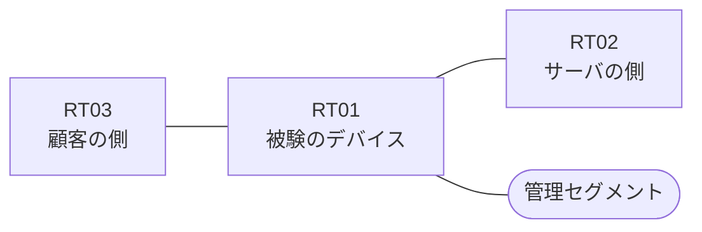

# 問題 20260929-002

> **本問は機器に接続せずに解答すること。追加の show 実行は認めない。**

## トポロジ

あなたの組織は、下記に示されているところのネットワークを運用しています。ある企業のネットワークにおいて、RT01 は、顧客の側のネットワークと、サーバの側のネットワークとの間に、配置されています。

| 区間 | 被験デバイス側のインターフェイス | ネットワーク |
|------|----------------------------------|--------------|
| RT03（顧客の側） ⇔ RT01 | `Ethernet2/0` | 10.146.253.0/24 |
| RT01 ⇔ RT02（サーバの側） | `Ethernet2/1` | 10.146.254.0/24 |
| RT01 ⇔ 管理セグメント | `Ethernet2/2` | 10.146.255.0/24 |

## 要件

1. `10.146.50.0/24` からの通信は、許可されてはなりません。
2. `10.146.51.0/24` からの通信は、許可されてはなりません。
3. アクセス リストのエントリは、1行で構成される必要があります。
4. RT01 において、`10.146.48.0/24`、`10.146.49.0/24`、`10.146.52.0/24`、`10.146.53.0/24` のネットワークからの通信のみが、サーバである `172.24.90.63` の TCP ポート 22 に到達できなければなりません。
5. ルーティング プロトコルの種別およびプロセスの配置は、変更されることはできません。
6. アクセス・リストは、顧客の側のインターフェイスである `Ethernet2/0` において、着信の方向に適用されなければなりません。
7. 当該のサーバの他のポートへの通信、および当該のサーバ以外の宛先への通信は、許可されてはなりません。

## 現在の状態

要求されているところの動作が、得られていない、ということが、報告されています。原因として、**アクセス・リストが、顧客の側ではなくサーバの側のインターフェイスに、着信の方向で適用されている** と **戻りの通信を許可するアクセス・リストに、established のキーワードを伴うエントリが存在しない** と **established のキーワードが、戻りの側ではなく、通信を開始する側のアクセス・リストに記述されている** の 3 つが、想定されています。機器の構成は、まだ取得されていません。

観測 | サーバへの到達
--- | ---
送信元が 10.146.48.0/24 のネットワークにあるホストから、172.24.90.63 の TCP ポート 22 宛ての通信 | 到達不可
送信元が 10.146.49.0/24 のネットワークにあるホストから、172.24.90.63 の TCP ポート 22 宛ての通信 | 到達不可
送信元が 10.146.52.0/24 のネットワークにあるホストから、172.24.90.63 の TCP ポート 22 宛ての通信 | 到達不可
送信元が 10.146.53.0/24 のネットワークにあるホストから、172.24.90.63 の TCP ポート 22 宛ての通信 | 到達不可
送信元が 10.146.50.0/24 のネットワークにあるホストから、172.24.90.63 の TCP ポート 22 宛ての通信 | 到達不可
送信元が 10.146.51.0/24 のネットワークにあるホストから、172.24.90.63 の TCP ポート 22 宛ての通信 | 到達不可
送信元が 10.146.250.0/24 のネットワークにあるホストから、172.24.90.63 の TCP ポート 22 宛ての通信 | 到達不可
送信元が 10.146.48.0/24 のネットワークにあるホストから、172.24.90.63 の TCP ポート 25 宛ての通信 | 到達不可
送信元が 10.146.48.0/24 のネットワークにあるホストから、172.24.90.130 の TCP ポート 22 宛ての通信 | 到達不可

## 設問

この事象の原因を特定するために、次に取得するべき出力として、最も多くの候補を除外できるものは、どれですか。(1つを選択してください)

## 選択肢
A. RT01 における `show ip access-lists`

B. RT01 における `show interfaces Ethernet2/0 | include packets`

C. RT01 における `show ip route`

D. RT01 における `show ip interface Ethernet2/0 | include access list`

E. RT01 における `show running-config | section ^interface`
