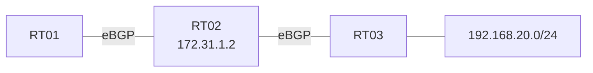

# 問題 20260929-009

> **本問は機器に接続せずに解答すること。追加の show 実行は認めない。**

## シナリオ



RT01 は eBGPによって 192.168.20.0/24 の正しい経路(next-hop 172.31.1.2)を学習していますが、PC から 192.168.20.0/24 への ping が失敗します。

```
RT01# show ip route 192.168.20.0
Routing entry for 192.168.20.0/24
  Known via "static", distance 1, metric 0
  Routing Descriptor Blocks:
  * 172.31.9.9
      Route metric is 0, traffic share count is 1

RT01# show running-config | include ip route
ip route 192.168.20.0 255.255.255.0 172.31.9.9

RT01# show ip bgp 192.168.20.0 | include from
  172.31.1.2 from 172.31.1.2 (RT02)
```

## 設問

RT01 で ping を成功させることができる設定はどれですか。なお、eBGP の設定は変更しません。(1つを選択してください)

## 選択肢

**A.**

```
ip route 192.168.20.0 255.255.255.0 172.31.9.9 5
```

**B.**

```
ip route 192.168.20.0 255.255.255.0 172.31.9.9 10
```

**C.**

```
no ip route 192.168.20.0 255.255.255.0 172.31.9.9
ip route 192.168.20.0 255.255.255.0 172.31.9.18
```

**D.**

```
ip route 192.168.20.0 255.255.255.0 172.31.9.9 30
```
