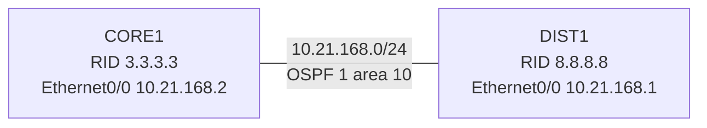

# 問題 20260929-016

> **本問は機器に接続せずに解答すること。追加の show 実行は認めない。**

## シナリオ



CORE1 と DIST1 は Ethernet0/0 同士で直接接続され、OSPF プロセス 1 のエリア 10 で隣接を形成する構成です。 隣接が形成されないため、CORE1 でデバッグを有効にしたところ、次の出力が得られました。

```
CORE1# debug ip ospf hello
*Sep 18 12:16:04.000: OSPF-1 HELLO Et0/0: Rcv hello from 8.8.8.8 area 10 10.21.168.1
*Sep 18 12:16:04.000: OSPF-1 HELLO Et0/0: Hello from 10.21.168.1 with mismatched Stub/Transit area option bit
*Sep 18 12:16:14.370: OSPF-1 HELLO Et0/0: Rcv hello from 8.8.8.8 area 10 10.21.168.1
*Sep 18 12:16:14.370: OSPF-1 HELLO Et0/0: Hello from 10.21.168.1 with mismatched Stub/Transit area option bit
```

## 設問

この事象の原因として最も適切なものは、次のうちどれですか。(1つを選択してください)

## 選択肢

A. CORE1 と DIST1 で、エリアを stub にする設定が片方にしか無い。

B. CORE1 と DIST1 で、リンクを所属させているエリア ID が一致していない。

C. CORE1 が送信する Hello が DIST1 に届いていない(片方向の通信になっている)。

D. CORE1 と DIST1 で OSPF の認証タイプが一致していない。
