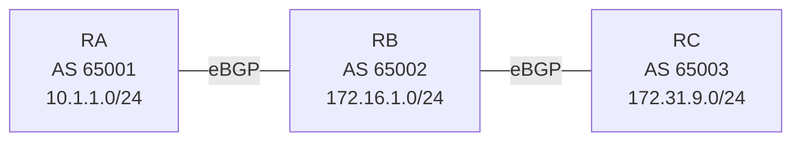

# 問題 20260929-017

> **本問は機器に接続せずに解答すること。追加の show 実行は認めない。**

## シナリオ



RA(AS 65001)- RB(AS 65002)- RC(AS 65003)の順に eBGP で接続されています。RA は 10.1.1.0/24、RB は 172.16.1.0/24、RC は 172.31.9.0/24 を広告しています。AS 65002 を非トランジット AS にしようとしましたが、AS 65001 と AS 65003 がそれぞれの経路を交換しています。

```
RA# show ip bgp | begin Network
     Network          Next Hop            Metric LocPrf Weight Path
 *>  10.1.1.0/24      0.0.0.0                  0         32768 i
 *>  172.16.1.0/24    10.255.0.2               0             0 65002 i
 *>  172.31.9.0/24    10.255.0.2                             0 65002 65003 i

【RB に追加する設定】
RB(config)# 【?】
RB(config)# router bgp 65002
RB(config-router)# neighbor 10.255.0.1 distribute-list 30 out
RB(config-router)# neighbor 10.255.0.6 distribute-list 10 out
```

## 設問

AS 65001 に AS 65003 の経路、AS 65003 に AS 65001 の経路が届かないようにするために RB で必要な【?】に当てはまる設定はどれですか。なお、RA と RC は AS 65002 の経路を動的に学習する必要があり、RB は AS 65001 と AS 65003 の経路を動的に学習する必要があります。(1つを選択してください)

## 選択肢

**A.**

```
access-list 30 deny 10.1.1.0 0.0.0.255
access-list 30 permit any
access-list 10 deny 172.31.9.0 0.0.0.255
access-list 10 permit any
```

**B.**

```
access-list 30 deny 172.31.9.0 0.0.0.255
access-list 30 permit any
access-list 10 deny 10.1.1.0 0.0.0.255
access-list 10 permit any
```

**C.**

```
access-list 30 permit 172.31.9.0 0.0.0.255
access-list 30 deny any
access-list 10 permit 10.1.1.0 0.0.0.255
access-list 10 deny any
```

**D.**

```
access-list 35 deny 172.31.9.0 0.0.0.255
access-list 35 permit any
access-list 15 deny 10.1.1.0 0.0.0.255
access-list 15 permit any
```
