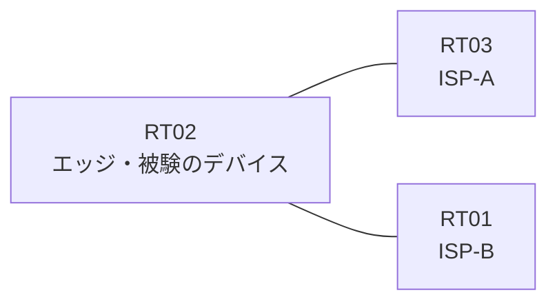

# 問題 20260930-001

> **本問は機器に接続せずに解答すること。追加の show 実行は認めない。**

## 設問

あなたの会社のエッジのルータは、2つのアップリンクによって、2つのサービス プロバイダへ接続されている、というものです。顧客のネットワーク 192.168.73.0/24 および 192.168.146.0/24 は、それぞれのプロバイダを経由して、広告されています。着信のインターフェイスと一致しない送信元を持つところのトラフィックは、破棄される、そして、検証に対する例外は、当該のネットワークの単位で、アクセス リストによって許可される、そして、エッジのルーターの両方のアップリンクのインターフェイスにおいて、送信元アドレスの検証が、有効にされているという条件において、下記の項目から、正しいものを選択しなさい。ルーティング・プロトコルの種別およびプロセスの配置は、変更されず、監視のためのホストである 192.168.146.37 および 192.168.146.153 からの、正規のトラフィックが、破棄されないものとします。



| 区間 | エッジ側インターフェイス | ネットワーク |
|------|--------------------------|--------------|
| RT02 ⇔ RT03（ISP-A） | Ethernet0/0 | 10.166.12.0/30 |
| RT02 ⇔ RT01（ISP-B） | Ethernet0/1 | 10.166.13.0/30 |

- 監視のためのホスト `192.168.146.37` および `192.168.146.153` は、ISP-B を経由して着信します。

```
RT02# show ip interface Ethernet0/0
Ethernet0/0 is up, line protocol is up
  Internet address is 10.166.12.1/30
  IP verify source reachable-via ANY
   0 verification drops
   0 suppressed verification drops
```
```
RT02# show access-lists
(出力なし)
```
```
RT02# show running-config | section interface
interface Ethernet0/0
 ip address 10.166.12.1 255.255.255.252
 ip verify unicast source reachable-via any
interface Ethernet0/1
 ip address 10.166.13.1 255.255.255.252
 ip verify unicast source reachable-via any
```
```
RT02# show ip route | begin Gateway
Gateway of last resort is not set
      192.168.73.0/24 is subnetted, 1 subnets
O E2     192.168.73.0 [110/20] via 10.166.13.2, Ethernet0/1
      192.168.146.0/24 is subnetted, 1 subnets
O E2     192.168.146.0 [110/20] via 10.166.12.2, Ethernet0/0
```
```
RT02# show ip interface Ethernet0/1
Ethernet0/1 is up, line protocol is up
  Internet address is 10.166.13.1/30
  IP verify source reachable-via ANY
   0 verification drops
   0 suppressed verification drops
```

## 選択肢

A. アクセス・リストが拡張の番号帯で定義され、送信元ではなく宛先に一致している

B. アクセス・リストが、インターフェイスの in 方向に適用されている

C. 両方のインターフェイスの検証モードが、着信インターフェイスの一致を要求していない

D. ISP-B との間のルーティングの隣接関係が確立されていない

E. ISP-B 向けインターフェイスの検証モードが、非対称に広告されているネットワークに対して厳格すぎる

F. ISP-B 向けインターフェイスに検証の構成が適用されていない
