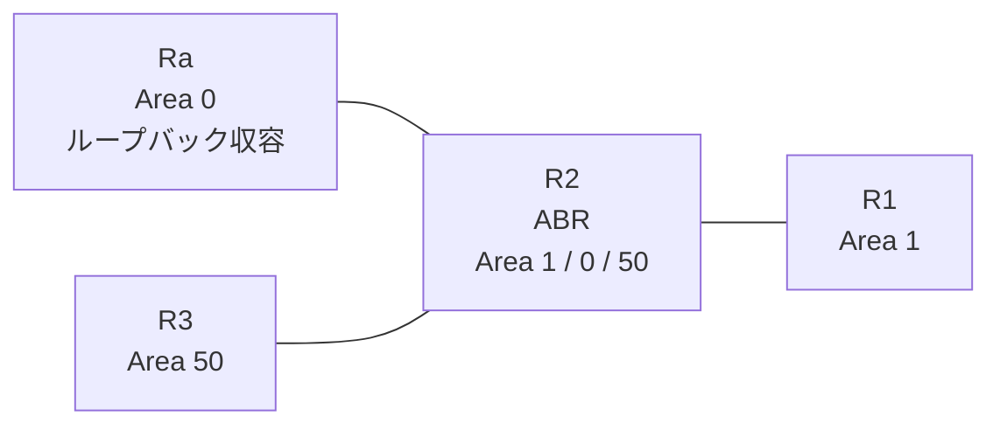

# 問題 20260930-002

> **本問は機器に接続せずに解答すること。追加の show 実行は認めない。**

## 設問

拠点の集約ルーター Ra は、サービスのためのプレフィックスを、4つのループバック インターフェイスによって収容しています。R2 は、エリア 1・エリア 0・エリア 50 を接続するところの ABR であり、そして、すべてのルータにおいて、OSPFv3 のプロセス 100 が構成されています。2001:DB8:9:9::/64 のルートは、バックボーン以外のすべてのエリアから、隠される、そして、適用は、単一のステートメントの追加によって、実現されるという条件において、必要とされる設定を、下記から選択しなさい。その他のルートの広告は、いかなる影響も受けず、インタフェースの IP アドレッシングは、変更されず、R2 自身の経路テーブルは、影響を受けないことが求められます。



| 区間 | インターフェイス | ネットワーク | エリア |
|------|------------------|--------------|--------|
| R1 ⇔ R2 | E0/0 | 2001:DB8:2:A::/64 | 1 |
| R2 ⇔ Ra | E0/1 | 2001:DB8:7:2::/64 | 0 |
| R2 ⇔ R3 | E0/2 | 2001:DB8:4::/64 | 50 |

- R1 の E0/0 セカンダリ: 2001:DB8:0:9::/64（Area 1）
- Ra のループバック: 2001:DB8:9:9::/64, 2001:DB8:A:A::/64, 2001:DB8:B:B::/64, 2001:DB8:C:C::/64（Area 0）

```
R3# show ipv6 route ospf | include ^O|via
OI  2001:DB8:0:9::/64 [110/20]
     via FE80::A8BB:CCFF:FE01:D020, Ethernet0/0
OI  2001:DB8:2:A::/64 [110/20]
     via FE80::A8BB:CCFF:FE01:D020, Ethernet0/0
```
```
R1# show ipv6 route ospf | include ^O|via
OI  2001:DB8:4::/64 [110/20]
     via FE80::A8BB:CCFF:FE01:D000, Ethernet0/0
```
```
R2# show running-config
Building configuration...
!
interface Ethernet0/0
 no ip address
 ipv6 address 2001:DB8:2:A::2/64
 ipv6 enable
 ipv6 ospf 100 area 1
!
interface Ethernet0/1
 no ip address
 ipv6 address 2001:DB8:7:2::2/64
 ipv6 enable
 ipv6 ospf 100 area 0
!
interface Ethernet0/2
 no ip address
 ipv6 address 2001:DB8:4::2/64
 ipv6 enable
 ipv6 ospf 100 area 50
!
router ospfv3 100
 router-id 2.2.2.2
 !
 address-family ipv6 unicast
  area 0 filter-list prefix PL-CORE out
 exit-address-family
!
ipv6 prefix-list PL-AREA10 seq 5 permit ::/0 ge 1
!
ipv6 prefix-list PL-CORE seq 5 deny 2001:DB8:9:9::/64
ipv6 prefix-list PL-CORE seq 10 permit ::/0
!
ipv6 prefix-list PL-LO seq 5 permit 2001:DB8:9:9::/64
!
ipv6 prefix-list PL01 seq 5 permit 2001:DB8:8::/45 le 64
!
```

## 選択肢

**A.**
```
R2(config)# ipv6 prefix-list PL-NEW seq 5 deny 2001:DB8:9:9::/64
R2(config)# ipv6 prefix-list PL-NEW seq 10 permit ::/0 le 128
R2(config)# router ospfv3 100
R2(config-router)# address-family ipv6 unicast
R2(config-router-af)# no area 0 filter-list prefix PL-CORE out
R2(config-router-af)# area 1 filter-list prefix PL-NEW in
R2(config)# no ipv6 prefix-list PL-CORE
```

**B.**
```
R2(config)# ipv6 prefix-list PL-NEW seq 5 deny 2001:DB8:9:9::/64
R2(config)# ipv6 prefix-list PL-NEW seq 10 permit ::/0 le 128
R2(config)# router ospfv3 100
R2(config-router)# address-family ipv6 unicast
R2(config-router-af)# no area 0 filter-list prefix PL-CORE out
R2(config-router-af)# area 0 filter-list prefix PL-NEW out
R2(config)# no ipv6 prefix-list PL-CORE
```

**C.**
```
R2(config)# ipv6 prefix-list PL-NEW seq 5 deny 2001:DB8:8::/46 le 64
R2(config)# ipv6 prefix-list PL-NEW seq 10 permit ::/0 le 128
R2(config)# router ospfv3 100
R2(config-router)# address-family ipv6 unicast
R2(config-router-af)# no area 0 filter-list prefix PL-CORE out
R2(config-router-af)# area 0 filter-list prefix PL-NEW out
R2(config)# no ipv6 prefix-list PL-CORE
```

**D.**
```
R2(config)# ipv6 prefix-list PL-NEW seq 5 deny 2001:DB8:9:9::/64
R2(config)# ipv6 prefix-list PL-NEW seq 10 permit ::/0
R2(config)# router ospfv3 100
R2(config-router)# address-family ipv6 unicast
R2(config-router-af)# no area 0 filter-list prefix PL-CORE out
R2(config-router-af)# area 0 filter-list prefix PL-NEW out
R2(config)# no ipv6 prefix-list PL-CORE
```
