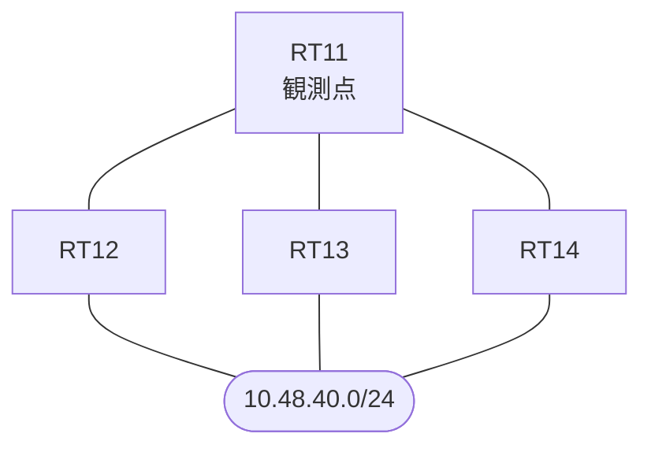

# 問題 20260930-008

> **本問は機器に接続せずに解答すること。追加の show 実行は認めない。**

## トポロジ

あなたは、下記のネットワークの保守を担当する技術者です。拠点のルータ RT11 は、複数の隣接するルータを経由して、10.48.40.0/24 への経路を学習しています。ネットワークは単一の EIGRP のオートノマス システム(200)として運用されており、そして、冗長なパスの活用が検討されています。



| 対象 | 内容 |
|------|------|
| RT11 ⇔ RT12 | Ethernet0/0・10.247.2.0/24（RT11 側の delay = 100） |
| RT11 ⇔ RT13 | Ethernet0/1・10.247.3.0/24（RT11 側の delay = 350） |
| RT11 ⇔ RT14 | Ethernet0/2・10.247.4.0/24（RT11 側の delay = 150） |
| 宛先 | 10.48.40.0/24（すべての隣接から到達可能） |

## 要件

1. RT11 における 10.48.40.0/24 への転送のパスは、運用の設計の意図と一致していなければなりません。
2. 既存の隣接関係は、維持されなければなりません。
3. 管理のための構成に対して、変更が加えられてはなりません。
4. 現在選好されているところの経路の側の構成は、変更されてはなりません。
5. 構成の変更は、1 箇所に限られなければなりません。

## 現在の状態

経路の選好に関する挙動のレビューが、実施されています。

```
RT11# show ip eigrp topology all-links
EIGRP-IPv4 Topology Table for AS(200)/ID(16.0.0.1)
Codes: P - Passive, A - Active, U - Update, Q - Query, R - Reply,
       r - reply Status, s - sia Status 

P 10.247.2.0/24, 1 successors, FD is 281600, serno 2
        via Connected, Ethernet0/0
P 10.247.3.0/24, 1 successors, FD is 345600, serno 3
        via Connected, Ethernet0/1
P 10.48.40.0/24, 1 successors, FD is 435200, serno 7, refcount 1
        via 10.247.2.2 (435200/409600), Ethernet0/0
        via 10.247.4.4 (492800/454400), Ethernet0/2
        via 10.247.3.3 (499200/409600), Ethernet0/1
```

## 設定抜粋

```
RT11# show running-config | section router eigrp
router eigrp 200
 eigrp router-id 16.0.0.1
 network 10.247.0.0 0.0.255.255
 no auto-summary
```
```
RT11# show running-config | section interface
interface Ethernet0/0
 description === to RT12 ===
 ip address 10.247.2.1 255.255.255.0
 delay 100
interface Ethernet0/1
 description === to RT13 ===
 ip address 10.247.3.1 255.255.255.0
 delay 350
interface Ethernet0/2
 description === to RT14 ===
 ip address 10.247.4.1 255.255.255.0
 delay 150
```

## 設問

RT14(10.247.4.4)経由の経路も転送に利用されることが期待されていましたが、そうなっていません。この事象の原因として、最も適切なものは、どれですか。(1つを選択してください)

## 選択肢
A. アドミニストレーティブ・ディスタンスが、他方の経路より大きいため

B. 当該の経路の最小の帯域幅が、他方の経路より小さいため

C. 当該の経路の隣接関係が確立されていないため

D. 当該の経路のホップ数が、他方の経路より多いため

E. 当該の経路の RD が、現在のサクセサの FD 以上であり、フィージビリティの条件を満たさないため
