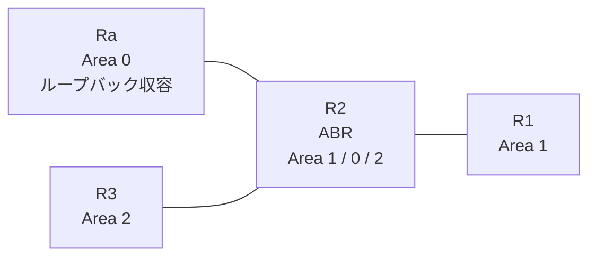

# 問題 20260930-009

> **本問は機器に接続せずに解答すること。追加の show 実行は認めない。**

## トポロジ

あなたは、ネットワークの運用を担当しています。拠点の集約ルータ Ra は、サービスのためのプレフィックスを、4つのループバック インターフェイスによって収容しています。R2 は、エリア 1・エリア 0・エリア 2 を接続するところの ABR であり、そして、すべてのルータにおいて、OSPFv3 のプロセス 10 が構成されています。



| 区間 | インターフェイス | ネットワーク | エリア |
|------|------------------|--------------|--------|
| R1 ⇔ R2 | E0/0 | 2001:DB8:0:B::/64 | 1 |
| R2 ⇔ Ra | E0/1 | 2001:DB8:6:2::/64 | 0 |
| R2 ⇔ R3 | E0/2 | 2001:DB8:2::/64 | 2 |

- R1 の E0/0 セカンダリ: 2001:DB8:4:2::/64（Area 1）
- Ra のループバック: 2001:DB8:8:8::/64, 2001:DB8:9:9::/64, 2001:DB8:A:A::/64, 2001:DB8:B:B::/64（Area 0）

## 要件

1. 他のいかなるルータの経路テーブルにも、影響が及んではなりません。
2. ルーティング プロトコルの種別およびプロセスの配置は、変更されてはなりません。
3. R1 の経路テーブルから、2001:DB8:9:9::/64 のルートが、除外されなければなりません。
4. エリア 1 へ広告される LSAは、維持されなければなりません。

## 現在の状態

通信の一部において、想定されていない挙動が、観測されています。あなたは、示されているところの出力および構成に基づいて、その構成が、下記において記述されているとおりに動作していない理由を、判断する必要があります。

```
R1# show ipv6 route ospf | include ^O|via
OI  2001:DB8:2::/64 [110/20]
     via FE80::A8BB:CCFF:FE01:5900, Ethernet0/0
OI  2001:DB8:6:2::/64 [110/20]
     via FE80::A8BB:CCFF:FE01:5900, Ethernet0/0
OI  2001:DB8:8:8::/64 [110/21]
     via FE80::A8BB:CCFF:FE01:5900, Ethernet0/0
OI  2001:DB8:A:A::/64 [110/21]
     via FE80::A8BB:CCFF:FE01:5900, Ethernet0/0
OI  2001:DB8:B:B::/64 [110/21]
     via FE80::A8BB:CCFF:FE01:5900, Ethernet0/0
```
```
R3# show ipv6 route ospf | include ^O|via
OI  2001:DB8:0:B::/64 [110/20]
     via FE80::A8BB:CCFF:FE01:5920, Ethernet0/0
OI  2001:DB8:4:2::/64 [110/20]
     via FE80::A8BB:CCFF:FE01:5920, Ethernet0/0
OI  2001:DB8:6:2::/64 [110/20]
     via FE80::A8BB:CCFF:FE01:5920, Ethernet0/0
OI  2001:DB8:8:8::/64 [110/21]
     via FE80::A8BB:CCFF:FE01:5920, Ethernet0/0
OI  2001:DB8:A:A::/64 [110/21]
     via FE80::A8BB:CCFF:FE01:5920, Ethernet0/0
OI  2001:DB8:B:B::/64 [110/21]
     via FE80::A8BB:CCFF:FE01:5920, Ethernet0/0
```

## 設定抜粋

```
R2# show running-config
Building configuration...
!
interface Ethernet0/0
 no ip address
 ipv6 address 2001:DB8:0:B::2/64
 ipv6 enable
 ipv6 ospf 10 area 1
!
interface Ethernet0/1
 no ip address
 ipv6 address 2001:DB8:6:2::2/64
 ipv6 enable
 ipv6 ospf 10 area 0
!
interface Ethernet0/2
 no ip address
 ipv6 address 2001:DB8:2::2/64
 ipv6 enable
 ipv6 ospf 10 area 2
!
router ospfv3 10
 router-id 2.2.2.2
 !
 address-family ipv6 unicast
  distribute-list prefix-list PL10 in
 exit-address-family
!
ipv6 prefix-list PL-AREA10 seq 5 permit 2001:DB8:8::/46 le 64
!
ipv6 prefix-list PL-TYPE3 seq 5 permit 2001:DB8:9:9::/64
!
ipv6 prefix-list PL10 seq 5 deny 2001:DB8:9:9::/64
ipv6 prefix-list PL10 seq 10 permit ::/0 le 128
!
```

## 設問

次のうち、正しいものは、どれですか。

## 選択肢
A. R2 において、対象を拒否するところのリストを、エリア 1 の filter-list として、in の方向に適用する

B. R2 において、対象を拒否するところのリストを、distribute-list として、in の方向に適用する

C. R1 において、対象を拒否するところのリストを、distribute-list として、in の方向に適用する

D. R1 において、対象を拒否し、そして、既定のプレフィックスを許可するところのリストを、distribute-list として、in の方向に適用する
