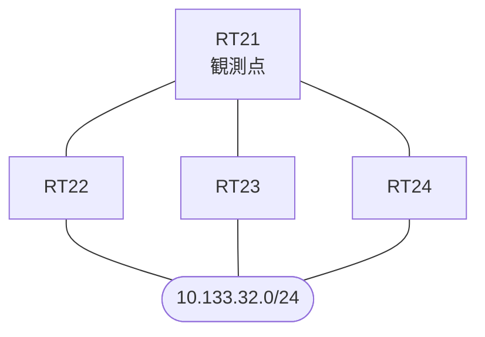

# 問題 20260930-016

> **本問は機器に接続せずに解答すること。追加の show 実行は認めない。**

## トポロジ

あなたの組織は、下記に示されているところのネットワークを運用しています。拠点のルータ RT21 は、複数の隣接するルータを経由して、10.133.32.0/24 への経路を学習しています。ネットワークは単一の EIGRP のオートノマス システム(100)として運用されており、そして、冗長なパスの活用が検討されています。



| 対象 | 内容 |
|------|------|
| RT21 ⇔ RT22 | Ethernet0/0・10.209.2.0/24（RT21 側の delay = 200） |
| RT21 ⇔ RT23 | Ethernet0/1・10.209.3.0/24（RT21 側の delay = 4000） |
| RT21 ⇔ RT24 | Ethernet0/2・10.209.4.0/24（RT21 側の delay = 2100） |
| 宛先 | 10.133.32.0/24（すべての隣接から到達可能） |

## 要件

1. RT21 における 10.133.32.0/24 への転送のパスは、運用の設計の意図と一致していなければなりません。
2. スタティック ルートおよび既定のルートによる迂回は、実施されてはなりません。
3. 既存の隣接関係は、維持されなければなりません。
4. 現在の最良の経路のメトリックは、悪化させられてはなりません。
5. 構成の変更は、1 箇所に限られなければなりません。

## 現在の状態

経路の選好に関する挙動のレビューが、実施されています。

```
RT21# show ip eigrp topology all-links
EIGRP-IPv4 Topology Table for AS(100)/ID(15.0.0.1)
Codes: P - Passive, A - Active, U - Update, Q - Query, R - Reply,
       r - reply Status, s - sia Status 

P 10.209.2.0/24, 1 successors, FD is 307200, serno 2
        via Connected, Ethernet0/0
P 10.209.3.0/24, 1 successors, FD is 1280000, serno 3
        via Connected, Ethernet0/1
P 10.133.32.0/24, 1 successors, FD is 460800, serno 7, refcount 1
        via 10.209.2.2 (460800/409600), Ethernet0/0
        via 10.209.4.4 (947200/409600), Ethernet0/2
        via 10.209.3.3 (1433600/409600), Ethernet0/1
```

## 設定抜粋

```
RT21# show running-config | section router eigrp
router eigrp 100
 eigrp router-id 15.0.0.1
 network 10.209.0.0 0.0.255.255
 no auto-summary
```
```
RT21# show running-config | section interface
interface Ethernet0/0
 description === to RT22 ===
 ip address 10.209.2.1 255.255.255.0
 delay 200
interface Ethernet0/1
 description === to RT23 ===
 ip address 10.209.3.1 255.255.255.0
 delay 4000
interface Ethernet0/2
 description === to RT24 ===
 ip address 10.209.4.1 255.255.255.0
 delay 2100
```

## 設問

RT21 の EIGRP のプロセスに `variance 3` が構成された場合、10.133.32.0/24 に対して、ルーティング・テーブルに搭載される経路は、どれですか。(1つを選択してください)

## 選択肢
A. RT24(10.209.4.4)経由・RT23(10.209.3.3)経由の 2 本が搭載される

B. RT24(10.209.4.4)経由の 1 本が搭載される

C. RT22(10.209.2.2)経由の 1 本が搭載される

D. RT22(10.209.2.2)経由・RT24(10.209.4.4)経由・RT23(10.209.3.3)経由の 3 本が搭載される

E. RT22(10.209.2.2)経由・RT24(10.209.4.4)経由の 2 本が搭載される
