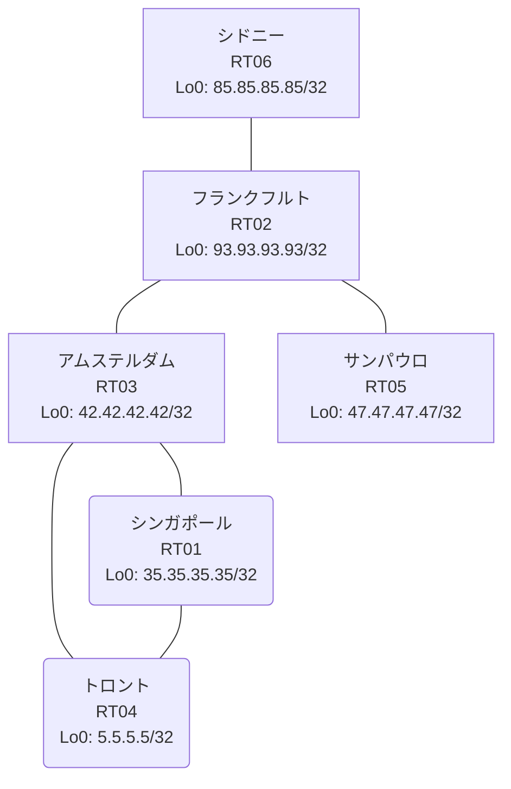

# 問題 20261001-002

> **本問は機器に接続せずに解答すること。追加の show 実行は認めない。**

## シナリオ

あなたは、下記のネットワークの保守を担当する技術者です。あなたの会社のネットワークは、複数のルーティング・ドメインが、境界のルータによって接続され、そして、すべての拠点のリーチアビリティが提供されている、というものです。ルーティングの設計の詳細は、示されているところのコンフィギュレーションから、読み取られることが、期待されています。各拠点のルータと、拠点のネットワークとの対応は、下記の表に示されているとおりです。一部の通信が、意図されているとおりに動作していない、という報告があります。示されているところの出力および構成に基づいて、要求されているところの動作が得られていない理由が、判断されなければなりません。EIGRP の初期のメトリックは、default-metric `1000000 100 255 1 1500` へ集約される必要があります。存在しないプロセス/AS を参照するところの構成のステートメントが、残置されてはなりません。ルートの再配送に対して、フィルタが、適用されてはなりません。本作業は、日中の時間帯において実施されるという理由により、対象外であるところのデバイスに対する構成の変更は、許可されていません。いずれのサイトからも、他のすべてのサイトのネットワークへの、IP リーチアビリティが、確保されていること。



| 拠点 | ルータ | 拠点網 |
|------|--------|----------------------|
| アムステルダム | RT03 | `42.42.42.42/32` |
| サンパウロ | RT05 | `47.47.47.47/32` |
| シドニー | RT06 | `85.85.85.85/32` |
| シンガポール | RT01 | `35.35.35.35/32` |
| トロント | RT04 | `5.5.5.5/32` |
| フランクフルト | RT02 | `93.93.93.93/32` |

リンク一覧:
```
  RT04:E0/0(.1) ── RT01:E0/0(.2)   10.212.18.0/30
  RT03:E0/0(.1) ── RT01:E0/1(.2)   10.64.211.0/30
  RT02:E0/0(.1) ── RT06:E0/0(.2)   10.152.31.0/30
  RT03:E0/1(.1) ── RT04:E0/1(.2)   10.184.122.0/30
  RT02:E0/1(.1) ── RT03:E0/2(.2)   10.38.142.0/30
  RT02:E0/2(.1) ── RT05:E0/0(.2)   10.138.196.0/30
```

## 出力

```
RT02# show running-config | section router
router eigrp 787
 network 10.38.142.0 0.0.0.3
 network 93.93.93.93 0.0.0.0
 redistribute ospf 66 match internal external 1 external 2
router ospf 66
 router-id 93.93.93.93
 redistribute eigrp 787
 passive-interface Loopback0
 network 10.138.196.0 0.0.0.3 area 0
 network 10.152.31.0 0.0.0.3 area 0
 network 93.93.93.93 0.0.0.0 area 0
```
```
RT04# show running-config | section router
router eigrp 787
 network 5.5.5.5 0.0.0.0
 network 10.184.122.0 0.0.0.3
 network 10.212.18.0 0.0.0.3
 passive-interface Loopback0
```
```
RT06# show running-config | section router
router ospf 66
 router-id 85.85.85.85
 network 10.152.31.0 0.0.0.3 area 0
 network 85.85.85.85 0.0.0.0 area 0
```
```
RT03# show running-config | section router
router eigrp 787
 network 10.38.142.0 0.0.0.3
 network 10.64.211.0 0.0.0.3
 network 10.184.122.0 0.0.0.3
 network 42.42.42.42 0.0.0.0
```
```
RT04# show ip route
Gateway of last resort is not set
      5.0.0.0/32 is subnetted, 1 subnets
C        5.5.5.5 is directly connected, Loopback0
      10.0.0.0/8 is variably subnetted, 6 subnets, 2 masks
D        10.38.142.0/30 [90/307200] via 10.184.122.1, 00:04:47, Ethernet0/1
D        10.64.211.0/30 [90/307200] via 10.212.18.2, 00:04:47, Ethernet0/0
                        [90/307200] via 10.184.122.1, 00:04:47, Ethernet0/1
C        10.184.122.0/30 is directly connected, Ethernet0/1
L        10.184.122.2/32 is directly connected, Ethernet0/1
C        10.212.18.0/30 is directly connected, Ethernet0/0
L        10.212.18.1/32 is directly connected, Ethernet0/0
      35.0.0.0/32 is subnetted, 1 subnets
D        35.35.35.35 [90/409600] via 10.212.18.2, 00:04:47, Ethernet0/0
      42.0.0.0/32 is subnetted, 1 subnets
D        42.42.42.42 [90/409600] via 10.184.122.1, 00:04:47, Ethernet0/1
      93.0.0.0/32 is subnetted, 1 subnets
D        93.93.93.93 [90/435200] via 10.184.122.1, 00:04:47, Ethernet0/1
```
```
RT02# show ip prefix-list
ip prefix-list PL-MIGR2: 2 entries
   seq 5 deny 42.42.42.42/32
   seq 10 permit 0.0.0.0/0 le 32
ip prefix-list PL-OLD1: 2 entries
   seq 5 deny 47.47.47.47/32
   seq 10 permit 0.0.0.0/0 le 32
```
```
RT02# show access-lists
Standard IP access list 59
    10 deny   47.47.47.47
    20 permit any
Standard IP access list 97
    10 deny   42.42.42.42
    20 permit any
```
```
RT01# show running-config | section router
router eigrp 787
 network 10.64.211.0 0.0.0.3
 network 10.212.18.0 0.0.0.3
 network 35.35.35.35 0.0.0.0
```
```
RT03# show ip route
Gateway of last resort is not set
      5.0.0.0/32 is subnetted, 1 subnets
D        5.5.5.5 [90/409600] via 10.184.122.2, 00:05:23, Ethernet0/1
      10.0.0.0/8 is variably subnetted, 7 subnets, 2 masks
C        10.38.142.0/30 is directly connected, Ethernet0/2
L        10.38.142.2/32 is directly connected, Ethernet0/2
C        10.64.211.0/30 is directly connected, Ethernet0/0
L        10.64.211.1/32 is directly connected, Ethernet0/0
C        10.184.122.0/30 is directly connected, Ethernet0/1
L        10.184.122.1/32 is directly connected, Ethernet0/1
D        10.212.18.0/30 [90/307200] via 10.184.122.2, 00:05:23, Ethernet0/1
                        [90/307200] via 10.64.211.2, 00:05:23, Ethernet0/0
      35.0.0.0/32 is subnetted, 1 subnets
D        35.35.35.35 [90/409600] via 10.64.211.2, 00:05:23, Ethernet0/0
      42.0.0.0/32 is subnetted, 1 subnets
C        42.42.42.42 is directly connected, Loopback0
      93.0.0.0/32 is subnetted, 1 subnets
D        93.93.93.93 [90/409600] via 10.38.142.1, 00:05:47, Ethernet0/2
```
```
RT05# show ip route
Gateway of last resort is not set
      5.0.0.0/32 is subnetted, 1 subnets
O E2     5.5.5.5 [110/20] via 10.138.196.1, 00:04:24, Ethernet0/0
      10.0.0.0/8 is variably subnetted, 7 subnets, 2 masks
O E2     10.38.142.0/30 [110/20] via 10.138.196.1, 00:04:24, Ethernet0/0
O E2     10.64.211.0/30 [110/20] via 10.138.196.1, 00:04:24, Ethernet0/0
C        10.138.196.0/30 is directly connected, Ethernet0/0
L        10.138.196.2/32 is directly connected, Ethernet0/0
O        10.152.31.0/30 [110/20] via 10.138.196.1, 00:04:24, Ethernet0/0
O E2     10.184.122.0/30 [110/20] via 10.138.196.1, 00:04:24, Ethernet0/0
O E2     10.212.18.0/30 [110/20] via 10.138.196.1, 00:04:24, Ethernet0/0
      35.0.0.0/32 is subnetted, 1 subnets
O E2     35.35.35.35 [110/20] via 10.138.196.1, 00:04:24, Ethernet0/0
      42.0.0.0/32 is subnetted, 1 subnets
O E2     42.42.42.42 [110/20] via 10.138.196.1, 00:04:24, Ethernet0/0
      47.0.0.0/32 is subnetted, 1 subnets
C        47.47.47.47 is directly connected, Loopback0
      85.0.0.0/32 is subnetted, 1 subnets
O        85.85.85.85 [110/21] via 10.138.196.1, 00:04:20, Ethernet0/0
      93.0.0.0/32 is subnetted, 1 subnets
O        93.93.93.93 [110/11] via 10.138.196.1, 00:04:24, Ethernet0/0
```
```
RT02# show route-map
route-map RM-MIGR2, deny, sequence 10
  Match clauses:
    ip address prefix-lists: PL-MIGR2 
  Set clauses:
  Policy routing matches: 0 packets, 0 bytes
route-map RM-MIGR2, permit, sequence 20
  Match clauses:
  Set clauses:
  Policy routing matches: 0 packets, 0 bytes
route-map RM-OLD1, deny, sequence 10
  Match clauses:
    ip address prefix-lists: PL-OLD1 
  Set clauses:
  Policy routing matches: 0 packets, 0 bytes
route-map RM-OLD1, permit, sequence 20
  Match clauses:
  Set clauses:
  Policy routing matches: 0 packets, 0 bytes
```
```
RT05# show running-config | section router
router ospf 66
 router-id 47.47.47.47
 timers throttle spf 50 200 5000
 passive-interface Loopback0
 network 10.138.196.0 0.0.0.3 area 0
 network 47.47.47.47 0.0.0.0 area 0
```

## 設問

次のうち、正しいものは、どれですか。

## 選択肢
A. RT02 の router ospf 66 配下の「redistribute eigrp 787」に metric 20 を追加する

B. RT02 の router eigrp 787 配下に「redistribute connected」を追加する

C. RT02 の router eigrp 787 配下で「redistribute ospf 66 match internal external 1 external 2 metric 1000000 100 255 1 1500」を設定する

D. RT02 で「clear ip route *」を実行する

E. RT04 の router eigrp 787 配下で「no passive-interface <上流IF>」を設定する

F. RT02 の router eigrp 787 配下に「default-metric 1000000 100 255 1 1500」を追加する
