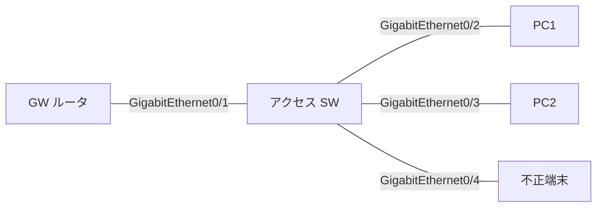

# 問題 20261001-007

> **本問は機器に接続せずに解答すること。追加の show 実行は認めない。**

## 設問

次の説明文(設定例を含む)の空欄 ①〜④ に入る語句を、下の語群 A〜H から 1 つずつ選択してください。同じ語句を 2 つの空欄に使うことはありません。語群にはどの空欄にも当てはまらない語句が含まれます。



```
ipv6 dhcp guard policy CLIENTS
 device-role client
ipv6 dhcp guard policy SERVERS
 device-role server
 match server access-list DHCP-SRV
!
ipv6 access-list DHCP-SRV
 permit ipv6 host 2001:DB8::53 any
!
interface GigabitEthernet0/1
 ipv6 dhcp guard attach-policy SERVERS
interface GigabitEthernet0/2
 ipv6 dhcp guard attach-policy CLIENTS
interface GigabitEthernet0/4
 ! (ポリシーなし)
```

上はアクセススイッチの設定で、GigabitEthernet0/1 の先に正規の DHCPv6 サーバ(リレー)、GigabitEthernet0/2 に端末、GigabitEthernet0/4 に偽サーバを動かす不正端末がつながる。DHCPv6 guard が破棄するのは、サーバやリレーがクライアント向きに送る［①］で、端末が送る SOLICIT/REQUEST は検査せず通す。この盤面で、正規サーバの応答が GigabitEthernet0/1 から入ると server ポリシーなので検査を通って転送される。偽サーバの応答が GigabitEthernet0/4 から入るとポリシーが無いので素通りする。その結果、端末 GigabitEthernet0/2 は先に応答した方の DNS を掴み、偽サーバの値になることがある。`show device-tracking counters interface GigabitEthernet0/1` の Dropped 欄には何も出ない。是正として妥当なのは［②］。なお［③］でサーバ/リレーの送信元アドレスも検査でき、優先度は［④］で範囲を絞れる。

## 選択肢

A. router-preference maximum

B. ADVERTISE と REPLY

C. match server access-list

D. 是正不要(意図どおり)

E. match ipv6 access-list

F. GigabitEthernet0/4 に device-role client のポリシーを付ける

G. preference min/max

H. SOLICIT と REQUEST
