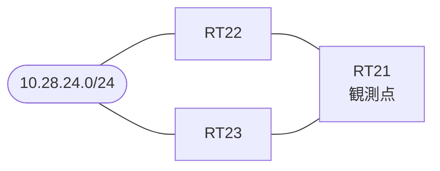

# 問題 20261001-008

> **本問は機器に接続せずに解答すること。追加の show 実行は認めない。**

## トポロジ

あなたは、下記のネットワークの保守を担当する技術者です。拠点のルータ RT21 は、複数の隣接するルータを経由して、10.28.24.0/24 への経路を学習しています。ネットワークは単一の OSPF のドメインとして運用されており、そして、RT21 は当該のプレフィックスを複数の経路によって受け取っています。



| 対象 | 内容 |
|------|------|
| RT21 ⇔ RT22 | Ethernet0/0・10.220.2.0/24（RT21 側の OSPF のコスト = 60） |
| RT21 ⇔ RT23 | Ethernet0/1・10.220.3.0/24（RT21 側の OSPF のコスト = 30） |
| RT22 | 外部の経路を再配送しているルータ（ASBR） |
| RT23 | 外部の経路を再配送しているルータ（ASBR） |

## 要件

1. 構成の変更は、1 箇所に限られなければなりません。
2. 現在選好されているところの経路の側の構成は、変更されてはなりません。
3. インタフェースの IP アドレッシングは、変更されてはなりません。
4. RT21 における 10.28.24.0/24 への転送のパスは、運用の設計の意図と一致していなければなりません。
5. 既存の隣接関係は、維持されなければなりません。

## 現在の状態

経路の選好に関する挙動のレビューが、実施されています。

```
RT21# show ip ospf database external 10.28.24.0
OSPF Router with ID (1.1.1.1) (Process ID 1)

		Type-5 AS External Link States
  LS age: 739
  Options: (No TOS-capability, DC, Upward)
  LS Type: AS External Link
  Link State ID: 10.28.24.0 (External Network Number )
  Advertising Router: 2.2.2.2
  LS Seq Number: 80000008
  Checksum: 0x4FDC
  Length: 36
  Network Mask: /24
	Metric Type: 1 (Comparable directly to link state metric)
	MTID: 0 
	Metric: 200 
	Forward Address: 0.0.0.0
	External Route Tag: 0

  LS age: 641
  Options: (No TOS-capability, DC, Upward)
  LS Type: AS External Link
  Link State ID: 10.28.24.0 (External Network Number )
  Advertising Router: 3.3.3.3
  LS Seq Number: 80000001
  Checksum: 0x8FEE
  Length: 36
  Network Mask: /24
	Metric Type: 2 (Larger than any link state path)
	MTID: 0 
	Metric: 20 
	Forward Address: 0.0.0.0
	External Route Tag: 0
```
```
RT21# show ip ospf border-routers
OSPF Router with ID (1.1.1.1) (Process ID 1)


		Base Topology (MTID 0)

Internal Router Routing Table
Codes: i - Intra-area route, I - Inter-area route

i 2.2.2.2 [60] via 10.220.2.2, Ethernet0/0, ASBR, Area 0, SPF 21
i 3.3.3.3 [30] via 10.220.3.3, Ethernet0/1, ASBR, Area 0, SPF 21
```

## 設定抜粋

```
RT21# show running-config | section router ospf
router ospf 1
 router-id 1.1.1.1
 network 10.220.2.0 0.0.0.255 area 0
 network 10.220.3.0 0.0.0.255 area 0
```
```
RT21# show running-config | section interface
interface Ethernet0/0
 description === to RT22 ===
 ip address 10.220.2.1 255.255.255.0
 ip ospf cost 60
interface Ethernet0/1
 description === to RT23 ===
 ip address 10.220.3.1 255.255.255.0
 ip ospf cost 30
```

## 設問

より小さい外部メトリックが広告されている側の ASBR を経由するところの経路が RT21 において選好されるようにするために、実施されなければならない変更は、どれですか。(1つを選択してください)

## 選択肢
A. RT21 の Ethernet0/0 の OSPF のコストを 61 へ上げる

B. RT21 において、外部の経路のアドミニストレーティブ・ディスタンスを 105 へ変更する

C. RT23 における再配送を、外部タイプ 1(metric-type 1)へ変更する

D. RT21 の Ethernet0/1 のコストを 59 へ下げ、かつ Ethernet0/0 のコストを 61 へ上げる

E. RT22 における再配送を、外部タイプ 2(metric-type 2)へ変更する
