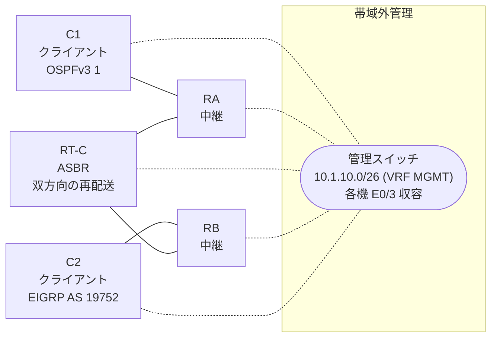

# 問題 20261001-009

> **本問は機器に接続せずに解答すること。追加の show 実行は認めない。**

## 設問

クライアントである C1 は OSPFv3 の ドメイン に、そして、C2 は EIGRP の ドメイン に、それぞれ収容されています。RT-C は、2 つの ドメイン の境界に位置しており、双方向の 再配送 が構成されています。C1 と C2 は、相互に 通信 できる、かつ、C1 において、2001:DB8:2:C::/64 は、タイプ 1 の 外部の ルート として受信されるという条件において、下記の項目から、正しいものを選択しなさい。管理のための構成に対して、変更が加えられないことが求められます。



| ルータ | 位置づけ | 参加プロトコル |
|--------|----------|----------------|
| C1 | クライアント | OSPFv3 1 area 0 |
| RA | 中継 | OSPFv3 1 area 0 |
| RT-C | **ASBR(2 つの ドメイン の 境界)** | 双方向の 再配送 |
| RB | 中継 | EIGRP CORE AS 19752 |
| C2 | クライアント | EIGRP CORE AS 19752 |

リンク一覧:
```
  (a) C1:Et0/0                ── RA:Et0/1                  2001:DB8:2A:2A::/64   C1 = 2001:DB8:2A:2A::2
  (b) RA:Et0/0                ── RT-C:GigabitEthernet0/0   2001:DB8:2A:A::/64
  (c) RT-C:GigabitEthernet0/1 ── RB:Et0/0                  2001:DB8:A:20::/64
  (d) RB:Et0/1                ── C2:Et0/0                  2001:DB8:2:C::/64     C2 = 2001:DB8:2:C::2
```

OSPFv3 の ドメイン には、RA によって注入されたところの 外部の ルート `2001:DB8:1:2::/64` が存在する。

```
C1# show ipv6 route ospf | include ^O|via
OE2 2001:DB8:1:2::/64 [110/20]
     via FE80::A8BB:CCFF:FE01:6000, Ethernet0/0
OE2 2001:DB8:A:20::/64 [110/20]
     via FE80::A8BB:CCFF:FE01:6000, Ethernet0/0
```
```
RB# show ipv6 route eigrp | include ^D|^EX|via
EX  2001:DB8:2A:A::/64 [170/1536000]
     via FE80::A8BB:CCFF:FE01:8000, Ethernet0/0
EX  2001:DB8:2A:2A::/64 [170/1536000]
     via FE80::A8BB:CCFF:FE01:8000, Ethernet0/0
```
```
C1# ping 2001:DB8:2:C::2
Type escape sequence to abort.
Sending 5, 100-byte ICMP Echos to 2001:DB8:2:C::2, timeout is 2 seconds:

% No valid route for destination
Success rate is 0 percent (0/1)

C2# ping 2001:DB8:2A:2A::2
Type escape sequence to abort.
Sending 5, 100-byte ICMP Echos to 2001:DB8:2A:2A::2, timeout is 2 seconds:
.....
Success rate is 0 percent (0/5)
```
```
RT-C# show running-config
Building configuration...
!
interface GigabitEthernet0/0
 description === to RA ===
 no ip address
 ipv6 address 2001:DB8:2A:A::1/64
 ipv6 enable
 ipv6 ospf 1 area 0
!
interface GigabitEthernet0/1
 description === to RB ===
 no ip address
 ipv6 address 2001:DB8:A:20::1/64
 ipv6 enable
!
router eigrp CORE
 !
 address-family ipv6 unicast autonomous-system 19752
  !
  af-interface GigabitEthernet0/0
   shutdown
  exit-af-interface
  !
  topology base
   redistribute ospf 1 match internal metric 1000 10 255 1 1500 route-map EMAP01 include-connected
  exit-af-topology
  eigrp router-id 6.5.3.7
 exit-address-family
!
router ospfv3 1
 router-id 9.8.9.6
 !
 address-family ipv6 unicast
  redistribute eigrp 19752 route-map RM-EIGRP include-connected
 exit-address-family
!
ipv6 prefix-list E5400 seq 5 permit 2001:DB8:2A:2A::/64
ipv6 prefix-list E5400 seq 10 permit 2001:DB8:2:C::/64
ipv6 prefix-list PL-CORE seq 5 permit 2001:DB8:A:20::/64
ipv6 prefix-list PL-EIGRP seq 5 permit 2001:DB8:2A:A::/64
ipv6 prefix-list PL-EIGRP seq 10 permit 2001:DB8:2A:2A::/64
!
route-map EMAP01 permit 10
 match ipv6 address prefix-list PL-EIGRP
route-map OMAP01 permit 10
 match ipv6 address prefix-list PL-OSPF
route-map RM-EIGRP permit 10
 match ipv6 address prefix-list PL-CORE
!
```

## 選択肢

A. 一方の 方向 の プレフィックス・リスト のみが、対向の クライアント の ネットワーク を許可している

B. アドミニストレーティブ・ディスタンス の 競合により、再配送 された ルート が 経路テーブル へ 導入されていない

C. route-map の 先頭の エントリ が、対向の クライアント の ネットワーク を拒否している

D. redistribute が参照しているところの名前の route-map が、定義されていない

E. 双方の プレフィックス・リスト が、隣接している リンク の ネットワーク のみを許可している

F. RT-C と 隣接の ルータ の 間で、ルーティング・プロトコル の 隣接関係 が確立されていない
