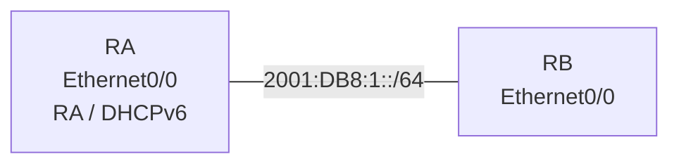

# 問題 20261001-010

> **本問は機器に接続せずに解答すること。追加の show 実行は認めない。**

## シナリオ



RA は DHCPv6 サーバとして DNS サーバとドメイン名だけを配布し、RB はアドレスを RA のプレフィックスから自動生成します。

```
RA# show running-config | section ipv6|interface Ethernet0/0
ipv6 unicast-routing
ipv6 dhcp pool DHCP6-A
 dns-server 2001:4860:4860::8888
 domain-name example.net
!
interface Ethernet0/0
 ipv6 address 2001:DB8:1::1/64
 ipv6 dhcp server DHCP6-A
 【1】
 no shutdown

RB# show running-config | section interface Ethernet0/0
interface Ethernet0/0
 【2】
 no shutdown
```

## 設問

【1】と【2】に当てはまるコマンドを、次のうちから 2 つ選択してください。

## 選択肢

A. ipv6 nd ra suppress all

B. ipv6 address autoconfig

C. ipv6 nd managed-config-flag

D. ipv6 nd other-config-flag

E. ipv6 address dhcp
